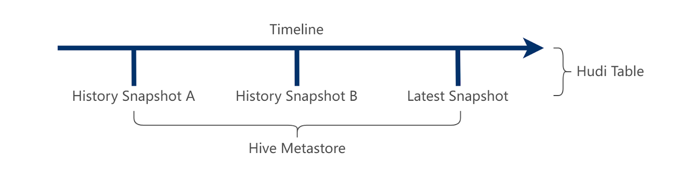
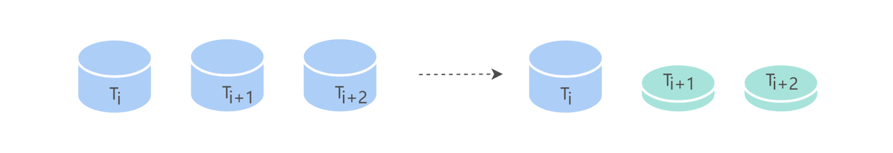
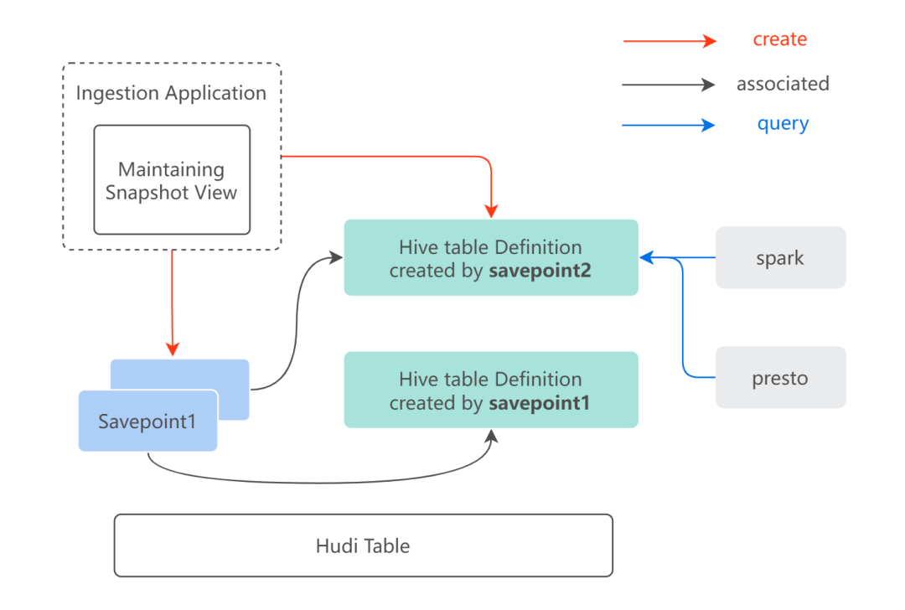

<!--
  Licensed to the Apache Software Foundation (ASF) under one or more
  contributor license agreements.  See the NOTICE file distributed with
  this work for additional information regarding copyright ownership.
  The ASF licenses this file to You under the Apache License, Version 2.0
  (the "License"); you may not use this file except in compliance with
  the License.  You may obtain a copy of the License at

       http://www.apache.org/licenses/LICENSE-2.0

  Unless required by applicable law or agreed to in writing, software
  distributed under the License is distributed on an "AS IS" BASIS,
  WITHOUT WARRANTIES OR CONDITIONS OF ANY KIND, either express or implied.
  See the License for the specific language governing permissions and
  limitations under the License.
-->
# RFC-61: Snapshot view management


## Proposers

- @<proposer1 @fengjian428>

## Approvers
 - @<approver1 @xushiyan>
 - @<approver2 @codope>

## Status

JIRA: [HUDI-4677](https://issues.apache.org/jira/browse/HUDI-4677)


## Abstract

For the snapshot view scenario, Hudi already provides two key features to support it:
* Time travel: user provides a timestamp to query a specific snapshot view of a Hudi table
* Savepoint/restore: "savepoint" saves the table as of the commit time so that it lets you restore the table to this savepoint at a later point in time if need be.
but in this case, the user usually uses this to prevent cleaning snapshot view at a specific timestamp, and also remove savepoint if already expire. 
the situation is there no life-cycle management of save points, that bring inconvenience for the users
 

Usually users incline to use a meaningful name instead of querying Hudi table with a timestamp, using the timestamp in SQL may lead to the wrong snapshot view being used. 
for example, we can announce that a new tag of hudi table with table_nameYYYYMMDD was released, then the user can use this new table name to query.
Savepoint is not designed for this "snapshot view" scenario in the beginning, it is designed for disaster recovery. 
let's say a new snapshot view will be created every day, and it has 7 days retention, we should support lifecycle management on top of it.
What this RFC plan to do is to let Hudi support release a snapshot view and lifecycle management out-of-box.

## Background
Introduce any much background context which is relevant or necessary to understand the feature and design choices.
typical scenarios and benefits of snapshot view:

1. Basic idea:



Create Snapshot view based on Hudi Savepoint
* Create Snapshot views periodically by time(date time/processing time)
* Use External Metastore(such as HMS) to store external view 

Build periodic snapshots based on the time period required by the user
These Snapshots are stored as tables in the metadata management system
Users can easily use SQL to access this data in Flink Spark or Presto.
Because the data store is complete and has no merged details,
So the data itself is to support the full amount of data calculation, also support incremental processing

2. Compare to Hive solution


The Snapshot view is created based on Hudi Savepoint, which significantly reduces the data storage space of some large tables
   * The space usage becomes (1 + (t-1) * p)/t
   * Incremental use reduces the amount of data involved in the calculation

When using snapshot view storage, for some scenarios where the proportion of changing data is not large, a better storage saving effect will be achieved
We have a simple formula here to calculate the effect
P indicates the proportion of changed data, and t indicates the number of time periods to be saved
The lower the percentage of changing data, the better the storage savings
So There is also a good savings for long periods of data

At the same time, it has benefit for incremental computing resource saving

3. Some typical scenarios
   1. Every day generate a new snapshot base on original Hudi table which named tbl-YYYYMMDD, user can use snapshot table to generate derived tables,
   provide report data. if user's downstream calculation logic changed, can choose relevant snapshot to re-process.
   user also can set retain days as X day, clean out-of-date data automatically. SCD-2 should also can be achieved here.
   2. One archived branch named yyyy-archived can be generated after compress and optimize. if our retention policy has been 
   changed(let's say remove some sensitive information), then can generate a new snapshot base on this branch after operation done.
   3. One Snapshot named pre-prod can release to customer after some quality validations passed base on any external tools.
   
## Implementation



### Extend Savepoint meta 
Snapshot view need to extend the savepoint metadata, so we are going to add one struct with four fields: 
* tag_name: tag name for your snapshot
* retain-days: number of day, So data belongs to this snapshot will be retained for retain-days,  then can be clean after snapshot expire
* database: database name in Catalog
* table-name: table name in Catalog 

new Savepoint Metadata should look like below:
``` diff
{
	"type": "record",
	"name": "HoodieSavepointMetadata",
	"namespace": "org.apache.hudi.avro.model",
	"fields": [{
		"name": "savepointedBy",
		"type": {
			"type": "string",
			"avro.java.string": "String"
	}, {
		"name": "savepointedAt",
		"type": "long"
	}, {
		"name": "comments",
		"type": {
			"type": "string",
			"avro.java.string": "String"
		}
	}, {
		"name": "partitionMetadata",
		"type": {
			"type": "map",
			"values": {
				"type": "record",
				"name": "HoodieSavepointPartitionMetadata",
				"fields": [{
					"name": "partitionPath",
					"type": {
						"type": "string",
						"avro.java.string": "String"
					}
				}, {
					"name": "savepointDataFile",
					"type": {
						"type": "array",
						"items": {
							"type": "string",
							"avro.java.string": "String"
						}
					}
				}]
			},
			"avro.java.string": "String"
		}
	}, {
		"name": "version",
		"type": ["int", "null"],
		"default": 1
+	}, {
+	    "name": "tagName",
+	    "type": "string",
+	 	"avro.java.string": "String"
+	 }, 
+    {
+       "name": "expiryTimestamp",
+    	"type": ["long", "null"],
+    	"default": 0
+    },
+    {
+       "name": "database",
+	    "type": "string",
+	 	"avro.java.string": "String"
+	 }, 
+    {
+       "name": "tableName", // will infer tagName's value if doesn't specific
+	    "type": "string",
+	 	"avro.java.string": "String"
+	 }
  ]
  }
}
```
### MergeOnRead table snapshot query support
* Problem
the savepoints are only related to base files not delta logs, so if we query on a _rt table's savepoint, data still can increase after that savepoint

* there are two solutions for MergeOnRead table snapshot query
  * also create a full table compaction request when create a savepoint. since log will be wrote into another file after comapction request, so we can exclude those files
but it will take effect on compaction plan, full table compaction is slow at big tables
  * should write data to another log if base file's instant lesser than savepoint and commit time larger than savepoint. it will take effect on read path and compaction logic
  
### Meta Sync
Create a snapshot view also will create a new external table into the Catalogs, and add a timestamp into tbl properties to identify which savepoint you are using.
for example, if you choose Hive Metastore as the catalog and create a snapshot view on a Hudi table, following steps will be process:
* create a new savepoint with tag name (let's say tbl-YYYYMMDD)
* create an external table in HMS, table's name is tbl-YYYYMMDD
* add as.of.instant= ${savepoint's timestamp} into table tbl-YYYYMMDD's storage properties ，

when user query such a snapshot's external table, engines like Spark/Presto will get the savepoint timestamp from external table's properties then pass back to Hudi for time travel 


### Operations
* Create Snapshot View
  create savepoint on a specific commit, meanwhile, create a new external table name tablename_YYYYMMDD, add as.of.instant={savepoint's timestamp} into external table storage properties ， this table has the same basepath with the original Hudi table
```sql
call create_snapshot_view(table => 'hudi_table', commit_Time => 'commit_timestamp_from_timeline', snapshot_table => 'snapshot_hive_table');
```

| Parameter Name   | Required | Default                       | Remarks                                                                                       |
|------------------| -------  |-------------------------------|-----------------------------------------------------------------------------------------------|
| `table`          | `true`   | `--`                          | the Hive table name you want to create savepoint, must be a Hudi table, without database name |
| `commit_Time`    | `false`  | `None`                        | the commit timestamp from Hudi timeline, if not provided, will use the latest commit          |
| `user`           | `false`  | `""`                          | the user name will be saved in Hudi savepoint metadata                                        |
| `comments`       | `false`  | `""`                          | the comment will be saved in Hudi savepoint metadata                                          |
| `snapshot_table` | `false`  | `$table name + _$commit_time` | the snapshot view table name in hive                                                          |
| `hms`            | `false`  | `None`                        | Hive metastore server used for syncing savepoint information                                  |

* Delete Snapshot View
  call delete savepoint command(via spark-sql or hudi-cli), meanwhile delete associated Hive table
```sql
call delete_snapshot_view(table => 'hudi_table', snapshot_table => 'snapshot_hive_table');
```

|  Parameter Name  | Required | Default | Remarks |
|  --------------  | -------  | ------- | ------- |
| `table`          | `true`   | `--`    | the Hive table name you want to delete savepoint, must be a Hudi table |
| `instant_time`   | `true`   | `--`    | the savepoint timestamp from Hudi timeline, must provide |
| `hive_sync`      | `false`  | `false` | whether to delete savepoint timestamp from Hive table serde properties |
| `hms`            | `false`  | `None`  | Hive metastore server used for deleting savepoint information |

* List Snapshot View
```sql
call show_snapshotviews(table => 'hudi_table');
```

|  Parameter Name  | Required | Default | Remarks |
|  --------------  | -------  | ------- | ------- |
| `table`          | `true`   | `--`    | the Hive table name you want to show savepoint list, must be a Hudi table |


## Rollout/Adoption Plan
This change simply extend savepoint feature and will not impact an existing users. The changes to the savepoint will only impact who use snapshot view feature to create new type of save points. Users will need to start running a Spark-SQL client or hudi-cli to get this functionality.


## Test Plan

Create snapshot view with expired time
* query it within expired time
* clean it within expired time
* clean it when exceed expired time
* query it when exceed expired time
* query it after delete&clean snapshot view  
