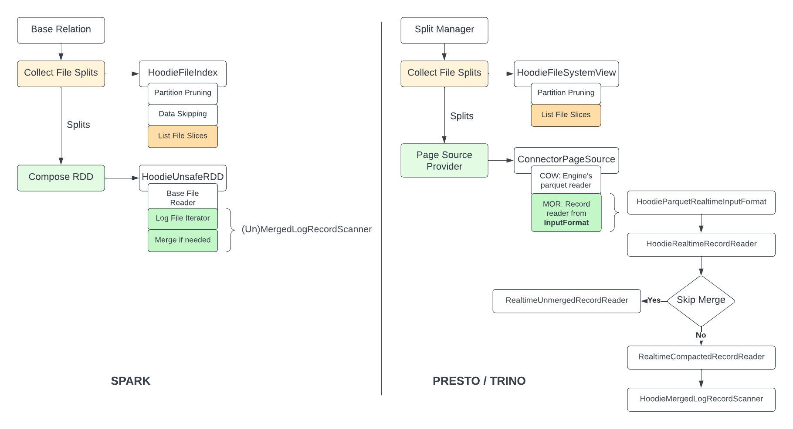

<!--
 Licensed to the Apache Software Foundation (ASF) under one or more
 contributor license agreements.  See the NOTICE file distributed with
 this work for additional information regarding copyright ownership.
 The ASF licenses this file to You under the Apache License, Version 2.0
 (the "License"); you may not use this file except in compliance with
 the License.  You may obtain a copy of the License at

      http://www.apache.org/licenses/LICENSE-2.0

 Unless required by applicable law or agreed to in writing, software
 distributed under the License is distributed on an "AS IS" BASIS,
 WITHOUT WARRANTIES OR CONDITIONS OF ANY KIND, either express or implied.
 See the License for the specific language governing permissions and
 limitations under the License.
-->

# RFC-64: New Hudi Table Spec API for Query Integrations

## Proposers

- @codope
- @alexeykudinkin

## Approvers

- @xiarixiaoyao
- @danny0405
- @vinothchandar
- @prasanna
- @xushiyan

## Status

JIRA: [HUDI-4141](https://issues.apache.org/jira/browse/HUDI-4141)

## Abstract

In this RFC we propose new set of higher-level Table Spec APIs that would allow
us to up-level our current integration model with new Query Engines, enabling
faster turnaround for such integrations.

## Background

[WIP] Plan

- [x] High-level capabilities API will be supporting
- [ ] High-level overview of integration points of the query engines
- [ ] Deep-dive into existing Spark/Flink/Trino integration points

The figure below shows the read path in Spark and Presto/Trino query engines. At
a high level, integration with these engines require providing of the following capabilities:

1. **Listing**: this stage requires enumerating of all of the data files w/in a table representing particular 
snapshot of its state, that will be subsequently scanned to fetch the date requested by the target query. All query engines
expect output of this stage in the form of balanced out file "splits" that way allowing to even out any skew in 
file sizes. This stage is where various _pruning_ techniques such as partition-pruning, file-level column 
statistics filtering are applied.

2. **Reading**: this stage transforms every file-split (identified in a previous stage) into an iterator over 
the records persisted in it. This stage is where actual data shaping to suit the needs of particular query takes 
place: records are projected into a schema expected by the query, corresponding filters are pushed down to 
reduce amount of data fetched from storage, schema evolution is handled, delayed operations are reconciled (merging/deleting) 



## Implementation

[WIP] Plan

- [x] Components & API pseudo-code
- [x] Diagram show-casing data flow and integration points
- [ ] Example integration walk-through

With this RFC, we aim to achieve following:

 - Up-level our current integration model with Query Engines, abstracting away Hudi's lower-level components,
 instead providing simple and eloquent abstractions providing necessary capabilities (for listing, reading)

 - Make sure Hudi's APIs are high-level enough to be useful in providing programmatic access to the data 
 for users willing to access it directly

To achieve that, we propose to introduce two tiers of APIs:

1. **Mid-level** (engine-friendly): these APIs will be abstracting away Hudi's internals, behind
    simple and familiar concepts and components such as file splits, iterators,
    statistics, etc.

2. **High-level** (user-friendly): these APIs will provide programmatic access to Hudi's capabilities
    bypassing query engine interfaces (like SQL, Spark DS, etc)

Following classic [layer-cake architecture](https://cs.uwaterloo.ca/~m2nagapp/courses/CS446/1195/Arch_Design_Activity/Layered.pdf) 
would allow us to abstract away complexity of the lower levels components and APIs from
Query Engines (on the *querying* side) as well as from the end users:

 - Mid-level components will internally leverage Hudi's core building blocks (such as
`FileSystemView`, `FileIndex`, `MergedLogRecordScanner`, `FileReader` etc), while exposing APIs
providing capabilities expected by the Query Engines (listed above).

 - High-level components will be stacked on top of mid-level ones and can be used directly by users to
read and write to tables.

These APIs will be built bottoms-up, initially focusing on the mid-level 
components, then higher-level ones. Once the mid-level components are ready, we could
demonstrate their utility by integrating with one of the query engines.

In the initial phase of this project we will be focusing the effort on the read-side of the integration,
shifting focus to the write-side in the subsequent phase.

### Components & API

Open Qs

1. ~~Some of the models defined here do already exist and might be representing
   lower-level components. Do we expose them in a higher level APIs or do we
   bifurcate and hide them as internal impl details (for ex, `HoodieFileGroup`
   vs `HoodieInternalFileGroup`)?~~
   1. *We'll be re-using existing models abstracting them behind projected interfaces 
   exposing only necessary functionality, hiding away complexity of the whole impl*
2. ~~What about Expressions? Wrapping is going to be hard because we need to
   analyze expression structure which is not going to be possible if we wrap.~~
   1. We will need to introduce our own Expression hierarchy supporting a *superset*
   of the commonly used expressions. While this requires quite some heavy-lifting 
   initially this unfortunately is the only option, provided that we need to 
   have deep introspections into these expression tress (in the analyses we run
   w/in Column Stats Index, Partition Pruning, etc)
   2. However, we won't be implementing an Expression Execution Engine: for execution
   we will continue to rely on execution engine machinery simply relaying from
   our own representation into the engine-specific one
3. Do we need to implement Catalog backend? We’d be fine with just the session
   catalog for now.

#### Models

We define following models as core building blocks of the new mid-/high-level APIs/

**TableId** is used to identify individual table (for ex, w/in catalog)

```java
class TableId {
  final String databaseName;
  final String tableName;
}
```

**TableMeta** captures basic meta information of the table

```java
class TableDef {
    final TableId tableId;

    // Table's base path
    final String basePath;
    // Table's latest schema
    final InternalSchema schema;
    // Table's type (COW, MOR) 
    final HoodieTableType tableType;
    
    // ...
}
```

##### File Group/Slice

In Hudi's glossary, following terms could be observed frequently:
 
 - File Group: collection of snapshots (or versions) of the group of records, where individual snapshot
  is called *file slice*
 - File Slice: individual snapshot(s) of the group of records

Physically file slice is usually represented as 

- For COW: a *base file*, representing a single snapshot (version) of the group of records,
  co-located in a single columnar-based file)

- For MOR: a *base file* and corresponding delta-log files. For MOR, unlike COW, *file slice* actually 
constitutes collection of snapshots (versions) of the group of records where:
  - Base file represents initial snapshot/version of the group of records
  - Delta-log files encode updated versions of the records stored in the base file

```java
// NOTE: This model is the same as an existing one (ref'd here for notational purposes)
class HoodieFileSlice {
    // Id of the file-group this slice belongs to
    HoodieFileGroupId fileGroupId;
    // Base file's path
    String baseFilePath;
    // Ordered list of the delta-log files 
    TreeSet<HoodieLogFile> logFilesPaths;
    // ...
}
```

NOTE: In case of COW set of records within the File Group wouldn't change.

```java
// NOTE: This model is the same as an existing one (ref'd here for notational purposes)
class HoodieFileGroup {
    // Id of the file-group
    HoodieFileGroupId id;
    // Projection of the timeline of committed actions affecting file-slices in this group
    HoodieTimeline timeline;
    // File-slices ordered by corresponding instant they've been committed at
    TreeMap<HoodieInstant, FileSlice> fileSlices;
    // ...
}
```

**PartitionDescriptor** describes particular partition within the dataset.

```java
class PartitionDescriptor {
    // Relative partition path within the dataset
    String partitionPath;
    // List of values for corresponding partition columns (partition values)
    List<Object> partitionColumnValues;
}
```

**PartitionSnapshot** represents a state of a single table's partition at any
particular instant T, comprised of the file-slices that are the _latest_ (
current) within their corresponding file-groups at the instant T.

NOTE: Non-partitioned tables assumed to have 1 partition enclosing the whole
table.

```java
class PartitionSnapshot {
    PartitionDescriptor descriptor;
    // (Latest) Instant T as of which partition's state is represented
    HoodieInstant latestInstant;
    // File-slices current at the instant T
    List<HoodieFileSlice> fileSlices;
}
```

**PartitionIncrementalSnapshot** represents a state of a single table's
partition at a particular instant T2, while only considering commits that
occurred in the table after T1 (ie within the timeline T1 -> T2)
comprised of the file-slices that are the _latest_ (current) within their
corresponding file-groups at instant T2.

NOTE: `PartitionSnapshot` is a special case of `PartitionIncrementalSnapshot` where
T1 = 0.

```java
class PartitionIncrementalSnapshot {
    PartitionDescriptor descriptor;
    // Timeline starting at T1 and ending at T2, completed actions thereof 
    // represent state of the partition
    HoodieTimeline timeline;
    // File-slices current at the instant T_y
    List<HoodieFileSlice> fileSlices;
}
```

**ReadingMode** represents the query type.

```java
enum ReadingMode {
    // Representing state of the table at a particular instant T
    SNAPSHOT,
    // (MOR only) Representing state of the table at a particular instant T,
    // reading exclusively base-files (ie, ignoring any delta-logs if present)
    SNAPSHOT_READ_OPTIMIZED,
    // Representing state of the table at a particular instant T_y assuming,
    // as an initial instant Tx (snapshot is a specification of this mode, where T_x = 0)
    INCREMENTAL,
    // Representing state of the table as a stream of CRUD operations on
    // individual records
    CDC
}
```

**Expression** (**Predicate**)

We will need to introduce our own Expression hierarchy supporting a *superset* of the 
commonly used expressions for the following reasons:
1. We need to do deep introspections into these expression trees (in the analyses we
   run w/in Column Stats Index for ex)
2. However, we won't be implementing an *Expression Execution Engine*: for execution
   we will continue to rely on query engine's machinery simply relaying expression-trees from
   our own representation into the engine-specific ones

```java
interface Expression {
  Expression[] children();
}

// Unary expressions like NOT, CAST, common single argument functions like sin, abs, etc,
interface UnaryExpression {
  Expression child();
}

// Binary expressions like AND, OR, GT, etc
interface BinaryExpression {
  Expresion left();
  Expression right();
}

// TODO clarify if we need this delineation 
// Simplified representation of the more expansive `Expression` tree structure (for ex, 
// used for filter push-down)
class Predicate {
  // ...
}
```

#### Mid-level (engine-friendly) APIs

**TimelineView** interface will be providing lightweight view of Hudi's timeline to be
able to correlate timestamps to w/ actions on Hudi's timeline

```java
interface TimelineView {
    // Looks up latest commit instant, provide (temporal) instant T;
    // This method is required to resolve commit-instants by the timestamp
    HoodieInstant findLatestCompletedActionAt(Instant instant);
    
    // ...
}
```

##### File Listing

To provide for *listing* capability described above we will be introducing following facades:
 
 - **RecordIndex**: to be able to resolve records against the file-groups where such records
are persisted (*required for writing*)
 - **FileIndex**: to be able to list file(-slices) constituting *partition snapshot*, satisfying 
pushed-down data-filters (validated t/h Partition Pruning, Files' Columns Stats filtering, etc)

```java
class RecordIndex {
    // Tags provided record-keys (PKs) within corresponding locations within the dataset;
    // in case record-key is not currently present in the dataset, no location will be provided
    HoodiePairData<HoodieKey, Option<HoodieRecordLocation>> tag(HoodieData<HoodieKey> records);
}

class FileIndex {
    // Lists files visible/reachable at the instant T
    // Equivalent to `listFilesBetween(null, instant, filters)`
    List<PartitionSnapshot> listFilesAt(HoodieInstant instant, Predicate[] filters);
    // Lists files added visible/reachable at the instant `to`, that were
    // added no earlier than at the instant `from`
    List<PartitionIncrementalSnapshot> listFilesBetween(HoodieInstant from, HoodieInstant to, Predicate[] filters);
    
    // TODO add CDC-capable API
}
```

##### Reading

Reading capability will be provided by `FileSliceReader` allowing for:

 - Data filters push-down
 - Schema projections (for columnar-based formats)
 - Schema evolution handling
 - Producing records in different modes (snapshot/incremental/CDC)

```java
class FileSliceReader {
    // Projects output of this reader as a projection of the provided schema
    // NOTE: Provided schema could be an evolved schema
    FileSliceReader project(InternalSchema schema);
    // Pushes down filters to low-level file-format readers (if supported)
    FileSliceReader pushDownFilters(Predicate[] filters);
    // Specifies reading mode for this reader
    FileSliceReader readingMode(ReadingMode mode);
    // Produces an iterable sequence of records from the particular file-slice
    Iterator<HoodieRecord> open(HoodieFileSlice fileSlice);
}
```

To see how `FileSliceReader` will be used, let's take example of Presto:

1. `HoodieMergedLogRecordScanner#getRecords` API will be returning
opaque `HoodieRecord`s as returned by `FileSliceReader#open`.
2. `HoodieRealtimeRecordReader` will implement Presto's `RecordReader` APIs using the
aforementioned log scanner API. Then, in Presto we can create `RecordCursor`
wrapping around `RecordReader`. The key advantage here is that
the `HoodieRealtimeRecordReader` won't have to spend cycles
converting `ArrayWritable` to `Avro` and vice-versa as it does today.


#### Higher-level (user-friendly) APIs

```java
class Table {
    // Gets table snapshot. Returns latest snapshot by default.
    Timeline getLatestSnapshot();
    Timeline getSnapshot(Optional<String> instant);
    
    // To perform write operations.
    // NOTE: Only mentioned a few. These are very similar to exising HoodieTable APIs.
    HoodieWriteMetadata upsert(
            HoodieEngineContext context, 
            HoodieInstant instantTime,
            HoodieData<HoodieRecord> records);
    HoodieWriteMetadata bulkInsert(
            HoodieEngineContext context,
            HoodieInstant instantTime,
            HoodieData<HoodieRecord> records);
        
    // Delete data that match given expression. 
    // NOTE: This could require a canonical representation of expression in Hudi.
    delete();
    delete(T expression);

    // Table services scheduling and execution
    Optional<HoodieCompactionPlan> scheduleCompaction(
            HoodieEngineContext engineContext,
            HoodieInstant instant,
            Map<String, String> extraProperties);

    Optional<HoodieClusteringPlan> scheduleClustering(
            HoodieEngineContext engineContext,
            HoodieInstant instant,
            Map<String, String> extraProperties);

    Optional<HoodieCleanerPlan> scheduleCleaning(
            HoodieEngineContext engineContext,
            HoodieInstant instant,
            Map<String, String> extraProperties);

    HoodieWriteMetadata compact(
            HoodieEngineContext engineContext,
            Optional<HoodieCompactionPlan> plan);

    HoodieWriteMetadata cluster(
            HoodieEngineContext engineContext,
            Optional<HoodieClusteringPlan> plan);
}
```

**HoodieCatalog** provides APIs for table's create/lookup/delete-lifecycle and abstracts away 
particular implementation of the specific Metastore in a vendor-neutral way.

```java
// NOTE: Implementation requires Metastore to persists tables' metadata into catalog
interface HoodieCatalog {
    // Instantiates a Hudi table (returning `HoodieTable` object that could 
    // handle subsequent operations w/ this table)
    HoodieTable createTable(TableDescriptor tableDescriptor);

    // Loads the table 
    HoodieTable loadTable(TableId tableId);

    // Drop an existing Hudi table. 
    // If `cascade` set to true then all files (data and metadata) are deleted.
    void dropTable(TableId tableId, boolean cascade);
}
```

## Rollout/Adoption Plan

To validate proof-of-concept of proposed (mid-level) APIs we're planning to prototype new 
integrations for Spark and Presto on top of then.

Such new integrations will be treated as experimental in 0.13, will be placed behind a 
feature-flag disabled by default. Based on its operational experience we will flip this 
feature-flag to be enabled by default and eliminate it in one of the subsequent releases. 

## Test Plan

- [ ] Comprehensive UTs/FTs for new components
- [ ] Existing integration tests covering end-to-end interaction between all components
- [ ] Performance evaluation

## Appendix A: Hive-specific HoodieRecord implementation

Here `HoodieRecord` is an abstraction as defined in RFC-46 and it will provide
APIs to implement functionality similar to `AvroUtils`. We will need to implement
`HoodieRecord` for `ArrayWritable`. In additional to that, we will also need an
implementation of `HoodieRecordMerger` that will handle merge functionality for `ArrayWritable`.

```java
class HoodieHiveRecord extends HoodieRecord<ArrayWritable> {
    
    @Override
    public HoodieRecord joinWith(HoodieRecord other, Schema targetSchema) {
        // Join this record with other
    }

    @Override
    public HoodieRecord rewriteRecord(Schema recordSchema, Properties props, Schema targetSchema) {
        // Rewrite record into new schema
    }
}

class HoodieHiveRecordMerger implements HoodieRecordMerger {

   @Override
   public String getMergingStrategy() {
      return UUID_MERGER_STRATEGY;
   }
  
   @Override
   Option<HoodieRecord> merge(HoodieRecord older, HoodieRecord newer, Schema schema, Properties props) throws IOException {
       // HoodieHiveRecord precombine and combineAndGetUpdateValue. 
       // It'd be associative operation.
   }

   @Override
   HoodieRecordType getRecordType() {
      return HoodieRecordType.HIVE;
   }
}
```
