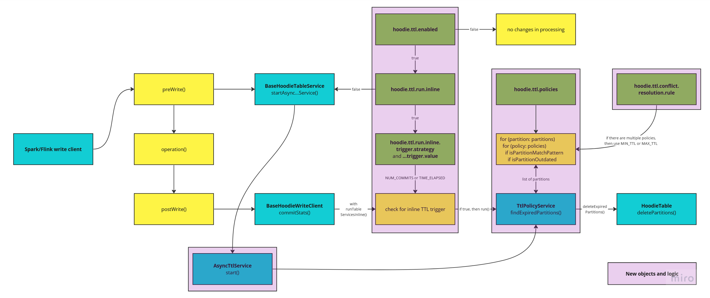

<!--
  Licensed to the Apache Software Foundation (ASF) under one or more
  contributor license agreements.  See the NOTICE file distributed with
  this work for additional information regarding copyright ownership.
  The ASF licenses this file to You under the Apache License, Version 2.0
  (the "License"); you may not use this file except in compliance with
  the License.  You may obtain a copy of the License at

       http://www.apache.org/licenses/LICENSE-2.0

  Unless required by applicable law or agreed to in writing, software
  distributed under the License is distributed on an "AS IS" BASIS,
  WITHOUT WARRANTIES OR CONDITIONS OF ANY KIND, either express or implied.
  See the License for the specific language governing permissions and
  limitations under the License.
-->
# RFC-65: Partition TTL management

## Proposers

- @geserdugarov
- @wombatu-kun

## Approvers
- @
- @

## Status

JIRA: [HUDI-5823](https://issues.apache.org/jira/browse/HUDI-5823)

## Abstract

To prevent unlimited growth of data in Hudi, users have possibility to configure `hoodie.cleaner.[commits/hours/fileversions].retained`.
However, at least the last file slice in each file group would be saved, no matter how old data is.
And if incoming data stream constantly generates new partitions with leaving some number of file groups 
in old partitions then data will grow infinitely. The most simple scenario for this is data partitioning by date.

To clean old partitions, users have to search for outdated ones and remove them manually.
This RFC proposes to implement partition level TTL for automation of this process and implement partition cleaning in the background.

## Background

To implement TTL support on partition level, we need to allow users to configure corresponding settings.
It could be done by using call procedures for Spark or by passing settings with write configuration.
All settings could be saved in `hoodie.properties` file.

Other table services support inline and asynchronous running. So, similarly we need to implement inline and asynchronous TTL processing.

During checking that partition is outdated we need some value of last update in the partition.
Hudi already writes `.hoodie_partition_metadata` file in each partition, which contains `commitTime`
and `partitionDepth` properties. To make this file more useful it is possible to add new property `lastUpdateTime`.

To mark outdated partitions for deletion, already implemented `delete_partition` operation could be used. Cleaner will do actual removing. 

## Implementation

### TTL configuration

Common TTL settings are added to the HoodieTableConfig and saved to `hoodie.properties` file:

```java
public class HoodieTableConfig extends HoodieConfig {
    public static final ConfigProperty<Boolean> TTL_POLICIES_ENABLED = ConfigProperty
        .key("hoodie.ttl.enabled")
        .defaultValue(false)
        .withDocumentation("When set to true, will delete old data according to configured TTL policies. By default, false.");
    
    public static final ConfigProperty<Boolean> TTL_RUN_INLINE = ConfigProperty
        .key("hoodie.ttl.run.inline")
        .defaultValue(true)
        .withDocumentation("When set to true and TTL is enabled, then TTL trigger is checked after each write."
        + " The outdated data will be removed during the next cleaning operation, after TTL check data is marked for deletion."
        + " When set to false and TTL is enabled, then outdated partitions are searched after each clean.");
    
    public static final ConfigProperty<String> TTL_TRIGGER_STRATEGY = ConfigProperty
        .key("hoodie.ttl.run.inline.trigger.strategy")
        .defaultValue(TtlTriggerStrategy.NUM_COMMITS.toString())
        .withDocumentation("Trigger strategy for TTL-management process execution (NUM_COMMITS or TIME_ELAPSED). By default, NUM_COMMITS");
    
    public static final ConfigProperty<String> TTL_TRIGGER_VALUE = ConfigProperty
        .key("hoodie.ttl.run.inline.trigger.value")
        .defaultValue("10")
        .withDocumentation("Value for trigger strategy for TTL-management process execution." 
       + " If TTL_TRIGGER_STRATEGY is set to TIME_ELAPSED then TTL_TRIGGER_VALUE units considered as ChronoUnit.DAYS");
    
    public static final ConfigProperty<String> TTL_POLICIES_CONFLICT_RESOLUTION_RULE = ConfigProperty
      .key("hoodie.ttl.conflict.resolution.rule")
      .defaultValue(TtlPoliciesConflictResolutionRule.MAX_TTL.toString())
      .withDocumentation("TTL policies conflict resolution rule (MIN_TTL or MAX_TTL):"
          + " MIN_TTL used in case of 'prefer cleaning' to minimize disk space costs; "
          + " MAX_TTL used in case of 'prefer to save data' to prevent deletion of any data in case of ambiguity. By default, MAX_TTL");
}
```

User interface for TTL configuration from Hudi CLI:

```java
@ShellComponent
public class TtlCommand {
  @ShellMethod(key = "ttl on", value = "Turns on TTL management")
  public String enableTtlManagement(
      @ShellOption(value = {"--runInline"}, help = "If true, then TTL trigger is checked after each write") final String runInline) {}

  @ShellMethod(key = "ttl off", value = "Turns off TTL management")
  public String disableTtlManagement() {}

  @ShellMethod(key = "ttl settings", value = "Updates TTL configuration settings (does not change on/off property)")
  public String updateSettings(
      @ShellOption(value = {"--triggerStrategy"}, help = "Trigger strategy: NUM_COMMITS or TIME_ELAPSED") final String strategy,
      @ShellOption(value = {"--triggerValue"}, help = "Value for trigger strategy: number of commits or elapsed DAYS") final String value,
      @ShellOption(value = {"--resolveConflictsBy"}, help = "Value for policies conflict resolution: MAX_TTL or MIN_TTL") final String resolveConflictsBy) {}
  
  @ShellMethod(key = "ttl show", value = "Fetches all configured TTL policies")
  public String showPolicies() {}

  @ShellMethod(key = "ttl save", value = "Upserts TTL policy")
  public String savePolicy(
      @ShellOption(value = {"--json"}, help = "JSON representation of TTL policy") final String json) {}

  @ShellMethod(key = "ttl delete", value = "Deletes TTL policy by spec")
  public String deleteBySpec(
      @ShellOption(value = {"--spec"}, help = "Value of spec field of the TTL policy") final String spec) {}

  @ShellMethod(key = "ttl empty", value = "Deletes all configured TTL policies")
  public String emptyPolicies() {}
}
```

Also, user could change TTL configuration by passing corresponding parameters, for instance:

```scala
spark.emptyDataFrame.write
  .format("org.apache.hudi")
  .option("hoodie.ttl.enable", true)
  .option("hoodie.ttl.run.inline", true)
  .option("hoodie.ttl.run.inline.trigger.strategy", "NUM_COMMITS")
  .option("hoodie.ttl.run.inline.trigger.value", "8")
  .option("hoodie.ttl.conflict.resolution.rule", "MIN_TTL")
  .mode(Append)
  .save("/table-path")
```

To support call procedures, new ones will be added to `org.apache.spark.sql.hudi.command`:
- `TtlConfigurationProcedure` for TTL settings configuration,
- `TtlSaveProcedure` to add new policies,
- `TtlDeleteProcedure` to remove existing policy,
- `TtlShowProcedure` to print current settings and policies,
- `TtlEmptyProcedure` to remove all policies.


### TTL policies

TTL policies are stored in JSON format in `.hoodie.properties` file. Content of this JSON is the following:

```java
public class TtlPolicy {
    @NotEmpty String spec; // considered as ID of the policy
    @NotNull TtlPolicyLevel level; // enum: PARTITION, or RECORD
    @NotNull ChronoUnit units; // from: YEARS, MONTHS, WEEKS, or DAYS
    @NotNull Integer value; // greater than 0, value for units
}
```

Call procedures could be used to set TTL policies, for instance:

```scala
spark.sql("call ttl_policy_save(table => 'table-name', spec => '*', units => 'YEARS', value => '1', level => 'PARTITION')")
spark.sql("call ttl_policy_save(path => 'table-path', spec => 'country=US/*', units => 'MONTHS', value => '2', level => 'PARTITION')")
```

For TTL configuration we could lock `.hoodie.properties` file, because it is not a frequent operation.

### TTL processing

We are considering two main workflows of TTL processing:
- inline, similar to other table services,
- asynchronous, similar to asynchronous cleaning or archiving.

The schema for both workflows is presented below:



1. For inline TTL processing, checking of trigger strategy and values are similar to clean operation. It is called from postwrite operations. 
2. If it's time to run TTL, then we are going through the list of all partitions and compare it with specs from policies.
If there is a match then we use the current TTL policy and don't look further for other policies, check conditions and move to the next partition.
It is needed for resolving conflicts in the case of multiple matches.
The list of policies is sorted in ascending or descending order of TTL values, which depends on `hoodie.ttl.conflict.resolution.rule`:
   - MIN_TTL, ascending order, used in case of 'prefer cleaning' to minimize disk space costs;
   - MAX_TTL, descending order, used in case of 'prefer to save data' to prevent deletion of any data in case of ambiguity.
   By default, MAX_TTL, 'prefer to save data', is used.
3. For the list of outdated partitions `DELETE_PARTITION` operation is called. It creates corresponding `replacecommit` in the Timeline.
Concurrency is supported by `DELETE_PARTITION` operation.

The similar process for asynchronous TTL processing, but it is called from prewrite operations.

## Rollout/Adoption Plan

The main problem here is the lack of `lastUpdateTime` properties in partition metadata by default.
For adding this property, we could implement Spark SQL command `ttl_update_partitions`, which should be run by user only once before using TTL.
It is needed to clarify for user what is happening.
In the case of background first running integrated with some other operation, the long time running could be confusing. We try to avoid this. 

Default values for TTL settings are chosen in the way, that there are no differences in behaviour after TTL implementation.

## Test Plan

1. Unit tests for new functionality. Run of all other unit tests to be sure that the default behaviour is not changed.
2. Integration tests using Spark and Flink engines.
3. Load tests with 10'000 partitions on real cluster with HDFS and Spark.

For load tests, data from TPC-H benchmark could be used. TPC-H schema contains 8 tables: `LINEITEM`, `ORDERS`, `PARTSUPP`, `PART`, `CUSTOMER`, `SUPPLIER`, `NATION`, and `REGION`.
The number of rows in each table, except `NATION` and `REGION`, depends on Scale Factor (`SF`). Number of rows in `LINEITEM` and `SUPPLIER` are `6'000'000*SF` and `10'000*SF` correspondigly.
Also, the `LINEITEM` table contains foreign key `SUPPKEY`, which is primary for the `SUPPLIER` table.
Therefore, we could use `SF=1` for data generation in TPC-H benchmark, and write `LINEITEM` table as Hudi table partitioned by `SUPPKEY` column to obtain 10'000 partitions in a result.
