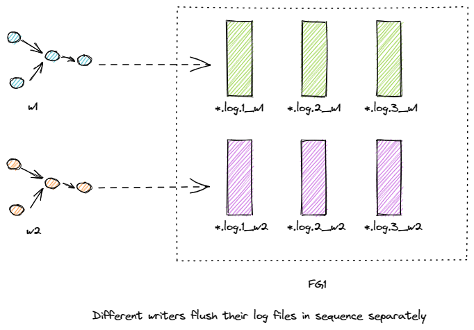
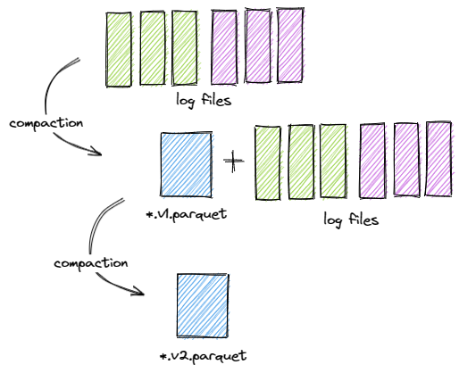
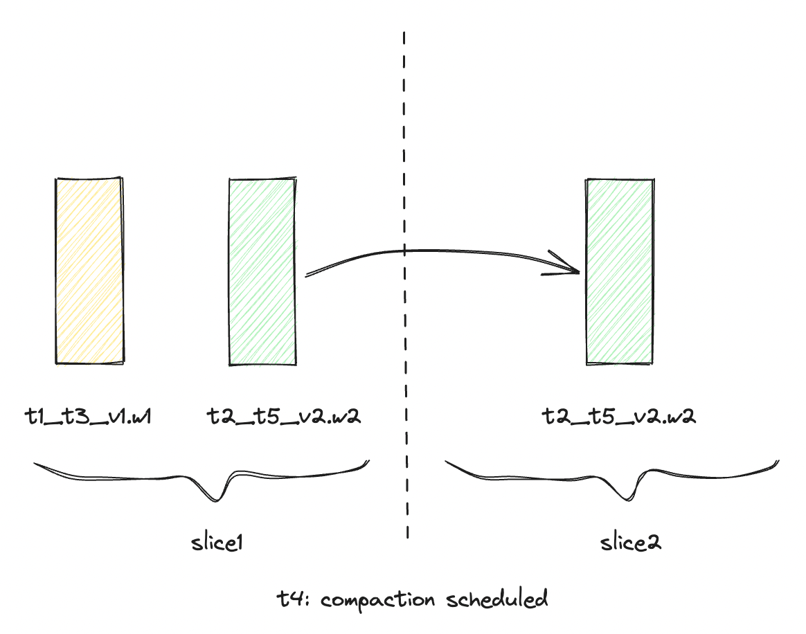
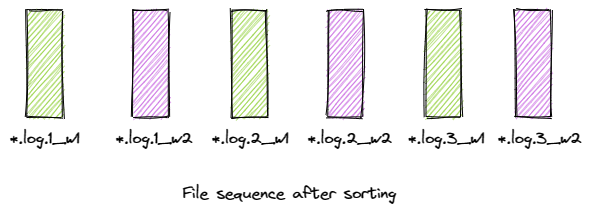

<!--
  Licensed to the Apache Software Foundation (ASF) under one or more
  contributor license agreements.  See the NOTICE file distributed with
  this work for additional information regarding copyright ownership.
  The ASF licenses this file to You under the Apache License, Version 2.0
  (the "License"); you may not use this file except in compliance with
  the License.  You may obtain a copy of the License at

       http://www.apache.org/licenses/LICENSE-2.0

  Unless required by applicable law or agreed to in writing, software
  distributed under the License is distributed on an "AS IS" BASIS,
  WITHOUT WARRANTIES OR CONDITIONS OF ANY KIND, either express or implied.
  See the License for the specific language governing permissions and
  limitations under the License.
-->
# RFC-66: Non-blocking Concurrency Control

## Proposers
- @danny0405
- @ForwardXu

## Approvers
-

## Status

JIRA: [Lockless multi writer support](https://issues.apache.org/jira/browse/HUDI-5672)

## Abstract

Apache Hudi community has seen instant time based Optimistic Concurrency Control (OCC) could cause serious write-write conflicts for important
application scenarios, e.g., multi-writer ingestion. In this RFC, we propose a completion time based Non-Blocking Concurrency Control (NBCC) scheme,
which not only brings more practical semantics to various Hudi operations, like `FileSlice` ordering, but also much higher performance
for multi-writer operations, like frequent writes with non-blocked compactions.

## Background
Apache Hudi already supports basic OCC with a number of lock providers.
However, in the scenario of multi-writer streaming ingestion, our OCC does not work well because
write-write conflicts would happen frequently.
For hashing index, writers utilize a deterministic hashing algorithm based on primary keys to distribute records.
In normal cases, these keys are evenly distributed among all data buckets. That means, in a single data flushing,
one writer could append to all data buckets, and conflicts could happen when there are multiple such writers.
For bloom filter index, the situation is slightly different. We write into the **small** bucket in higher priority using a small-file-load-rebalancing strategy,
such that multiple writers is prone to write into the same **small** buckets at the same time, which causes conflicts.
Therefore, OCC does not work well for multiple streaming writers ingestion. In this RFC, we propose a non-blocking solution for streaming ingestion.

Streaming jobs are suitable for data ingestion since it does not need complex pipeline orchestration and has a smother write workload.
Most of the raw data set we are handling today are generated constantly in streaming way.

In multi-writer streaming ingestion, several streaming events with the same schema sink into one Hudi table, such that the table becomes
a UNION table view for all input data set. This is a common use case in reality since the data could come from various data sources.

Another important use case we want to unlock is the real-time data set join. One of the serious pain points in streaming computation is the dataset join.
For example, Flink engine has basic supports for SQL JOINs, meanwhile, it stores the input records in its inner state-backend. Such design is very expensive 
for pure data join with no additional computations.
In [HUDI-3304](https://issues.apache.org/jira/browse/HUDI-3304), we introduced a `PartialUpdateAvroPayload`, in combination with the lockless multi-writer,
we can implement N-ways data sources join in real-time! Hudi would take care of the payload join during compaction service procedure.

## Design

### The Precondition

#### MOR Table Type Is Required

The table type must be `MERGE_ON_READ`, so that we can defer the conflict resolution to the compaction phase. The compaction service would resolve the conflicts of the same keys by respecting the event time sequence of the events.

#### Deterministic Bucketing Strategy

Deterministic bucketing strategy is required, because the same records keys from different writers are desired to be distributed into the same bucket, not only for UPSERTs, but also for all the new INSERTs.

#### Lazy Cleaning Strategy

Config the cleaning strategy as lazy so that the pending instants are not rolled back by the other active writers.

### Basic Work Flow

#### Writing Log Files Separately In Sequence

Basically, each writer flushes the log files in sequence, the log file rolls over for different versioning number,
a pivotal thing needs to note here is that we need to make the write_token unique for the same version log files with the same base instant time,
so that the file name does not conflict for the writers.

The log files generated by a single writer can still preserve the sequence by versioning number, which is important if the natual order is needed for single writer events.



### The Compaction Procedure

The compaction service is the duty role that actually resolves the conflicts. Within a file group, it sorts the files then merge all the record payloads for a record key.
The event time sequence is respected by combining the payloads with event time field provided by the payload (known as the `preCombine` field in Hudi).



#### Non-Serial Compaction Plan Schedule
Currently, the compaction plan scheduling must be in serial order with the writers, that means, while scheduling the compaction plan, no ongoing writers should be writing to
the table. This restriction makes the compaction almost impossible for multi streaming writers because there is always an instant writing to the table for streaming ingestion.

In order to unblock the compaction plan scheduling and keep the completeness of the readers, we introduce the completion time for file slice generation:

- Support quick look-up from instant time ➝ completion time, the [HUDI-6539](https://issues.apache.org/jira/browse/HUDI-6539) supports fast completion time queries on archived timeline, based on this, we are able
to support flexible completion time queries on both active and archived timeline, see [HUDI-6725](https://issues.apache.org/jira/browse/HUDI-6725);
- New compaction plan scheduling to comply with the completion time, that is: only log files that have smaller completion time(than the compaction start instant time) should be considered
- New file slice generation strategy, a log file with smaller instant time (than the compaction instant time) but greater completion time should be assigned to a new file slice
- By combining #2 and #3, in general, we are slicing by comparing the compaction start time with the log files completion time.



Assumes we have two log files, with instant time & completion time as [t1, t3] and [t2, t5], at t4, a compaction plan was scheduled,
the plan does not include file t2_t5_v1.w2, in the reader view, the log file should be assigned to a different file slice than the t4 instant time.

#### Global Monotonically Increasing Timestamp

In order to make the time deterministic among cloud storages, we use a logical time generated by a special **TimeGenerator**, see [HUDI-1623](https://issues.apache.org/jira/browse/HUDI-1623) for details.

#### Assumption On Locks
In order to get global monotonically increasing time generation, we may introduce lock providers on the instant time generation and the creation of completed metadata file.
That means, for each instant time/completion time generation request, there is a try-lock action. As a special case, we store the completion time as part of the completed
metadata file name, the time generation and file creation should have atomicity altogether, they should be guarded under the same lock of regular time generation request.

### The Log File Naming Convention

We use the current instant time instead of the base commit time in the file name,
so that tasks from different writers can not conflict in file name. We can also parse the file name to fetch the instant time quickly. 
Finally, the log name is with the following pattern:

```shell
${uuid}_${delta_commit instant time}.log.${version}_${task_token}
```

### The Sorting Rules for Log Files from Different Writers

The sorting rules is important because it somehow decides the natual order processing,
especially when the event time field are the same, and we don't know which payload to choose when combining.
Here we can keep using the log file name compactor of current codebase, that is:

```sql
order by delta_commit_time, version_number, write_token
```

For a single writer, its log files natual order is preserved by the auto increasing version_number,
for multiple writers, we try the best to preserve the natual order still with the version number,
but the write_token has deterministic priority in sorting, which breaks the file generation order.



### Format changes

| Type                       | Changes                                                                                                                            |
|----------------------------|------------------------------------------------------------------------------------------------------------------------------------|
| Commit/compaction metadata | No changes                                                                                                                         |
| Commit file name           | we are only going to add completion time in completed metadata filename for all actions                                            |
| Log file format            | Adding deltacommit instant time to log file name. The file name does not contain base instant time; No changes to log block format |

### Commit Protocol

| Type                            | Content                                                                                                                                       |
|---------------------------------|-----------------------------------------------------------------------------------------------------------------------------------------------|
| Writer expectations             | Writer does not need to look up the latest file slice to fetch the base commit time anymore, it always uses the current instant time directly |
| Conflict Resolution             | No explicit conflict resolution, it is handled by the compactor                                                                               |
| Reader expectations             | Readers still query based on file slices, see the pseudocode for new file slicing                                                             |
| Synchronization and correctness | Still need some mutex on commit log (timeline). Getting the completion time and adding to the timeline needs to happen atomically             |

**Note:** Clustering and updates conflict resolution is not in the scope of non-blocking concurrency control, you still need the OCC for course-grained failures and retries. 

## Appendix

### Pseudocode for New File Slicing

Assume we have the following inputs to build the file slices:
1. `base_files_by_file_id`: a map of filegroup id to list of base files.
2. `log_files_by_file_id`: a map of feilgroup id to list of log files.
3. `timeline`: Hudi write timeline .

The pseudocode below introduces a notion of **file slice barriers**, which contain a list of instant (start) times of 
the base files in descending order. Barriers will help in demarcating file slices. The below pseudocode builds the file 
slices per file group. Building file groups from file slices is not shown but can be easily done.

```python
# new file slicing
def build_file_slices(base_files_by_file_id, log_files_by_file_id, timeline):
    # get set of all filegroup ids
    file_id_set = base_files_by_file_id.keys
    file_id_set.add_all(log_files_by_file_id.keys)
    
    for file_id in file_id_set:
        # sort the base files by descending order of instant (start) time, i.e. last written base file first
        base_files_in_file_id = base_files_by_file_id[file_id].sort(BASE_FILE_REVERSE_COMPARATOR)
        # filter out log files that have been log-compacted
        log_files_in_file_id = handle_log_compaction(log_files_by_file_id[file_id], timeline)
        # sort the log files by ascending order of completion time
        log_files_in_file_id.sort(LOG_FILE_COMPARATOR)
        # get list of file slice barriers for this fielgroup id
        file_slice_barriers = get_file_slice_barriers(base_files_in_file_id, log_files_in_file_id)    
        # build file slices
        file_slices = []
        for log_file in log_files_in_file_id:
            file_slice = find_file_slice(log_file, file_slice_barriers)
            file_slices.add(file_slice)
            
            
# Given all log files for a file id, filter out such log files that have been log-compacted.
def handle_log_compaction(log_files_in_file_id, timeline):
    log_compaction_instants = timeline.get_completed_log_compaction()
    for log_compaction_instant in log_compaction_instant:
        log_files_compacted = get_log_files_compacted(log_compaction_instant)
        log_files_in_file_id.remove(log_files_compacted)
        
    return log_files_in_file_id


# Given base files and log files for a filegroup id, return a list containing file slice barriers. 
def get_file_slice_barriers(base_files_in_file_id, log_files_in_file_id):
    file_slice_barriers = []
    if base_files_in_file_id.size > 0:
        for base_file in base_files_in_file_id:
            file_slice_barriers.add(instant_time(base_file))
    elif log_files_in_file_id.size > 0:
        # for a file group with no base file, the instant time of the earliest log file is the barrier
        file_slice_barriers.add(instant_time(log_files_in_file_id[0]))
    
    return file_slice_barriers


def find_file_slice(log_file, file_slice_barriers):
  completion_time = completion_time(log_file)
  for barrier in file_slice_barriers:
    if (barrier < completion_time):
      # each file slice is attached to a barrier, returns the existing file slice or a fresh new one based on the barrier.
      # note that since file_slice_barriers is reverse sorted, we would return the file slice 
      # corresponding to the max barrier just less than the completion_time
      return get_or_create_file_slice(log_file, barrier)


all_file_slices = {} # map of barrier to file slice

def get_or_create_file_slice(log_file, barrier):
  if barrier in all_file_slices:
    # add log file to the file slice for the barrier
    all_file_slices[barrier].add_log_file(log_file)
  else:
    # else create a new file slice with the barrier time
    file_slice = FileSlice(barrier)
    file_slice.add_log_file(log_file)
    all_file_slices[barrier] = file_slice

  return all_file_slices[barrier]
```

In order to prove the correctness, let's use the following notations:
1. `Ts_Fx`: instant (start) time for a base file `Fx`.
2. `Tc_Fx`: completion time for a base file `Fx`.
3. `Ts_Lx`: instant (start) time for a log file `Lx` for the same file id as `Fx`.
4. `Tc_Lx`: completion time for a log file `Lx` for the same file id as `Fx`.

The main idea is that the file slicing per file group should satisfy the following temporal order of base files and log 
files within that file group:
1. A log file `Ly` _temporally follows_ another base file `Fx` if `Ts_Fx` < `Ts_Ly`. 
2. A base file `Fy` _temporally follows_ another base file `Fx` if `Ts_Fx` < `Tc_Fx` < `Ts_Fy`.
3. A log file `Ly` _temporally follows_ another log file `Lx` if `Ts_Lx` < `Tc_Lx` < `Ts_Ly`.
4. A base file `Fy` _temporally follows_ another log file `Lx` if `Ts_Lx` < `Tc_Lx` < `Ts_Fy`.

Barriers (sorted by latest first) demarcates file slicing boundary, as in, whenever you hit a barrier, a new slice needs
to be created and attached to the barrier.

#### A Demo Conducive to Comprehension

Just to make it concrete for the readers, we can add an example.
Let's take this example of one filegroup and consider the following sequence of commits:

```xml
fg_t10 -> very first commit with start time, end time as [t10, t20].
l1 -> log file version 1 start time, end time as [t21, t40].
l2 -> concurrent log file version 2 [t30, t50].
fg_t60 -> base file due to compaction [t60, t80].
l3 -> concurrent log file version 3 [t35, t90].
```

In this case, file_slice_barriers list is [t60, t10]. For a query at `t100`, `build_file_slices` should build the 
following file slices corresponding to each barrier time:

```xml
[
{t60, fg_t60.parquet, {l3}},
{t10, fg_t10.parquet, {l1, l2}}
]
```

This assumes that file slicing is done based on completion time.

### Pseudocode for Time Travel Queries

```python
# This is based on the new file slicing.
# Given a time travel query with "as of timestamp" t, 
# first find the write 'w' with max completionTime(w) < t, among all the writes that completed before t 
# (Note t may not match an existing completion time directly) 
max_completion_time = findMaxCompletedTimeBefore(t) 

fileSlicesToRead = [] 
for fg in fileGroups:
  fileSlice = latestFileSliceThatIsOverlappingWithCompletionTime(fg, max_completion_time)
  fileSlicesToRead.append(fileSlice)
return fileSlicesToRead

def latestFileSliceThatIsOverlappingWithCompletionTime(fg, max_completion_time):
  # getAllFileSlices() returns the file slices as it does today ordered reversely by instant time.
  for f_slice in fg.getAllFileSlices():
    # the min_completion time may takes time if there is a base file.
    fs_min_completion_time = getMinCompletionTime(f_slice)
    fs_max_completion_time = getMaxCompletionTime(f_slice)

    if (fs_min_completion_time <= max_completion_time):
      # Needs to remove the log files that completed later than the maxCompletionTime
      if (fs_max_completion_time > max_completion_time):
        f_slice.getLogFiles().removeIf(log_file -> completion_time(log_file) > max_completion_time)
      
      return f_slice
  
  return empty
```

### Pseudocode for Incremental/CDC Queries

```python
#1. Fetch all base and log files with completion time between t1 (exclusive) and t2 (inclusive), 
files = fetchFilesFromMetadataWrittenBetweenCompletionTime(t1, t2) 

# just resolve the committed new files, and use that to composite the fs view;
# use the file slicing algorithm above-mentioned.
fs_view = build_fs_view(files)

# also fetch valid instant set by the completion time range [t1, t2], name it as valid_instants;
valid_instants = find_instants_finished_in_time_range(t1, t2)

# for each file slice, we filter the rows by the set of valid_instants;
# for log file we have block filtering by instant time, but for base file, this is inefficient
for file_slice in fs_view.getLatestFileSlices:
  filterRecordsBetween(t1, t2, read_file_slice_with_filtering(valid_instants))
```