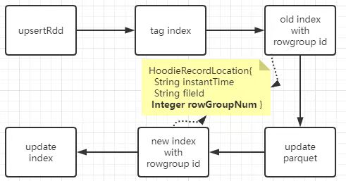
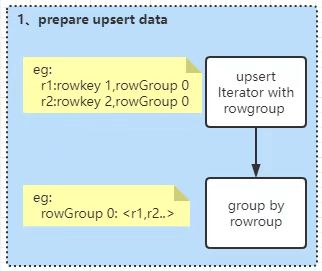
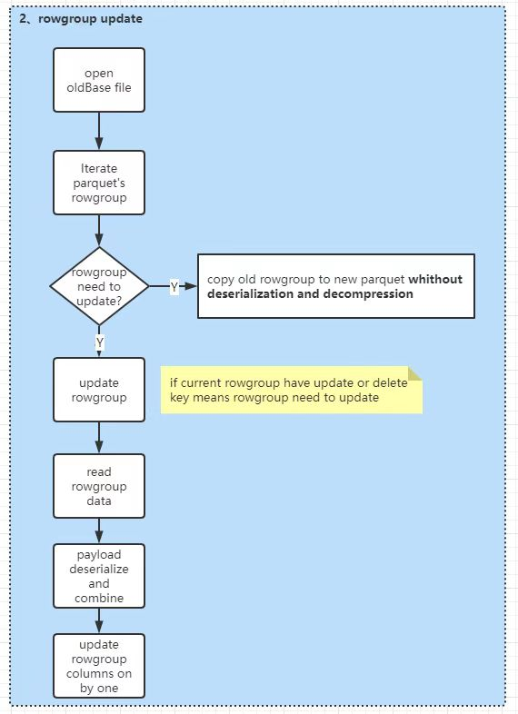
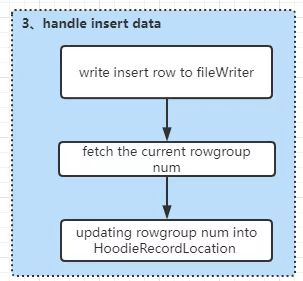

<!--  Licensed to the Apache Software Foundation (ASF) under one or more  contributor license agreements. See the NOTICE file distributed with  this work for additional information regarding copyright ownership.  The ASF licenses this file to You under the Apache License, Version 2.0  (the "License"); you may not use this file except in compliance with  the License. You may obtain a copy of the License at

<pre class="md-fences md-end-block ty-contain-cm modeLoaded" spellcheck="false" lang="" cid="n2" mdtype="fences" style="box-sizing: border-box; overflow: visible; font-family: var(--monospace); font-size: 0.9em; display: block; break-inside: avoid; text-align: left; white-space: normal; background-image: inherit; background-position: inherit; background-size: inherit; background-repeat: inherit; background-attachment: inherit; background-origin: inherit; background-clip: inherit; background-color: rgb(248, 248, 248); position: relative !important; border: 1px solid rgb(231, 234, 237); border-radius: 3px; padding: 8px 4px 6px; margin-bottom: 15px; margin-top: 15px; width: inherit; color: rgb(51, 51, 51); font-style: normal; font-variant-ligatures: normal; font-variant-caps: normal; font-weight: 400; letter-spacing: normal; orphans: 2; text-indent: 0px; text-transform: none; widows: 2; word-spacing: 0px; -webkit-text-stroke-width: 0px; text-decoration-thickness: initial; text-decoration-style: initial; text-decoration-color: initial;"> http://www.apache.org/licenses/LICENSE-2.0</pre>

Unless required by applicable law or agreed to in writing, software  distributed under the License is distributed on an "AS IS" BASIS,  WITHOUT WARRANTIES OR CONDITIONS OF ANY KIND, either express or implied.  See the License for the specific language governing permissions and  limitations under the License.  -->

# RFC-68: A more effective HoodieMergeHandler for COW table with parquet

## Proposers

*   @loukey-lj

## Approvers

*   @<approver1 github username>

*   @<approver2 github username>

## Status

JIRA: https://issues.apache.org/jira/browse/HUDI-4790

> Please keep the status updated in `rfc/README.md`.

## Abstract

To provide a more effective HoodieMergeHandler for COW table with parquet. Hudi rewrite whole parquet file every COW, that costs a lot in De/serialization and De/compression.  To decrease this cost, a 'surgery' is introduced, which rebuilds a new parquet from an old one,  just copying unchanged rowGroups and overwriting changed rowGroups when updating parquet files.

## Background

*   Parquet is a columnar storage format. All data is horizontally divided into row groups. A row group contains the column chunks of all columns in the interval corresponding to this row group. A column chunk is composed of pages, which are compression and coding units. 

*   In current version of Hudi, a complex De/serialization and De/compression happens every time upserting long tail data on COW, which causes giant CPU/IO cost.

*   The purpose of current RFC aims to decrease costs of De/serialization and De/compression in upserting.  Try to think about the reality, if we know which row groups need to be updated and even more the columns need to be updated in these row groups, we can skip much data's de/serialization and de/compression. That brings giant improvement.

## Implementation

### How partial update works

a. Add one more member variable(Integer rowGroupId) into the class HoodieRecordLocation.

<pre class="md-fences md-end-block ty-contain-cm modeLoaded" spellcheck="false" lang="java" cid="n35" mdtype="fences" style="box-sizing: border-box; overflow: visible; font-family: var(--monospace); font-size: 0.9em; display: block; break-inside: avoid; text-align: left; white-space: normal; background-image: inherit; background-position: inherit; background-size: inherit; background-repeat: inherit; background-attachment: inherit; background-origin: inherit; background-clip: inherit; background-color: rgb(248, 248, 248); position: relative !important; border: 1px solid rgb(231, 234, 237); border-radius: 3px; padding: 8px 4px 6px; margin-bottom: 15px; margin-top: 15px; width: inherit; color: rgb(51, 51, 51); font-style: normal; font-variant-ligatures: normal; font-variant-caps: normal; font-weight: 400; letter-spacing: normal; orphans: 2; text-indent: 0px; text-transform: none; widows: 2; word-spacing: 0px; -webkit-text-stroke-width: 0px; text-decoration-thickness: initial; text-decoration-style: initial; text-decoration-color: initial;">public class HoodieRecordLocation implements Serializable {
 protected String instantTime;
 protected String fileId;
 /**
 * the index of key in parquet rowGroup num.
 */
 protected Integer rowGroupNum;
 }</pre>

b. Number of rowgroup of a Parquet starts from 0 which continously increases util BlockSize reaches `hoodie.parquet.block.size`.  Since every record in parquet belongs to a rowgroup, we can simply use parquet API to locate rowgroup num of new record which needs to be written into corresponding parquet file, and then record rowgroup num into hoodieRecordLocation of each hoodieRecord.  HoodieRecordLocations will be collected into WriteStatus which will be updated to the index on batch.

c. At phase of tagging index, rowgroup num will be queried out, so that they can be used to accelerate updating files.

Concrete flow of upserting is as below:

### steps of writing a parquet file on cow

1.  (upserting) data preparing

    At phase of tag indexing, find out `HoodieRecord.currentLocation.rowGroupNum` of updating records, if rowgroup num is empty, record does implicitly not exists, which means current operation is a INSERT, otherwise DELETE or UPDATE. At next, rowgroup nums are used to make grouping by of the updating records so as to collect all rowgroups which should be updated.

2.  rowgroup updating

    The process of updating rowgroup is divided into 5 steps.

    1.  Deserializing and decompressing the columns which need to be combined and assembled into a List<Pari<rowKey,Pari<offset,record>> structure,   where offset represents record's row number in rowgroup(every rowgroup's row number starts with zero).

    2.  Using HoodieRecordPayload#getInsertValue to deserialize the upserting data, then invoking HoodieRecordPayload#getInsertValue to combine the updating rows. 

    3.  Converting combined data into column structure, just like `[{"name":"zs","age":10},{"name":"ls","age":20}] ==> {"name":["sz","ls"],"age":[10,20]}`

    4.  Iterating rowgroups' columns. if column needn't be updated then writing column by datapage without decompression and deserialization.

    5.  If column needs to be updated then write columns one by one.

3.  insert handling

## Rollout/Adoption Plan

*   What impact (if any) will there be on existing users?

*   If we are changing behavior how will we phase out the older behavior?

*   If we need special migration tools, describe them here.

*   When will we remove the existing behavior

## Test Plan

Describe in few sentences how the RFC will be tested. How will we know that the implementation works as expected? How will we know nothing broke?.
