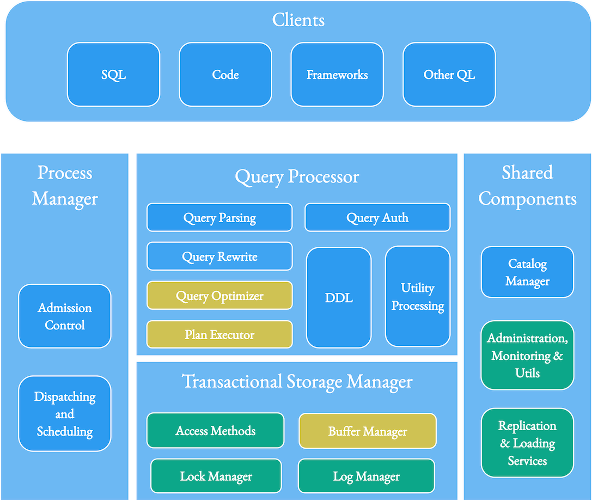

<!--
  Licensed to the Apache Software Foundation (ASF) under one or more
  contributor license agreements.  See the NOTICE file distributed with
  this work for additional information regarding copyright ownership.
  The ASF licenses this file to You under the Apache License, Version 2.0
  (the "License"); you may not use this file except in compliance with
  the License.  You may obtain a copy of the License at

       http://www.apache.org/licenses/LICENSE-2.0

  Unless required by applicable law or agreed to in writing, software
  distributed under the License is distributed on an "AS IS" BASIS,
  WITHOUT WARRANTIES OR CONDITIONS OF ANY KIND, either express or implied.
  See the License for the specific language governing permissions and
  limitations under the License.
-->
# RFC-69: Hudi 1.X

## Proposers

* Vinoth Chandar

## Approvers

*   Hudi PMC

## Status

Completed

## Abstract

This RFC proposes an exciting and powerful re-imagination of the transactional database layer in Hudi to power continued innovation across the community in the coming years. We have [grown](https://git-contributor.com/?chart=contributorOverTime&repo=apache/hudi) more than 6x contributors in the past few years, and this RFC serves as the perfect opportunity to clarify and align the community around a core vision. This RFC aims to serve as a starting point for this discussion, then solicit feedback, embrace new ideas and collaboratively build consensus towards an impactful Hudi 1.X vision, then distill down what constitutes the first release - Hudi 1.0.

## **State of the Project**

As many of you know, Hudi was originally created at Uber in 2016 to solve [large-scale data ingestion](https://www.uber.com/blog/uber-big-data-platform/) and [incremental data processing](https://www.uber.com/blog/ubers-lakehouse-architecture/) problems and later [donated](https://www.uber.com/blog/apache-hudi/) to the ASF. 
Since its graduation as a top-level Apache project in 2020, the community has made impressive progress toward the [streaming data lake vision](https://hudi.apache.org/blog/2021/07/21/streaming-data-lake-platform) to make data lakes more real-time and efficient with incremental processing on top of a robust set of platform components. 
The most recent 0.13 brought together several notable features to empower incremental data pipelines, including - [_RFC-51 Change Data Capture_](https://github.com/apache/hudi/blob/master/rfc/rfc-51/rfc-51.md), more advanced indexing techniques like [_consistent hash indexes_](https://github.com/apache/hudi/blob/master/rfc/rfc-42/rfc-42.md) and 
novel innovations like [_early conflict detection_](https://github.com/apache/hudi/blob/master/rfc/rfc-56/rfc-56.md) - to name a few.

Today, Hudi [users](https://hudi.apache.org/powered-by) are able to solve end-end use cases using Hudi as a data lake platform that delivers a significant amount of automation on top of an interoperable open storage format. 
Users can ingest incrementally from files/streaming systems/databases and insert/update/delete that data into Hudi tables, with a wide selection of performant indexes. 
Thanks to the core design choices like record-level metadata and incremental/CDC queries, users are able to consistently chain the ingested data into downstream pipelines, with the help of strong stream processing support in 
recent years in frameworks like Apache Spark, Apache Flink and Kafka Connect. Hudi's table services automatically kick in across this ingested and derived data to manage different aspects of table bookkeeping, metadata and storage layout. 
Finally, Hudi's broad support for different catalogs and wide integration across various query engines mean Hudi tables can also be "batch" processed old-school style or accessed from interactive query engines.

## **Future Opportunities**

We have been adding new capabilities in the 0.x release line, but we can also turn the core of Hudi into a more general-purpose database experience for the lake. As the first kid on the lakehouse block (we called it "transactional data lakes" or "streaming data lakes" 
to speak the warehouse users' and data engineers' languages, respectively), we made some conservative choices based on the ecosystem at that time. However, revisiting those choices is important to see if they still hold up.

*   **Deep Query Engine Integrations:** Back then, query engines like Presto, Spark, Flink, Trino and Hive were getting good at queries on columnar data files but painfully hard to integrate into. Over time, we expected clear API abstractions 
around indexing/metadata/table snapshots in the parquet/orc read paths that a project like Hudi can tap into to easily leverage innovations like Velox/PrestoDB. However, most engines preferred a separate integration - leading to Hudi maintaining its own Spark Datasource, 
Presto and Trino connectors. However, this now opens up the opportunity to fully leverage Hudi's multi-modal indexing capabilities during query planning and execution.
*   **Generalized Data Model:** While Hudi supported keys, we focused on updating Hudi tables as if they were a key-value store, while SQL queries ran on top, blissfully unchanged and unaware. Back then, generalizing the support for 
keys felt premature based on where the ecosystem was, which was still doing large batch M/R jobs. Today, more performant, advanced engines like Apache Spark and Apache Flink have mature extensible SQL support that can support a generalized, 
relational data model for Hudi tables.
*   **Serverful and Serverless:** Data lakes have historically been about jobs triggered periodically or on demand. Even though many metadata scaling challenges can be solved by a well-engineered metaserver 
(similar to what modern cloud warehouses do anyway), the community has been hesitant towards a long-running service in addition to their data catalog or a Hive metaserver. In fact, our timeline server efforts were stalled 
due to a lack of consensus in the community. However, as needs like concurrency control evolve, proprietary solutions emerge to solve these very problems around open formats. It's probably time to move towards a truly-open 
solution for the community by embracing a hybrid architecture where we employ server components for table metadata while remaining server-less for data.
*   **Beyond structured Data**: Even as we solved challenges around ingesting, storing, managing and transforming data in parquet/avro/orc, there is still a majority of other data that does not benefit from these capabilities. 
Using Hudi's HFile tables for ML Model serving is an emerging use case with users who want a lower-cost, lightweight means to serve computed data directly off the lake storage. Often, unstructured data like JSON and blobs 
like images must be pseudo-modeled with some structure, leading to poor performance or manageability. With the meteoric rise of AI/ML in recent years, the lack of support for complex, unstructured, large blobs in a project like Hudi will only fragment data in lakes.
To this end, we need to support all the major image, video and ML/AI formats with the same depth of capabilities around indexing, mutating or capturing changes.
*   **Even greater self-management**: Hudi offers the most extensive set of capabilities today in open-source data lake management, from ingesting data to optimizing data and automating various bookkeeping activities to 
automatically manage table data and metadata. Seeing how the community has used this management layer to up-level their data lake experience is impressive. However, we have plenty of capabilities to be added, e.g., 
reverse streaming data into other systems or [snapshot management](https://github.com/apache/hudi/pull/6576/files) or [diagnostic reporters](https://github.com/apache/hudi/pull/6600) or cross-region logical replication or 
record-level [time-to-live management](https://github.com/apache/hudi/pull/8062), to name a few.

## **Hudi 1.X**

Given that we have approached Hudi more like a database problem, it's unsurprising that Hudi has many building blocks that make up a database. Drawing a baseline from the 
seminal [Architecture of a Database System](https://dsf.berkeley.edu/papers/fntdb07-architecture.pdf) paper (see page 4), we can see how Hudi makes up the bottom half of a database optimized for the lake, 
with multiple query engines layers - SQL, programmatic access, specialized for ML/AI, real-time analytics and other engines sitting on top. The major areas below directly map how we have tracked 
the Hudi [roadmap](https://hudi.apache.org/roadmap). We will see how we have adapted these components specifically for the scale of data lakes and the characteristics of lake workloads.

_Reference diagram highlighting existing (green) and new (yellow) Hudi components, along with external components (blue)._

The log manager component in a database helps organize logs for recovery of the database during crashes, among other things. At the transactional layer, Hudi implements ways to organize data into file groups and 
file slices and stores events that modify the table state in a timeline. Hudi also tracks inflight transactions using marker files for effective rollbacks. Since the lake stores way more data than typical operational 
databases or data warehouses while needing much longer record version tracking, Hudi generates record-level metadata that compresses well to aid in features like change data capture or incremental queries, effectively 
treating data itself as a log. In the future, we would want to continue improving the data organization in Hudi, to provide scalable, infinite timeline and data history, time-travel writes, storage federation and other features.

The lock manager component helps implement concurrency control mechanisms in a database. Hudi ships with several external lock managers, although we would want to ultimately streamline this through 
our [metaserver](https://github.com/apache/hudi/pull/4718) that serves only timeline metadata today. The paper (pg 81) describes the tradeoffs between the common concurrency control techniques in 
databases: _2Phase Locking_ (hard to implement without a central transaction manager), _OCC_ (works well w/o contention, fails very poorly with contention) and _MVCC_ (yields high throughputs, but relaxed 
serializability in some cases). Hudi implements OCC between concurrent writers while providing MVCC-based concurrency for writers and table services to avoid any blocking between them. Taking a step back, 
we need to ask ourselves if we are building an OLTP relational database to avoid falling into the trap of blindly applying the same concurrency control techniques that apply to them to the high-throughput 
pipelines/jobs writing to the lake. Hudi has a less enthusiastic view of OCC and encourages serializing updates/deletes/inserts through the input stream to avoid performance penalties with OCC for fast-mutating 
tables or streaming workloads. Even as we implemented techniques like Early Conflict Detection to improve OCC, this RFC proposes Hudi should pursue a more general purpose non-blocking MVCC-based concurrency control 
while retaining OCC for simple and batch append-only use cases.

The access methods component encompasses indexes, metadata and storage layout organization techniques exposed to reads/writes on the database. Last year, we added 
a new [multi-modal index](https://www.onehouse.ai/blog/introducing-multi-modal-index-for-the-lakehouse-in-apache-hudi) with support for [asynchronous index building](https://github.com/apache/hudi/blob/master/rfc/rfc-45/rfc-45.md) based 
on MVCC to build indexes without blocking writers and still be consistent upon completion with the table data. Our focus has thus far been more narrowly aimed at using indexing techniques for write performance, 
while queries benefit from files and column statistics metadata for planning. In the future, we want to generalize support for using various index types uniformly across writes and queries so that queries can be planned, 
optimized and executed efficiently on top of Hudi's indices. This is now possible due to having Hudi's connectors for popular open-source engines like Presto, Spark and Trino. 
New [secondary indexing schemes](https://github.com/apache/hudi/pull/5370) and a proposal for built-in index functions to index values derived from columns have already been added.

The buffer manager component manages dirtied blocks of storage and also caches data for faster query responses. In Hudi's context, we want to bring to life our now long-overdue 
columnar [caching service](https://hudi.apache.org/blog/2021/07/21/streaming-data-lake-platform#lake-cache) that can sit transparently between lake storage and query engines while understanding 
transaction boundaries and record mutations. The tradeoffs in designing systems that balance read, update and memory costs are detailed in the [RUM conjecture](https://stratos.seas.harvard.edu/files/stratos/files/rum.pdf). 
Our basic idea here is to optimize for read (faster queries served out of cache) and update (amortizing MoR merge costs by continuously compacting in-memory) costs while adding the cost of cache/memory to the system. 
Currently, there are potentially many candidate designs for this idea, and we would need a separate design/RFC to pursue them.

Shared components include replication, loading, and various utilities, complete with a catalog or metadata server. Most databases hide the underlying format/storage complexities, providing users 
with many data management tools. Hudi is no exception. Hudi has battle-hardened bulk and continuous data loading utilities (deltastreamer, flinkstreamer tools, along with Kafka Connect Sink), 
a comprehensive set of table services (cleaning, archival, compaction, clustering, indexing, ..), admin CLI and much much more. The community has been working on new server components 
like a [metaserver](https://github.com/apache/hudi/pull/4718) that could expand to indexing the table metadata using advanced data structures like zone maps/interval trees or a [table service manager](https://github.com/apache/hudi/pull/4309) to manage Hudi tables 
centrally. We would love to evolve towards having a set of horizontally scalable, highly available metaservers, that can provide both these functionalities as well as some of the lock management capabilities. 
Another interesting direction to pursue would be a reverse loader/streamer utility that can also move data out of Hudi into other external storage systems.

In all, we propose Hudi 1.x as a reimagination of Hudi, as the _transactional database for the lake_, with [polyglot persistence](https://en.wikipedia.org/wiki/Polyglot_persistence), raising the level of 
abstraction and platformization even higher for Hudi data lakes.

## Hudi 1.0 Release

Rome was not built in a day, so can't the Hudi 1.x vision also? This section outlines the first 1.0 release goals and the potentially must-have changes to be front-loaded. 
This RFC solicits more feedback and contributions from the community for expanding the scope or delivering more value to the users in the 1.0 release.

In short, we propose Hudi 1.0 try and achieve the following.

1. Incorporate all/any changes to the format - timeline, log, metadata table...
2. Put up new APIs, if any, across - Table metadata, snapshots, index/metadata table, key generation, record merger,...
3. Get internal code layering/abstractions in place - e.g. HoodieData, FileGroup Reader/Writer, Storage,...
4. Land all major, outstanding "needle mover" PRs, in a safe manner guarded by configs.
5. Integrate some/all of the existing indexes for Spark/Flink/Presto, and validate intended functionality and performance gains.

All changes should be backward compatible and not require rewriting of base/parquet files in existing tables. However, full compaction of the logs or planned downtime to rewrite the 
timeline or rebuilding the metadata table may be necessary when moving from 0.x to 1.0 release. 

Following table details the JIRAs tracking each of these proposed changes for the first release, in sequential order (i.e we will go about working on these in that order).
Also, we indicate what changes are preferable to land in 0.X/master branch before we cut a 1.0 feature branch and fork off using the `Pre Branching` column. (value yes indicates this change
could be landed to ease the process of cherry-picking changes from 0.x -> 1.x for the next few months). Such epics are marking with both `1.0.0` and `0.14.0`/`0.15.0` as fix-versions.

JIRA Issues Filter for 1.0: [link](https://issues.apache.org/jira/issues/?filter=12352767)

| Change                                    | Impact                                                                                                                                              | Pre Branching? | JIRAs/RFCs                                                                                                                                                                              |
|-------------------------------------------|-----------------------------------------------------------------------------------------------------------------------------------------------------|----------------|-----------------------------------------------------------------------------------------------------------------------------------------------------------------------------------------|
| 1.X Storage Format                        | New storage format changes to timeline, log files, file naming, metadata, table properties to unlock features below.                                |                | [HUDI-6242](https://issues.apache.org/jira/browse/HUDI-6242)                                                                                                                            |
| APIs/Abstractions, Record mergers         | Internal APIs and abstractions needed to provide clear layering of functionality across txn, engine integrations.                                   | yes            | [HUDI-6243](https://issues.apache.org/jira/browse/HUDI-6243), [HUDI-3217](https://issues.apache.org/jira/browse/HUDI-3217)                                                              |
| Dev hygiene/Test stability                | Get the house in order in terms of code formatting, build etc before branching off                                                                  | yes            | [HUDI-2261](https://issues.apache.org/jira/browse/HUDI-2261),[HUDI-1574](https://issues.apache.org/jira/browse/HUDI-1574)                                                               |
| Bundling           | Thin down the bundles more, ease integration into different engines further.                                                                        | yes            | [HUDI-2261](https://issues.apache.org/jira/browse/HUDI-3529)                                                               |
| Non-blocking Concurrency Control Protocol | Design of new concurrency scheme on top of 1.X format, with focus on Spark and Flink writers                                                        |                | [HUDI-1456](https://issues.apache.org/jira/browse/HUDI-1456), [HUDI-5672](https://issues.apache.org/jira/browse/HUDI-5672)                                                              |
| Table Format APIs                         | External APIs to read/write data/metadata.                                                                                                          |                | [HUDI-4141](https://issues.apache.org/jira/browse/HUDI-4141)                                                                                                                            |
| Cloud Optimized storage layout            | Support for decoupling layout of files on cloud storage suffering from throttling issues.                                                           |                | [HUDI-3625](https://issues.apache.org/jira/browse/HUDI-3625)                                                                                                                            |
| Logical partitioning via indexing         | Making partitioning just a logical construct and allow different partitioning schemes on same table as coarse indexes.                              |                | [HUDI-512](https://issues.apache.org/jira/browse/HUDI-512)                                                                                                                              |
| Snapshot management                       | Use new timeline to implement easy, and long-living snapshots/savepoints.                                                                           |                | [HUDI-4677](https://issues.apache.org/jira/browse/HUDI-4677)                                                                                                                            |
| Streaming CDC/Incremental reads           | Rework and streamline CDC/Incremental queries on top of new format.                                                                                 |                | [HUDI-2749](https://issues.apache.org/jira/browse/HUDI-2749)                                                                                                                            |
| Writer performance improvements           | Implement various optimizations to write path, like logging updates as deletes + inserts for overwrite scenarios, improvements to table services,.. |                | [HUDI-3249](https://issues.apache.org/jira/browse/HUDI-3249)                                                                                                                            |
| Secondary Indexes                         | Support for few secondary indexes - creation, maintenance, and integration via Spark/Flink SQL                                                      |                | [HUDI-3907](https://issues.apache.org/jira/browse/HUDI-3907)                                                                                                                            |
| Presto/Trino queries                      | Change Presto/Trino connectors to work with new format, integrate fully with metadata                                                               |                | [HUDI-3210](https://issues.apache.org/jira/browse/HUDI-4394), [HUDI-4394](https://issues.apache.org/jira/browse/HUDI-4394),[HUDI-4552](https://issues.apache.org/jira/browse/HUDI-4552) |

## Follow-on releases

The RFC feedback process has generated some awesome new ideas, and we propose to have the following be taken up post 1.0 release, 
for easy sequencing of these projects. However, contributors can feel free to drive these JIRAs/designs as they see fit.

JIRA release: [link](https://issues.apache.org/jira/projects/HUDI/versions/12353261); Notable JIRAs/EPICs below.

| Change                                | Impact                                                                                    | JIRAs/RFCs                                        |
|---------------------------------------|-------------------------------------------------------------------------------------------|---------------------------------------------------|
| Caching service                       | Lightning fast queries by reading out a pre-materialized, mutable, transactional cache.   | https://issues.apache.org/jira/browse/HUDI-6489   |
| Additional Indexing techniques        | Geospatial, bitmaps, .. and more.                                                         | https://issues.apache.org/jira/browse/HUDI-6493   |
| Metaserver + Table Management service | Provide a scalable metadata service, along with unburdening writers from table management | https://issues.apache.org/jira/browse/HUDI-3345, https://issues.apache.org/jira/browse/HUDI-4147 |
|                                       |                                                                                           |                                                   |

## Rollout/Adoption Plan

We propose 1.0 execution be done in a series of three releases below.

1. **alpha (August 2023)**: All format changes are landed, internal code layering/abstraction work, major outstanding PRs are landed safely. 0.X tables can be upgraded seamlessly and core Hudi write/query flows are certified.
2. **beta (September 2023)**: new APIs are added, code paths are changes to use the new APIs, index integrations with performance/functional qualifications.
3. **Generally available (October 2023):** Scale testing, stress testing and production hardening by the community before general release.

## Test Plan
We intend to test the 1.0 release candidates across the following vectors, extensively. 

 - Performance of SQL operations across incremental and snapshot/batch read/write statements, with and without indexes. 
 - Improvements in MoR read/write performance (CoW numbers expected to be on-par for read, improving for incremental writes)
 - Backwards compatibility, and upgrade scenarios.
 - Testing across various query engines with Spark, Flink, Presto, Trino and Hive being mandatory.
 - Soak testing in large user workloads in the community (any volunteers would be amazing!)

