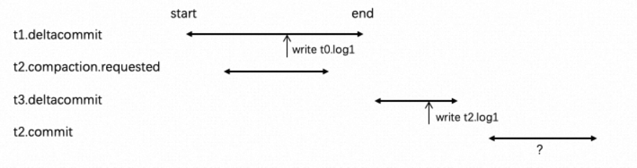
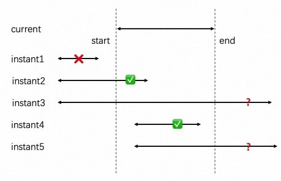
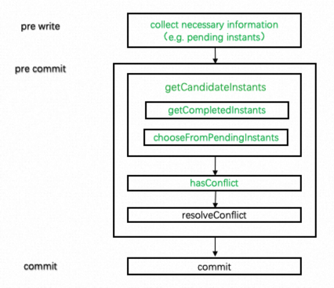

<!--
  Licensed to the Apache Software Foundation (ASF) under one or more
  contributor license agreements.  See the NOTICE file distributed with
  this work for additional information regarding copyright ownership.
  The ASF licenses this file to You under the Apache License, Version 2.0
  (the "License"); you may not use this file except in compliance with
  the License.  You may obtain a copy of the License at

       http://www.apache.org/licenses/LICENSE-2.0

  Unless required by applicable law or agreed to in writing, software
  distributed under the License is distributed on an "AS IS" BASIS,
  WITHOUT WARRANTIES OR CONDITIONS OF ANY KIND, either express or implied.
  See the License for the specific language governing permissions and
  limitations under the License.
-->

# RFC-71: Enhance OCC conflict detection

## Proposers

- @Zouxxyy

## Approvers

- @YannByron

## Status

JIRA: https://issues.apache.org/jira/browse/HUDI-6543

## Abstract

Hudi's multi-writer concurrency model was first proposed
by [RFC-22](https://cwiki.apache.org/confluence/display/HUDI/RFC+-+22+%3A+Snapshot+Isolation+using+Optimistic+Concurrency+Control+for+multi-writers)
. Its concurrency conflict detection is based on
start_commit_timestamp. Its premise is that the active timeline will not be refreshed during the entire transaction
process. However, this assumption has already been broken.

[HUDI-3355](https://issues.apache.org/jira/browse/HUDI-3355) expanded the range of candidate instants for conflict
detection, including instants transform from pending to completed since the transaction
started; [HUDI-5517](https://issues.apache.org/jira/browse/HUDI-5517)
introduced stateTransitionTime which can be used for
end_commit_timestamp; [HUDI-6288](https://issues.apache.org/jira/browse/HUDI-6288)
Use stateTransitionTime for conflict detection and introduce the concept of write priority.

Before things get more complicated, now it is time to reorganize and improve the conflict detection of hudi OCC,
because it is the basis of multiple concurrent writes.

## Background

Hudi's conflict detection mainly includes three steps: (1) getCandidateInstants (2) hasConflict (3) resolveConflict

Currently, there are three strategies, and the following briefly introduces their special features:

- `SimpleConcurrentFileWritesConflictResolutionStrategy`: The scope of candidateInstants is: completed instants since
  last completed instant + pending table service + instants transform from pending to complete;
- `IngestionPrimaryWriterBasedConflictResolutionStrategy`: The scope of candidateInstants is: completed instants'
  stateTransitionTime is greater than the current's start_timestamp + pending ingestion if current is table service;
- `BucketIndexConcurrentFileWritesConflictResolutionStrategy`: Same as the first one, except that hasConflict is
  specially treated for bucket index;

The problems with the above strategies are:

- The logic of getCandidateInstants in `SimpleConcurrentFileWritesConflictResolutionStrategy` is complicated;
- The rationality of priority design in `IngestionPrimaryWriterBasedConflictResolutionStrategy` needs to be explored;
- There are arrangement problems in the three strategies, which is not conducive to expansion;
- There are many useless reload active timelines;

## Implement

### Priority of write operation

First, let's divide hudi's write operations into two categories:

- ingestion: insert, upsert, insert overwrite...
- table service: clustering, compaction (clean don't cause conflict, ignore it)

[HUDI-6288](https://issues.apache.org/jira/browse/HUDI-6288) proposes the concept of ingestion priority: data ingestion
is prioritized over table service (both clustering and compaction). But, is that true? Let's dig deeper.

For clustering, once the clustering plan is written, as long as it is not completed, new data can't be written to the
new/old FG (unless `SparkAllowUpdateStrategy` is used, when using it, although the data modified by the write operation
is in clustering plan, the write operation can still be successful, and then rollback clustering plan). This function is
very useful, its core idea is ingestion's priority is higher than clustering, which avoids clustering blocking
ingestion.

For compaction, the biggest difference between it and clustering is: after the compaction plan is written, data can
still be written to the same FG. Problems can arise if ingestion is still prioritized over compaction (No conflict
detection with compaction plan).

For example, we write a compaction plan at t2. One data writing occurs at t1, assuming that the compaction plan was not
detected during data writing, finally write `fg1.t0.log1`. Assuming the compaction plan at t2 is completed before t1
completed, so it will not contain `fg1.t0.log1`. Another data writing occurs at t3, now it can detect the compaction
plan, and finally write `fg1.t2.log1`. Then t2.compaction start commit, if we do conflict detection, will find that
there is a conflict with t1 and do rollback, but `fg1.t2.log1` written by t3 is dirty; if we skip conflict
detection, `fg1.t0.log1` written by t1 is lost.



```text
t0.commit               // last completed compaction
t1.deltacommit          // write fg1.t0.log1
t2.compaction.requested // compaction plan (contain fg1)
t3.deltacommit          // write fg1.t2.log1
t2.commit               // if do conflict detection, fg1.t2.log1 is dirty; else skip, fg1.t0.log1 is lost
```

To sum up: For clustering, due to the blocking between it and ingestion, we can set the priority between them. For
compaction, we must always include the compaction plan in conflict detection.

### Write operations that require conflict detection

From the above, the write operations that require conflict detection in pre commit are as follows:

- ingestion
- clustering with `SparkAllowUpdateStrategy`

Note: The conflict detection between table services has been completed in the schedule (this process needs to be locked)

### getCandidateInstants

Get candidate instants for conflict detection



The above figure lists all the situations. For candidate instants, our expectation is "1" is excluded, "2" and "4" are
mandatory, "3" and "5" are optional". In this RFC, We divided it into two steps: (1) `getCompletedInstants` (2)
`chooseFromPendingInstants`

(1) getCompletedInstants, provide two ways:

- start_timestamp_based (default)

At txn start: record all pending instants ("2", "3")

At pre commit: choose start_timestamp > current start_timestamp and have completed instants ("4") + pending instants
recorded in the start which transformed into completed ("2")

- end_timestamp_based

At txn start: do nothing

At pre commit: choose end_timestamp > current start_timestamp的instants ("2", "4")

Note: Approach1 is an improved version of the current behavior (does not require last completed instant), we use it by
default now; Approach2 is based on end_timestamp, which is more elegant. After end_timestamp (stateTransitionTime) is
stable, we can use it by default.

(2) chooseFromPendingInstants

For the selection of instants in the pending, combined with the content of "Priority of write operation" mentioned
above, we have the following selection logic:

| current \ pending            | ingestion                                        | clustering                                       | compaction |
|------------------------------|--------------------------------------------------|--------------------------------------------------|------------|
| ingestion                    | no                                               | no if SparkAllowUpdateStrategy is set ; else yes | yes        |
| clustering                   | yes if SparkAllowUpdateStrategy is set ; else no | no                                               | no         |
| compaction (will not happen) | -                                                | -                                                | -          |

Note:

- I don’t introduce other configurations here, I hope it works out of the box, because once user use
  `SparkAllowUpdateStrategy`, it has already indicated that ingestion takes precedence over clustering.
- Not all pending ingestion's contain metadata (such as bulk insert or ingestion by Flink), apply a JIRA for tracking
  it.

### hasConflict & resolveConflict

- hasConflict: just use "if else" to distinguish the bucket index, and consider method reuse.
  Because in early conflict detection, there is a similar logic called `hasCommitConfliction`, but currently there is a
  bug here, for it does not consider the bucket index.
- resolveConflict: preserve existing logic

Note: During the implementation, the code format may be optimized in this part, but the logic will not be modified; if
necessary logic optimization is needed, will be supplemented here.

### Flow chart



Note:

- The text in green is modified by this RFC;
- The timing of obtaining pending instants still be placed in pre write;
- Only two reload active timeline are needed in the whole process: one at pre write, another at pre commit;
- Pre write don't need to be locked, but pre commit and commit need to be locked;

### Related class design

```
TransactionManager {
   Option<HoodieInstant> currentTxnOwnerInstant;
   // Option<HoodieInstant> lastCompletedTxnOwnerInstant  // remove
...
}

class SimpleConcurrentFileWritesConflictResolutionStrategy extends AbstratConflictResolutionStrategy {
   Stream<HoodieInstant> getCompletedInstants(...) {}
}

class EndTimestampBasedConcurrentFileConflictResolutionStrategy extends AbstratConflictResolutionStrategy {
   Stream<HoodieInstant> getCompletedInstants(...) {}
}

abstract class AbstratConflictResolutionStrategy { 
   HoodieWriteConfig config;
   
   Stream<HoodieInstant> getCompletedInstants(...) {}
    
   Stream<HoodieInstant> chooseFromPendingInstants(...) {}
    
   Stream<HoodieInstant> getCandidateInstants(...) {
      getCompletedInstants(...)
      chooseFromPendingInstants(...)
    }

    boolean hasConflict(...) {}

    void resolveConflict(...) {}
}
```

## Configuration

`hoodie.write.lock.conflict.resolution.strategy`

- `SimpleConcurrentFileWritesConflictResolutionStrategy`: current (default)
- `EndTimestampBasedConcurrentFileWritesConflictResolutionStrategy`: new, based on end_timestamp, which is more
  elegant. After end_timestamp (stateTransitionTime) is stable, we can use it by default.

Remove `BucketIndexConcurrentFileWritesConflictResolutionStrategy`
and `IngestionPrimaryWriterBasedConflictResolutionStrategy`. Because there is no need to introduce the above
configuration, internal automatic identification, out of the box, more user-friendly.

## Rollout/Adoption Plan

- `SimpleConcurrentFileWritesConflictResolutionStrategy` is consistent with the current behavior;
- `EndTimestampBasedConcurrentFileWritesConflictResolutionStrategy` is a new configuration;
- `IngestionPrimaryWriterBasedConflictResolutionStrategy` will be removed, but is not online and has no impact;

## Test Plan

complete tests for all strategies

## Future work

- At present, (1) commit phase has duplicate codes both in `writeClient` and `CommitActionExecutor`, there are
  maintenance costs; (2) `hoodie.auto.commit` configuration is extremely hacky. Therefore, we plan to remove auto commit 
  in `CommitActionExecutor` and remove `hoodie.auto.commit` configuration to complete the unification of the commit
  phase. (a single PR)
- Our ultimate goal is to achieve unified hudi meta (timeline + metadata table) management: pure APi + unified access
  entrance + one txn one meta init + strictly control the refresh of meta. (Because this work is more extensive, a new
  RFC will be proposed. In fact, this RFC was originally just a pre-work, but I think it's worth discussing and hope to
  get some opinions, so I wrote this small RFC)
