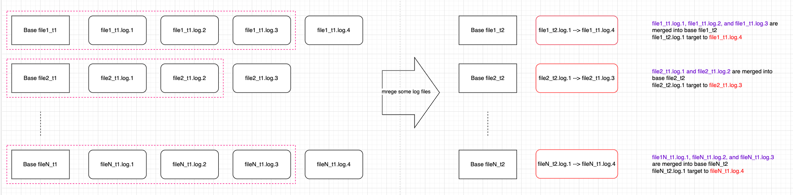

<!--
  Licensed to the Apache Software Foundation (ASF) under one or more
  contributor license agreements.  See the NOTICE file distributed with
  this work for additional information regarding copyright ownership.
  The ASF licenses this file to You under the Apache License, Version 2.0
  (the "License"); you may not use this file except in compliance with
  the License.  You may obtain a copy of the License at

       http://www.apache.org/licenses/LICENSE-2.0

  Unless required by applicable law or agreed to in writing, software
  distributed under the License is distributed on an "AS IS" BASIS,
  WITHOUT WARRANTIES OR CONDITIONS OF ANY KIND, either express or implied.
  See the License for the specific language governing permissions and
  limitations under the License.
-->
# RFC-[74]: [support EventTimeBasedCompactionStrategy]

## Proposers

- @waitingF

## Approvers
 - @<approver1 github username>
 - @<approver2 github username>

## Status

JIRA: [HUDI-6979](https://issues.apache.org/jira/browse/HUDI-6979)

> Please keep the status updated in `rfc/README.md`.

## Abstract

Currently, to gain low ingestion latency, we can adopt the MergeOnRead table, which support appending log files and 
compact log files into base file later. When querying the snapshot table (RT table) generated by MOR, 
query side have to perform a compaction so that they can get all data, which is expected time-consuming causing query latency.
At the time, hudi provide read-optimized table (RO table) for low query latency just like COW.

But currently, there is no compaction strategy based on event time, so there is no data freshness guarantee for RO table.
For cases, user want all data before a specified time, user have to query the RT table to get all data with expected high query latency.
Based on this, we want to implement the strategy based on the event time: `EventTimeBasedCompactionStrategy`. 


## Background

Generally the data to ingest arrives roughly in event time order. For cases some users read the hudi table, 
they may not concern with the immediate full data, but the data before a specified time T (eg. data before 0 clock).

Currently, reading the RT table will be more time-consuming than reading the RO table due to compaction. 
Because the RO table can be thought as a COW table as it only contains base file.

And there is no compaction strategy based on event time. The only `DayBasedCompactionStrategy` need the table partitioned by day in specified format(yyyy/mm/dd), which is not very general and has too large a time granularity.

Based on this, we plan to launch a compaction strategy based on event time: `EventTimeBasedCompactionStrategy`.

With this strategy, we can expand use-case of RO table, and assign the event time attribute to the RO table without special partition. 
That is given event time threshold T, the log files before T can be compacted, then resulting RO table obtains all data before T, with low query latency.


## Implementation

To support the `EventTimeBasedCompactionStrategy`, there are some steps:
1. support PartialCompaction
2. write min event time to the header of log block
3. design the EventTimeBasedCompactionStrategy
4. sync min event time to RO table property
5. enrich related metrics

### 1. support PartialCompaction
Currently, one compaction operation will select all log files or no log file in the orderAndFilter method.

To support event time based compaction strategy, there will be log files which match the time threshold and
log files which not match the threshold, so we have to support the feature `PartialCompaction` first,
which merges partial log files in one file slice while leaving the unselect log files. For those left log files, 
they will not be visible if the compaction plan generated and new file slice generated, so we have to make those left log files visible in case of dataloss.

Note:
The feature `PartialCompaction` is different from `LogCompaction`, as `LogCompaction` compact some log files into a bigger log file
while `PartialCompaction` merge some log files into base file.

A simple diagram merging partial log files is shown below.



For those left log files, we can't simply `rename` to new instant for visibility, because they may still be queried. 
The visibility can be achieved by:
- creating symlinks for those log files, for file system support symlinks, eg. DFS hdfs. This is the main goal for the `partial log files merging` feature.
- copying log files to new instant time, for file system not support symlinks, eg. Object Storage S3

#### modifications to support PartialCompaction
1. HoodieCompactionOperation

Adding new field `symlinkOperations` which save the symlink operations in the compaction operation, 
then we can query out the symlinkOperations in clean and rollback to track the log file trace.
```avro schema
                  {
                     "name": "symlinkOperations",
                     "type": ["null", {
                        "type": "array",
                        "items": {
                           "name": "HoodieSymlinkOperation",
                           "type": "record",
                           "fields": [
                              {
                                 "name": "symlink", // new log file name with new instant
                                 "type": ["null", "string"]
                              },
                              {
                                 "name": "target",  // old log file name
                                 "type": ["null", "string"]
                              }
                           ]
                        }
                     }],
                     "default": null
                  },
```

2. CompactionStrategy

Implement new method `filterLogFiles` which support filter log files to compact and log files to remain.
```java
  /**
   * Filter the log files to be compacted. Default all log files to compact.
   * @param allLogFiles all log files in the file slice.
   * @return pair of (logFilesToCompact, logFilesToRemain)
   */
  public Pair<List<HoodieLogFile>, List<HoodieLogFile>> filterLogFiles(FileSystem fs, HoodieWriteConfig writeConfig,
                                                                       List<HoodieLogFile> allLogFiles, String instantTime) {
    return Pair.of(allLogFiles.stream().sorted(HoodieLogFile.getLogFileComparator()).collect(toList()), new ArrayList<>());
  }
```

3. Compaction plan generation and execution

Generating the compaction plan, we need to generate the planed symlink operations for log files to remain.

Executing the compaction plan, we need to operate the symlink operations in plan. 
And after the compaction completed, we need to save those operations in the commit metadata for later reading out the relationship of those log files.


4. CleanPlaner

For creating symlinks case, the log file to be cleaned may be the target of log file to remain. So we have to check 
if the log file is target or not. We can only safely clean the log files outdated and not used as target.

For copying log files case, nothing special needed, just as before.

5. Rollback

When rolling back compaction, we need to check the symlink operations in compaction plan, and to roll back those operations too.
That is deleting those symlinks or copied files generated by the compaction.

6. Append new log file

When generating a new log file, for the logVersion calculation, need to consider the planed symlink log files in last compaction plan. 
Because the scheduled compaction plan may not be executed, so the symlinked log files are not generated, but the next log version should consider the not generated log file names.

7. Query side

As the strategy will generate duplicate log blocks with symlink or copy, so the query side without precombine will meet data duplicate issue.

- Read Optimized Queries: should be ok.
- Snapshot Queries: should be ok.
- Incremental Queries: should not read the symlinked or copied files as they are not newly ingested.
- Time Travel Queries: should not read the symlinked or copied files as they are not newly ingested.

So for Incremental and TimeTravel queries, we need to skip those symlinked or copied files, since they are not ingested at the instant time.
For the skip, we can get those files from completed commit metadata then do a filter.


### 2. write min event time to the header of log block

when appending logs, we can save the min event time for a data block, then we can add the min event time property to 
the log block header, then we can query out the min event time without deserializing the log data.

Note:

For the strategy, we do better tune the `hoodie.logfile.max.size` to proper value. 
Or there may be cases, all data written to one log file, any time generate a compaction, it will be a full compaction.

### 3. design the EventTimeBasedCompactionStrategy

For those cases can not guarantee the data latency, the strategy also cannot ensure the accuracy of event time freshness of RO table.

Supposed the data coming roughly in the order of event time, the latest data ingested at most `data_latency` time later, 
So for compaction instant time `compaction_time`, then we can choose any time before `compaction_time - data_latency` as the event time `threshold`, 
as the data before `threshold` is expected being ingested to hudi.

And we need a new CompactionTriggerStrategy `EVENT_TIME_TRIGGER`, which will check if no pending compaction plan or clustering plan exists.
When using the `EventTimeBasedCompactionStrategy`, we can not trigger a new compaction plan if any pending compaction plan or clustering plan exists. 
Or we will break the event time rule that all data before threshold is compacted. Seeing below image:

Suppose we support generate multi compaction plans, plan1 with threshold1=0:30, plan2 with threshold2=1:00.
Those plans are executed as the order. Then as defined, when plan2 finished, there should not be no log file with min_event_time <= threshold,
but there exist file1_t1.log.3 and fileN_t1.log.2 which break the rule. So we can not trigger a new compaction plan if any pending compaction plan or clustering plan exists.


With the `EventTimeBasedCompactionStrategy` above, there may be data with event time after threshold being compacted. 
For cases users want exact event time split (users don't want any data after threshold exist in RO table), 
we need to perform the log record filter in compaction execution based on the threshold. 
This can be somehow complicated, just as a follow-up.


### 4. sync min event time to RO table property

We can get the event time threshold from last completed compaction, then sync the threshold as RO table data freshness to user.
From the threshold, users know that all data before threshold was ingested and can be queried out from RO table instead of RT table.

### 5. metrics
to better know the internal state of log files, we need to add more metrics:

- the min event time from all log files
- remained log files related file slices count
- remained log files total file size
- remained log files count


## Rollout/Adoption Plan

Should be compatible as before.

 - What impact (if any) will there be on existing users?
   - no compact to existing users.
 - If we are changing behavior how will we phase out the older behavior?
   - not change to old behavior
 - If we need special migration tools, describe them here.
   - no need for migration tools
 - When will we remove the existing behavior?
   - no affect to existing behavior


## Test Plan

New test classes to test the features `PartialCompaction` and `EventTimeBasedCompactionStrategy`.
In those test cases, all RO tables and RT tables can be queried as expected, and the incremental and time travel queries work as expected.
