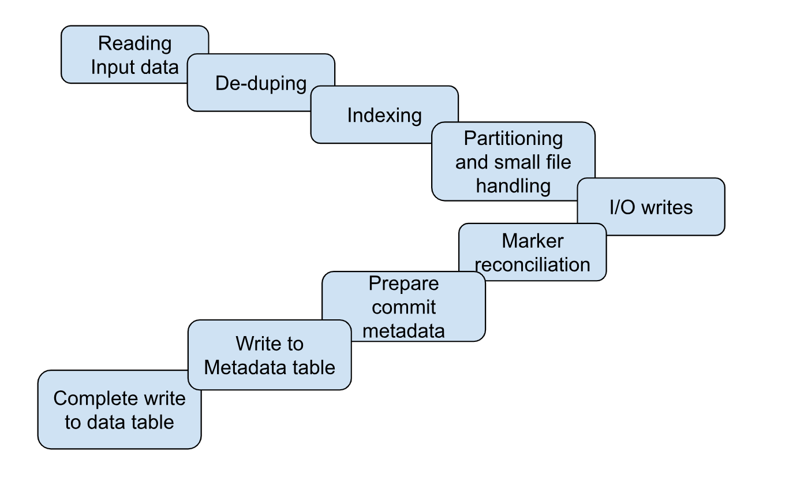

<!--
  Licensed to the Apache Software Foundation (ASF) under one or more
  contributor license agreements.  See the NOTICE file distributed with
  this work for additional information regarding copyright ownership.
  The ASF licenses this file to You under the Apache License, Version 2.0
  (the "License"); you may not use this file except in compliance with
  the License.  You may obtain a copy of the License at

       http://www.apache.org/licenses/LICENSE-2.0

  Unless required by applicable law or agreed to in writing, software
  distributed under the License is distributed on an "AS IS" BASIS,
  WITHOUT WARRANTIES OR CONDITIONS OF ANY KIND, either express or implied.
  See the License for the specific language governing permissions and
  limitations under the License.
-->
# RFC-[79]: [Robust spark writes]

## Proposers

- @nsivabalan
- @nbalajee

## Approvers
 - @vinoth
 - @codope

## Status

JIRA: https://issues.apache.org/jira/browse/HUDI-7967

> Please keep the status updated in `rfc/README.md`.

## Abstract

Apache Hudi is a transactional data lake platform that assists users to write and read from hadoop compatible file systems. Hudi guarantees ACID semantics to ensure no dirty writes are exposed to concurrent readers and, writes are either entirely complete or is rolledback. Hudi is designed to run with distributed compute engines like Spark and Flink. Especially with spark, there are chances of task retries, stage retries which are beyond the limits of Hudi’s capabilities and hence Hudi’s design and implementation has to ensure writes are resilient to such task and stage retries. Hudi should guarantee no data consistency issues due to any of these failure/retry scenarios. But off late we have identified edge cases which calls for this RFC to build a robust and foolproof mechanism to ensure Hudi is resilient to such task and stage failures and retries.

## Background
Spark task retries is not new to Hudi writes and we have already designed a marker based mechanism to tackle such spark task retries. Feel free to checkout [this](https://hudi.apache.org/docs/markers) page for more detailed info on markers in Hudi and how it ensures spurious data files accounted for with Hudi writes.

### Gaps
Even though marker based reconciliation tackles most common task retry scenarios, there are few edge cases which our existing marker based reconciliation may not handle. Let's take a look at the sequence of events in our write pipeline and go from there.

_Reference diagram highlighting the write skeleton in Hudi_

1.Reading from source
2. Deduping
3.Indexing
3. Partitioning + spark file handling
4. I/O or writes (write handles)
5. Marker reconciliation
6. Prepare commit metadata.
7. Write to metadata table
8. Complete the write to data table (marking commit as complete).

Here the major failure scenarios are round steps 5, 6, 7 and 8. If a spark task(or a subset of tasks) is attempted twice in step5, we could see 2 data files written to disk. And we should be able to find markers for both attempts. During marker based reconciliation, we should be able to account for the spurious data file and delete it.

#### Case1:
Stray executor:

1 -> 2 … 5(writes) ->
The write stage completes and spark triggers a kill for any additional tasks that is currently running. Lets say due to executor failure/spark speculative execution, another task was triggered, but attempt1 of task completed and is sent back to the driver when the write stage is completed. And hence we have a stray task running. At the end of the stage, spark will be triggering a kill for any stray tasks. And due to networking glitch, it could so happen that the task could not be reached for killing and it is running. During marker based reconciliation, we might see the marker file, but the data file could be missing if the task is still making progress. And eventually when the task completes, the spurious data file could be added to storage. Even the commit metadata may not be tracking this spurious data file.
We heard from uber, that this stray executor could sometimes be running even after spark application is completed (very one off case)

#### Case2:
Dag retrigger while writing to MDT(spark rdd cache invalidation). Issue exacerbated with RLI.

1 -> 2 … 5(writes) -> 6(marker based reconciliation) ->
After marker based reconciliation is complete, while trying to write to MDT, say the dag is retriggered due to spark rdd cache invalidation. So, write handles could be re-executed, but the reconciliation may not get executed again. So, this could lead to duplicate data files on storage. Infact our commit metadata could be tracking one set of files, but MDT writes could be tracking a diff set of files.

## Design

We are proposing two additional markers to assist with detecting and thwarting spurious data files in Hudi on any cost.
### 1. Completion Marker:
   The marker mechanism discussed above strictly speaking is a begin marker. So, lets add a completion maker at the end of writes (write handle) for each data file produced to mark the completion of the write for a given task in addition to the begin marker. Completion marker will only track the fileId and commit time(write token should be ignored) and the writeStatus gets serialized as content. This might be in contrast to the begin markers where the marker will track the actual data file name.

Write handle changes:
In the  constructor
1. If completion marker is already present for the given fileID and commit time, read the CM(completion marker), to deser write status and return right away. (short circuit).
2. If completion marker is not present, go ahead w/ writing the data file(s).
3. In the end just before returning the writeStatus back to driver:
   again check for CM.
   if present, delete the newly created file and read the CM, to deser write status and return the same WriteStatus.
   if not, go ahead, create CM and return WriteStatus. or spark could have aborted the task by then in which case there won't be any data file only.

Most of spark task retries, executor losses should be taken care by the marker based reconciliation even w/o completion marker fix. Above design should help w/ stray executor issues and spark speculative execution.

If a single write handle need to write 3 files:
Say a single write handle needs to write 3 data files due to file sizing overflows. And is crashed after writing just 2 of them. Based on above proposal, on retry, all 3 data files needs to be written out again. Bcoz, the boundaries at which the records get split across data files it not deterministic. Say we have to write 2.5M records. In first attempt, we could be writing 1M in file1, 900k in 2nd file and 600k in 3rd file. On re-attempt, we could be splitting the records as 950k in first file, 900k in 2nd file nad 650k in 3rd file. So, completion marker tracks whether an entire write handle is complete or not, i.e. entire spark task is fully complete or not.
This also means that, we might be serializing N no of write statuses to the Completion marker.

### 2. Finalize Write markers:
   Entire spark stage has to be retried after marker based reconciliation is complete(case2). So, lets add a finalize write markers which is just 1 marker per write.

AIs:
We have two options to go about when such behavior is seen. Either we could fail the entire write or we could re-generate the write status.

Within write handle, if we deduce the finalize write markers:
If config is enabled:
Fail the entire write.

If config is not enabled // which means to not throw exception
Get hold of already written data files, parse them to generate writeStatus (since we need to get hold of hoodie record keys in WriteStatus) and return them.

Even in 2nd case, we do not generate new data files, but just read back the already written files and serve them.

With both the fixes in play, we can completely avoid generating spurious data files. And even if entire stage is re-tried/re-executed, we could avoid a full rewrite of the data files.

## Implementation nuances:

We need the implement the aforementioned design in all write handles. But we also need to ensure one more thing apart from generating and acting on the two markers.
FileID generation:
We need to ensure we generate fileID prefixes in the driver and not in the executor. Unless we make them deterministic, w/ clustering and create handles, a re-attempt could generate a new fileID and one of the above fix will not catch the spurious data file issue.

- Bulk insert (write client) needs fixes to generate fileID prefixes in driver.
- Bulk insert in row write code path needs fixes.
- Inserts and upserts are good. (no fixes required)
- Clustering under the hood uses bulk insert. So, no additional fixes needed.

Overall: we need to ensure fileID prefixes are generated in the driver once and not re-generated on re-attempts, we should be good. Even if we have file sizing overflow cases, we suffix the indexes to the fileID prefix, and so we should be good. Our completion markers are designed one per fileId prefix and so entire spark task will be retried on any crashes/failures mid-way for a given spark task.

## Rollout/Adoption Plan

 - What impact (if any) will there be on existing users? 
 - If we are changing behavior how will we phase out the older behavior?
 - If we need special migration tools, describe them here.
 - When will we remove the existing behavior

## Test Plan

Describe in few sentences how the RFC will be tested. How will we know that the implementation works as expected? How will we know nothing broke?.