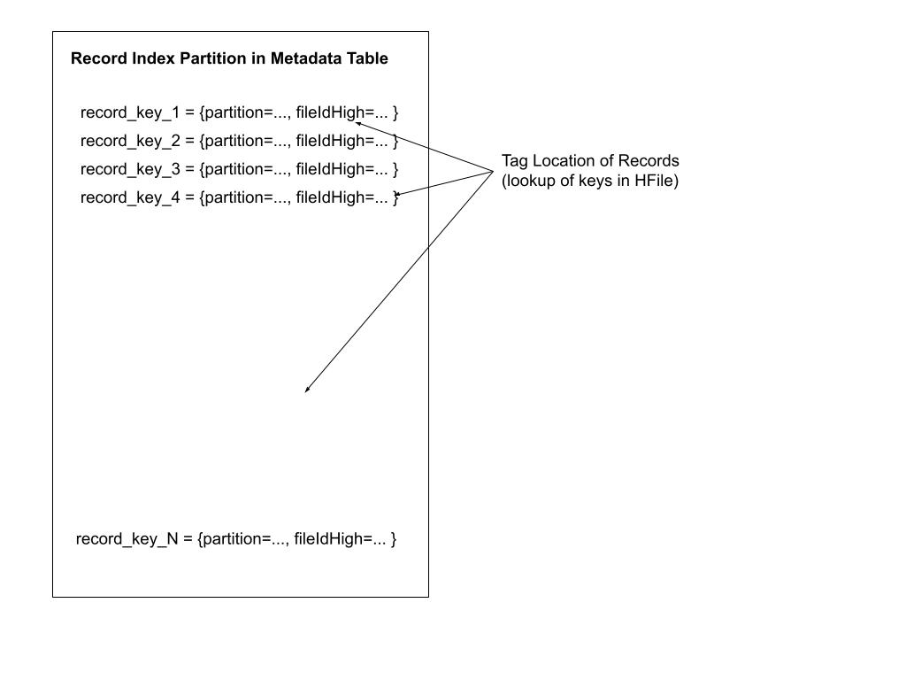

<!--
  Licensed to the Apache Software Foundation (ASF) under one or more
  contributor license agreements.  See the NOTICE file distributed with
  this work for additional information regarding copyright ownership.
  The ASF licenses this file to You under the Apache License, Version 2.0
  (the "License"); you may not use this file except in compliance with
  the License.  You may obtain a copy of the License at

       http://www.apache.org/licenses/LICENSE-2.0

  Unless required by applicable law or agreed to in writing, software
  distributed under the License is distributed on an "AS IS" BASIS,
  WITHOUT WARRANTIES OR CONDITIONS OF ANY KIND, either express or implied.
  See the License for the specific language governing permissions and
  limitations under the License.
-->
# RFC-8: Metadata based Record Index

## Proposers
- @prashantwason

## Approvers


## Status
JIRA: https://issues.apache.org/jira/browse/HUDI-53


## Abstract
HUDI requires an [Index](https://hudi.apache.org/docs/indexing) during updates to locate the existing records by their 
unique record keys. The HUDI Index is a mapping of the record-key to record's file path. Hudi supports several indexes 
like:
 1. Bloom Index: Employs bloom filters built out of the record keys, optionally also pruning candidate files using record key ranges.
 2. Simple Index (default): Performs a lean join of the incoming update/delete records against keys extracted from the table on storage.
 3. HBase Index: Manages the index mapping in an external Apache HBase table.

We are proposing a new Index called Record Index which will save the record key to file path location within the 
[HUDI Metadata Table](https://hudi.apache.org/docs/metadata). Since the HUDI Metadata Table is internal to a HUDI Dataset, 
the Record Index is updated and queried using the resources already available to the HUDI dataset.


## Justification

Bloom and Simple Index are slow for large datasets as they have high costs involved in gathering the index data from various
data files at lookup time. Furthermore, these indexes do not save a one-to-one record-key to record file path mapping but
deduce the mapping via an optimized search at lookup time. A per file overhead required in these indexes means that datasets 
with larger number of files or number of records will not work well with these indexes. 

The Hbase Index saves one to one mapping for each record key so is very fast and scaled with the dataset size. But Hbase 
Index requires a separate HBase cluster to be maintained. HBase is operationally difficult to maintain and scale for throughput, 
requires dedicated resources and expertise to maintain.

The Record Index will provide the speed and scalability of HBase Index without all the limitation and overhead. Since 
the HUDI Metadata Table is a HUDI Table, all future performance improvements in writes and queries will automatically 
provide those improvements to Record Index performance. 

## Design
Record Index will save the record-key to file path mapping in a new partition within the HUDI Metadata Table. Metadata table
uses HBase HFile - the tree map file format to store and retrieve data. HFile is an indexed file format
and supports map like faster lookups by keys. Since, we will be storing mapping for every single record key, Record Index
lookups for large number of keys transform into direct lookups of keys from HUDI Metadata Table and should be able to 
benefit greatly from the faster lookups in HFile.


### Metadata Table partitioning and schema:

A new partition `record_index` will be added under the metadata table. The existing metadata table payload schema will
be extended and shared for this partition also. The type field will be used to detect the record_index payload record.
Here is the schema for the record_index payload record.
```
    {
        "name": "recordIndexMetadata",
        "doc": "Metadata Index that contains information about record keys and their location in the dataset",
        "type": [
            "null",
             {
               "type": "record",
               "name": "HoodieRecordIndexInfo",
                "fields": [
                    {
                        "name": "partition",
                        "type": "string",
                        "doc": "Partition which contains the record",
                        "avro.java.string": "String"
                    },
                    {
                        "name": "fileIdHighBits",
                        "type": "long",
                        "doc": "fileId which contains the record (high 64 bits)"
                    },
                    {
                        "name": "fileIdLowBits",
                        "type": "long",
                        "doc": "fileId which contains the record (low 64 bits)"
                    },
                    {
                        "name": "fileIndex",
                        "type": "int",
                        "doc": "index of the file"
                    },
                    {
                        "name": "instantTime",
                        "type": "long",
                        "doc": "Epoch time in millisecond at which record was added"
                    }
                ]
            }
        ],
        "default" : null
    }
```

The key for the record index record would be the actual key from the record. The partition name is also saved as string.
HUDI base files names have a format which includes a UUID fileID, an integer file Index, a write token and a timestamp. 
The record index payload only saves the fileID and file index information. The fileID is split into UUID and the integer file index. The UUID is encoded into two longs and the file index is saved
as an integer. The timestamp is encoded into epoch time in milliseconds.

This schema format is chosen to minimize the data size of each mapping to ensure the smallest possible size of the 
record index even for datasets with billions of records. 

Experiments have shown that with random UUID record keys and datestr partitions (YYYY/MM/DD), we can achieve an average
size of 50 to 55 bytes per mapping saved in the record index. The size might even be lower for keys which may compress better.

Below picture gives a pictorial representation of record index partition in metadata table.



### Record Index initialization:

Like any other HUDI Metadata Table index, the record index can be initialized inline (before the writer writes records to the dataset)
or via the Async Indexer.

The initialization involves the following steps:
1. Get the list of all files in the dataset 
   1. Since the `files` partition is a pre-requisite for all other partitions in Metadata Table, the list of all files can be taken from the Metadata Table itself and does not involve listing the entire dataset.
2. Read the record keys from all the files in the dataset
   1. Only the record key column needs to be read from the base files. 
   2. This step scales with more Executors and more memory
3. Determine the number of fileGroups to use for the `record index` partition
4. Create record index records corresponding to each record key read
5. Insert the records into the Metadata Table partition `record index`

We will add functionality to automatically estimate the number of fileGroups to use for the `record index` partition based
on the number of records in the dataset (available after Step 2 above). This should simplify rollout as the user does not
have to worry about the number of fileGroups for optimal performance. Configs will allow specifying the number of fileGroups
too.


### Metadata Index lookup:

For the incoming upsert records, given their keys, tag their current location. The key lookup would require the following steps:

1. Generate the list of keys to be looked up (extract HoodieKeys from the upsert records)
2. Lookup all the keys from the HUDI Metadata Table
   1. Keys are partitioned based on the hash as the HUDI Metadata Table mappings are saved in various fileGroups (count fixed at initialization time) with each fileGroup saving a portion of the key space
   2. Each partition of keys is looked up in parallel from the fileGroup using various Executors
3. Tag the location, where a mapping was found in HUDI Metadata Table, back to upsert records 

Given N fileGroups in the record index, an indexing lookup of M keys is reduced to N lookups of M/N keys in parallel. Hence, 
for fastest lookup operation, the number of executors for the writer process should be >= N.

This also means that lookup from record index can be scaled with growing data size by:
1. Increasing the number of fileGroups (N in the above example)
2. Using at least N or greater executors for the indexing process

HDFS based experiments have shown than on average key lookups from HFile in HUDI Metadata Table complete in 1-2msec. 
So for lookup of M keys we expect ballpark time of K + M / N * 2msec where K is the overhead of opening HFile (~100msec) 
and merging the log files. Periodic compaction of Metadata Table keeps the value of K lower.


## Implementation
1. No changes to the HoodieIndex public interface.
2. A new index type will be added - RECORD_LEVEL


### Writer flow:
Let's walk through the writer flow to update the record index.

Whenever a new commit is getting applied to metadata table, we do the following.<br>
1. Parse the WriteStatus to determine the record which have been inserted into the dataset
   1. Such records have new location (HoodieRecord::getNewLocation()) but no current location ((HoodieRecord::getCurrentLocation()))
2. Create new records for each record keys being added to the dataset
3. Commit all these records to metadata table.

We need to ensure that WriteStatus tracks all written records keys for every commit.


### Reader flow:
When a new batch of write is ingested into Hudi, we need to tag the records with their
original file group location. Refer to Metadata Index lookup section for more details.


### Limitations:
1. The number of file groups are fixed at the time of initialization and there is no support for dynamically increasing or decreasing the number of file groups.
2. If the total number of records in the dataset grows by large factor, the number of file groups might need to be increased to maintain the same performance.
   1. This currently requires re-initialization of the record index.
3. Record Index is a global index and hence requires unique keys in the dataset


### Future Improvements:
1. Add support for non-global index
2. Add support for indexing only a window of days rather than the entire dataset.
   1. This will allow the record index to be used efficiently for datasets where dedupe is required on the last N days of data.
3. Add support for dynamically increasing or decreasing the number of file groups.


## Rollout/Adoption Plan
* Record Index will be available in 0.14.0 release
* Metadata Table scheme will be upgraded as part of release upgrade process
* Record Index will be disabled by default and can be enabled by setting the write configs 


## Test Plan
* Functionality
    * Tag location for existing keys
    * Tag location for non-existing keys
* Performance
    * Prove Metadata based indices are helping upsert use cases
* Upgrade
