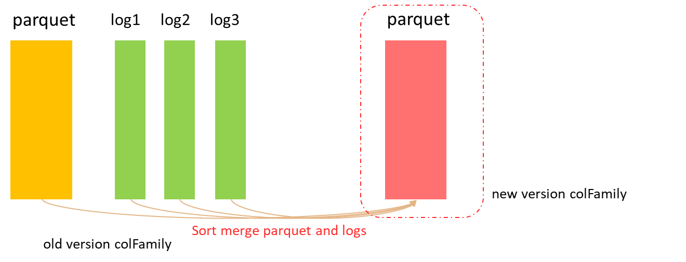

<!--
  Licensed to the Apache Software Foundation (ASF) under one or more
  contributor license agreements.  See the NOTICE file distributed with
  this work for additional information regarding copyright ownership.
  The ASF licenses this file to You under the Apache License, Version 2.0
  (the "License"); you may not use this file except in compliance with
  the License.  You may obtain a copy of the License at

       http://www.apache.org/licenses/LICENSE-2.0

  Unless required by applicable law or agreed to in writing, software
  distributed under the License is distributed on an "AS IS" BASIS,
  WITHOUT WARRANTIES OR CONDITIONS OF ANY KIND, either express or implied.
  See the License for the specific language governing permissions and
  limitations under the License.
-->
# RFC-80: Support column families for wide tables

## Proposers  
- @xiarixiaoyao
- @wombatu-kun

## Approvers
 - @vinothchandar
 - @danny0405
 - @beyond1920

## Status

JIRA: https://issues.apache.org/jira/browse/HUDI-7947

## Abstract

In streaming processing, there are often scenarios where the table is widened. The current mainstream real-time wide table concatenation is completed through Flink's multi-layer join;
Flink's join will cache a large amount of data in the state backend. As the data set increases, the pressure on the Flink task state backend will gradually increase, and may even become unavailable.
In multi-layer join scenarios, this problem is more obvious.  
1.x also supports partial updates being encoded in logfiles. That should be able to handle this scenario. But even with partial-update, the column families will reduce write amplification on compaction.  

So, main gains of clustering columns for wide tables are:  
Write performance:
- Writing is similar to ordinary bucket writing, but it involves splitting column clusters and sorting. Therefore, the writing performance of full data is 10% lower than that of native bucket writing.
- However, if only some columns are updated among a large number of columns, the writing efficiency is much faster than that of non-column clustered tables. (Note: 1.0 introduces a partial update functionality, that can also avoid such writing costs, by writing only the changed columns)  

Read performance:  
Since the data is already sorted when it is written, the SortMerge method can be used directly to merge the data; compared with the native bucket data reading performance is improved a lot, and the memory consumption is reduced significantly.  

Compaction performance:  
The logic of compaction and reading is the same. Compaction costs across column families is where there real savings are.  

The log merge we can make it pluggable to decide between hash or sort merge - we need to introduce new log headers or standard mechanism for merging to determine if base file or log files are sorted.

## Background
Currently, Hudi organizes data according to fileGroup granularity. The fileGroup is further divided into column clusters to introduce the columnFamily concept.  
The organizational form of Hudi files is divided according to the following rules:  
The data in the partition is divided into buckets according to hash (each bucket maps to a file group); the files in each bucket are divided according to columnFamily; multiple colFamily files in the bucket form a completed fileGroup; when there is only one columnFamily, it degenerates into the native Hudi bucket table.

## Implementation
This feature should be implemented for both Spark and Flink. So, a table written by Flink this way, also can be read by Spark.

### Constraints and Restrictions
1. The overall design relies on the non-blocking concurrent writing feature of Hudi 1.0.  
2. Lower version Hudi cannot read and write column family tables.  
3. Only MOR bucketed tables support setting column families.  
   MOR+Bucket is more suitable because it has higher write performance, but this does not mean that column family is incompatible with other indexes and cow tables.  
4. Column families do not support repartitioning and renaming.  
5. Schema evolution does not take effect on the current column family table.  
   Not supporting Schema evolution does not mean users can not add/delete columns in their table, they just need to do it explicitly.
6. Like native bucket tables, clustering operations are not supported.

### Model change
After the column family is introduced, the storage structure of the entire Hudi bucket table changes:

The bucket is divided into multiple columnFamilies by column cluster. When columnFamily is 1, it will automatically degenerate into the native bucket table.

### Proposed Storage Format Changes
After splitting the fileGroup by columnFamily, the naming rules for base files and log files change. We add the cfName suffix at the end of all file names to facilitate Hudi itself to distinguish column families. If it's not present, we assume default column family.
So, new file name templates will be as follows:  
- Base file: [file_id]\_[write_token]\_[begin_time][_cfName].[extension]  
- Log file: [file_id]\_[begin_instant_time][_cfName].log.[version]_[write_token]  

Also, we should evolve the metadata table files schema to additionally track a column family name.  

### Specifying column families when creating a table
In the table creation statement, column family division is specified in the options/tblproperties attribute;
Column family attributes are specified in key-value mode:  
* Key is the column family name. Format: hoodie.colFamily. Column family name    naming rules specified.  
* Value is the specific content of the column family: it consists of all the columns included in the column family plus the preCombine field. Format: " col1,col2...colN; precombineCol", the column family list and the preCombine field are separated by ";"; in the column family list the columns are split by ",".  

Constraints: The column family list must contain the primary key, and columns contained in different column families cannot overlap except for the primary key. The preCombine field does not need to be specified. If it is not specified, the primary key will be taken by default.

After the table is created, the column family attributes will be persisted to hoodie's metadata for subsequent use.

### Adding and deleting column families in existing table
Use the SQL alter command to modify the column family attributes and persist it:    
* Execute ALTER TABLE table_name SET TBLPROPERTIES ('hoodie.columnFamily.k'='a,b,c;a'); to add a new column family.  
* Execute ALTER TABLE table_name UNSET TBLPROPERTIES('hoodie.columnFamily.k'); to delete the column family.

Specific steps are as follows:
1. Execute the ALTER command to modify the column family
2. Verify whether the column family modified by alter is legal. Column family modification must meet the following conditions, otherwise the verification will not pass:
    * The column family name of an existing column family cannot be modified.  
    * Columns in other column families cannot be divided into new column families.  
    * When creating a new column family, it must meet the format requirements from previous chapter.  
3. Save the modified column family to the .hoodie directory.

### Writing data
The Hudi kernel divides the input data according to column families; the data belonging to a certain column family is sorted and directly written to the corresponding column family log file.

Specific steps:  
1. The engine divides the written data into buckets according to hash and shuffles the data (the writing engine completes it by itself and is consistent with the current writing of the native bucket).  
2. The Hudi kernel sorts the data to be written to each bucket by primary key (both Spark and Flink has its own ExternalSorter, we can refer those ExternalSorter to finish sort).  
3. After sorting, split the data into column families.  
4. Write the segmented data into the log file of the corresponding column family.  

#### Common API interface
After the table columns are clustered, the writing process includes the process of sorting and splitting the data compared to the original bucket bucketing. A new append interface needs to be introduced to support column families.  
Introduce ColumnFamilyAppendHandle extend AppendHandle to implement column family writing.

### Reading data
#### ColumnFamilyReader and RowReader

Hudi internal row reader reading steps:  
1. Hudi organizes files by column families to be read.
2. Introduce familyReader to merge and read each column family's own baseFile and logfile to achieve column family-level data reading.  
    * Since log files are written after being sorted by primary key, familyReader merges its own baseFile and logFile by primary key using sortMerge.
    * familyReader supports upstream incoming column pruning to reduce IO overhead when reading data.  
    * During the merging process, if the user specifies the precombie field for the column family, the merging strategy will be selected based on the precombie field. This logic reuses Hudi's own precombine logic and does not need to be modified.    
3. Row reader merges the data read by multiple familyReaders according to the primary key.  

Since the data read by each familyReader is sorted by the primary key, the row reader merges the data read by each familyReader in the form of sortMergeJoin and returns the complete data.  

The entire reading process involves a large amount of data merging, but because the data itself is sorted, the memory consumption of the entire merging process is very low and the merging is fast. Compared with Hudi's native merging method, the memory pressure and the merging time are significantly reduced.

#### Engine reads pseudo process

1) The engine itself delivers the data files that need to be scanned to executor/woker/taskmanger.  
2) executor/worker/taskmanger calls Hudi’s rowReader interface and passes in column clipping and filter conditions to rowReader.  
3) The Hudi kernel completes the data reading of rowReader and returns complete data. The data format is Avro.  
4) The engine gets the Avro format data and needs to convert it into the data format it needs. For example, spark needs to be converted into unsaferow, hetu into block, flink into row, and hive into arrayWritable.

### Column family level compaction
Extend Hudi's compaction schedule module to merge each column family's own base file and log file:

### Full compaction
Extend Hudi's compaction schedule module to merge and update all column families in the entire table.  
After merging at the column family level, multiple column families are finally merged into a complete row and saved.  

Full compaction will be optional, only column family level compaction is required.  
Different users might need different columns, some might need columns come from multiple column families, some might need columns from only one column family.
It's better to allow users to choose whether enable full compaction or not.  
Besides, after full compaction, projection on the reader side is less efficient because the projection could only be based on the full parquet file with all complete fields instead of based on column family names.    

ColumnFamily can be used not only in ML scenarios and AI feature table, but also can be used to simulate multi-stream join and concatenation of wide tables. 。
In simulation of multi-stream join scenario, Hudi should produce complete rows, so full compaction is needed in this case.

## Rollout/Adoption Plan

This feature itself is a brand-new feature. If you don’t actively turn it on, you will not be able to reach the logic of the column families.    
Business behavior compatibility: No impact, this function will not be actively turned on, and column family logic will not be enabled.  
Syntax compatibility: No impact, the column family attributes are in the table attributes and are executed through SQL standard syntax.  
Compatibility of data type processing methods: No impact, this design will not modify the bottom-level data field format.  

## Test Plan
List to check that the implementation works as expected:  
1. All existing tests pass successfully on tables without column families defined.  
2. Hudi SQL supports setting column families when creating MOR bucketed tables.  
3. Column families support adding and deleting in SQL for MOR bucketed tables.  
4. Hudi supports writing data by column families.  
5. Hudi supports reading data by column families.  
7. Hudi supports compaction by column family.  
8. Hudi supports full compaction, merging the data of all column families to achieve data widening.  