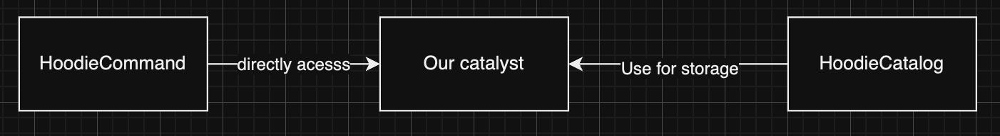

<!--
  Licensed to the Apache Software Foundation (ASF) under one or more
  contributor license agreements.  See the NOTICE file distributed with
  this work for additional information regarding copyright ownership.
  The ASF licenses this file to You under the Apache License, Version 2.0
  (the "License"); you may not use this file except in compliance with
  the License.  You may obtain a copy of the License at

       http://www.apache.org/licenses/LICENSE-2.0

  Unless required by applicable law or agreed to in writing, software
  distributed under the License is distributed on an "AS IS" BASIS,
  WITHOUT WARRANTIES OR CONDITIONS OF ANY KIND, either express or implied.
  See the License for the specific language governing permissions and
  limitations under the License.
-->
# RFC-81: Support column families for wide tables

## Proposers  
- @Davis-Zhang-Onehouse 

## Approvers
 - @vinothchandar
 - @danny0405
 - @yihua

## Status

JIRA: https://issues.apache.org/jira/browse/HUDI-8201

## Background

As of today, The integration of Apache Hudi and spark is deeply coupled with spark catalyst catalog (V1 catalog), to store and manage table metadata. This dependency introduces the challenge that users must set up and maintain a separate catalog service and its implementation has to be Hive Meta Store(HMS) compatible.

In this RFC, we would like to explore
- if we can decouple the spark catalyst from hoodie-spark integration code 
- providing a replacement of non-HMS compatible implementation
while all supported SQL cmd are still functional.


## Objectives

### Functional Requirements

1. Implement a managed catalog solution native to Apache Hudi without extending HMS interface.
2. Provide ACID for table metadata across multiple Spark sessions.
3. Support all existing Hudi table operations (Existing hudi DDL, DML, describe cmds, etc.).
4. Maintain compatibility with existing Hudi APIs and integrations.

## Today's behavior

Feel free to skip this section if you are already familiar of how the hudi-spark integration code is coupled with spark catalyst.

#### What's V1, V2 catalog/data source.
https://app.clickup.com/18029943/docs/h67bq-43177/h67bq-843517?block=block-64af8b7d-c247-4dd9-88c9-a94cd957099c

#### How V1 and V2 datasource related to V1 and V2 catalog
https://app.clickup.com/18029943/docs/h67bq-43177/h67bq-843517?block=block-c1e29adb-fba0-4ef6-9f6c-9a83bbe99d59

#### How V1 and V2 command are related to together
https://app.clickup.com/18029943/docs/h67bq-43177/h67bq-843517?block=block-622527c8-b52b-4fb7-97b4-c8a7833da87a

### Today's hudi behavior
Today there are 3 entities: HoodieCommand, spark catalyst and Hoodie catalog.



```
/Users/zhanyeha/spark-3.4.3-bin-hadoop3/bin/spark-sql \
    --jars hudi-spark3.4-bundle_2.12-0.14.1-rc2.jar \
    --conf 'spark.sql.extensions=org.apache.spark.sql.hudi.HoodieSparkSessionExtension' \
    --conf 'spark.serializer=org.apache.spark.serializer.KryoSerializer' \
    --conf 'spark.kryo.registrator=org.apache.spark.HoodieSparkKryoRegistrar' \
    --conf 'spark.sql.catalog.spark_catalog=org.apache.spark.sql.hudi.catalog.HoodieCatalog' \
    --conf 'spark.sql.catalogImplementation=in-memory' \
    --conf spark.sql.defaultCatalog=spark_catalog
```

**Key take-aways:**

The HoodieCommand and HoodieCatalog always use spark catalyst catalog as a data store to track table metadata, including table path, name, creation time, schema, etc. The 2 components themselves do not persist anything on their own.

[Only V1 logic]: With the config above, spark runs V1 data source code path, as it detects the catalog to use is spark.sql.catalog.spark_catalog. "spark_catalog" is a catalog implementation that will be used as the v2 interface to Spark's built-in v1 catalog. As a result, at query analysis phase, we will end up with physical plan with type `org.apache.spark.sql.execution.command.RunnableCommand`. The relations are of V1Table type.

In contrast, if we do the following, where the default catalog is set to `spark.sql.catalog.<my_catalog_name>`, spark will take it as a V2 catalog, and we end up with physical plan with type `org.apache.spark.sql.execution.datasources.v2.V2CommandExec`. the relation are of V2Table type.
```
/Users/zhanyeha/spark-3.4.3-bin-hadoop3/bin/spark-sql \
    --jars /Users/zhanyeha/hudi-internal/packaging/hudi-spark-bundle/target/hudi-spark3.4-bundle_2.12-0.14.1-rc2.jar \
    --conf spark.sql.defaultCatalog=oh_catalog \
    --conf 'spark.sql.extensions=org.apache.spark.sql.hudi.HoodieSparkSessionExtension' \
    --conf 'spark.serializer=org.apache.spark.serializer.KryoSerializer' \
    --conf 'spark.kryo.registrator=org.apache.spark.HoodieSparkKryoRegistrar' \
    --conf 'spark.sql.catalog.oh_catalog=org.apache.spark.sql.hudi.catalog.HoodieCatalog' \
    --conf 'spark.sql.catalog.spark_catalog=org.apache.spark.sql.hudi.catalog.HoodieCatalog' \
    --conf 'spark.sql.catalogImplementation=in-memory'
```

#### HoodieCommand:
HoodieCommand are a bunch of commands subclassing `org.apache.spark.sql.execution.command.RunnableCommand`.

For all V1 data source, Each SQL command eventually resolve to a hoodie command carry out the hoodie specific logic. Take create table as an example.

```plain
CREATE TABLE d1.hudi_table_mor_single_partition (
  id INT,
  name STRING,
  price DOUBLE,
  ts BIGINT
) USING hudi
```

**Parse phase:** Initially spark query engine parses the query string into an **unresolved** **logical** query plan.

*   Why logical: As of now we only know we need to run "CreateTable" logic, but what's the exact function implementation to use is not decided. (interface v.s. class implemented interface)
*   Why unresolved: we only know the relation id as a signifier, the relation "UnresolvedIdentifier" needs to be resolved to an entry managed by some catalog in the analyze phase.

Here is how the query tree looks like at the end of the parse phase.
```plain
'CreateTable [StructField(id,IntegerType,true), StructField(name,StringType,true), StructField(price,DoubleType,true), StructField(ts,LongType,true)], TableSpec(Map(),Some(hudi),Map(),None,None,None,false), false
+- 'UnresolvedIdentifier [d1, hudi_table_mor_single_partition], false
```

**Analyze phase**: Then at query analyze phase 2 things happens

1. The **"logical" function** is interpolated with either spark default implementation (this is default setting) or hoodie specific implementation.

As below, at the query analyze phase, hoodie analyzer revise the query tree, searching for target spark commands and replace them with a hoodie version one. For those that are not interpolated, default spark command implementation is adopted. Because we are using V1 catalog, so for physical plans we end up with V1 command objects.

```scala
case class HoodiePostAnalysisRule(sparkSession: SparkSession) extends Rule[LogicalPlan] {
  override def apply(plan: LogicalPlan): LogicalPlan = {
    plan match {
      // Rewrite the CreateDataSourceTableCommand to CreateHoodieTableCommand
      case CreateDataSourceTableCommand(table, ignoreIfExists)
        if sparkAdapter.isHoodieTable(table) =>
        CreateHoodieTableCommand(table, ignoreIfExists)

      case DropTableCommand(tableName, ifExists, false, purge)
             ....
      case AlterTableDropPartitionCommand(tableName, specs, ifExists, purge, retainData)
            ....
....
```

For all interpolated V1 commands, please refer `src/main/scala/org/apache/spark/sql/hudi/analysis/HoodieAnalysis.scala`.

For all default spark implementation of V1 commands, please refer `org.apache.spark.sql.execution.command`

If you are interested in how a query tree is revised, please refer Private ([https://app.clickup.com/18029943/docs/h67bq-43177/h67bq-843517](https://app.clickup.com/18029943/docs/h67bq-43177/h67bq-843517)).

2. The **unresolved relation** is resolved into actual catalog objects `org.apache.spark.sql.connector.catalog.Table` . HoodieCatalog::LoadTable is involved in this process.

Eventually we end up with a resolved physical plan for execution.

```plain
CreateHoodieTableCommand `spark_catalog`.`d1`.`hudi_table_mor_single_partition`, false
```

Finally, if you check the CreateHoodieTableCommand implementation, it directly access spark catalyst catalog which causes the coulping.

```scala
case class CreateHoodieTableCommand(table: CatalogTable, ignoreIfExists: Boolean)
  extends HoodieLeafRunnableCommand with SparkAdapterSupport {

  override def run(sparkSession: SparkSession): Seq[Row] = {

    // sparkSession.sessionState.catalog is spark catalyst vvvvv
    val tableIsExists = sparkSession.sessionState.catalog.tableExists(table.identifier)

    if (tableIsExists) {
      .....
    }

    // HoodieCatalogTable combines catalyst catalog and .hoodie folder vvvvvv
    // providing all necessary meta info about a table                 vvvvvv
    val hoodieCatalogTable = HoodieCatalogTable(sparkSession, table)
    ....

    val queryAsProp = hoodieCatalogTable.catalogProperties.get(ConfigUtils.IS_QUERY_AS_RO_TABLE)
    if (queryAsProp.isEmpty) {
      // .hoodie folder is created by as part of hoodie specific table 
      //  creation logic
      hoodieCatalogTable.initHoodieTable()
    }

    // Insert entries into the spark catalyst catalog for this table.
    CreateHoodieTableCommand.createTableInCatalog(sparkSession, hoodieCatalogTable, ignoreIfExists, queryAsProp)
}

  def createTableInCatalog(
      sparkSession: SparkSession,
      hoodieCatalogTable: HoodieCatalogTable,
      ignoreIfExists: Boolean,
      queryAsProp: Option[String] = None): Unit = {
    val table = hoodieCatalogTable.table
    assert(table.tableType != CatalogTableType.VIEW)

    // again, directly access the spark catalyst catalog
    val catalog = sparkSession.sessionState.catalog

    // hoodieCatalogTable combines spark catalyst & .hoodie fodler serving
    // comprehensive meta info about a table
    val path = hoodieCatalogTable.tableLocation
    val tableConfig = hoodieCatalogTable.tableConfig
    val properties = tableConfig.getProps.asScala.toMap

   ....

    // Calling catalyst API to insert entries
    catalog.createTable(newTable, ignoreIfExists = false, validateLocation = false)
}
```

`org.apache.spark.sql.hudi.catalog.HoodieCatalog` is an extension of Spark's built-in v1 catalog (the "spark catalyst" box in the picture above). On top of a plain HMS based v1 catalog, we are allowed to override methods so that hoodie specific logic can be added. For example, when creating tables, we want to do more things other than simply save a catalog entry in the metastore. The condition there is very similar to HoodieCommand introduced above.

## Proposed Implementation

The proposed architecture is as follows:


Inside HoodieCatalog, it create its own catalyst catalog. For all the hoodie-spark integration logic, we replace the usage of spark catalyst with hoodie internal catalyst. The interface needs implementation is `org.apache.spark.sql.catalyst.catalog.ExternalCatalog`.

Example code change:


Spark session launch command
```
~/spark-3.4.3-bin-hadoop3/bin/spark-sql \
    --jars hudi-spark3.4-bundle_2.12-0.14.1-rc2.jar \
    --conf 'spark.sql.extensions=org.apache.spark.sql.hudi.HoodieSparkSessionExtension' \
    --conf 'spark.serializer=org.apache.spark.serializer.KryoSerializer' \
    --conf 'spark.kryo.registrator=org.apache.spark.HoodieSparkKryoRegistrar' \
    --conf 'spark.sql.catalog.spark_catalog=org.apache.spark.sql.hudi.catalog.HoodieCatalog' \
    --conf 'spark.sql.catalogImplementation=in-memory' \
    --conf spark.sql.defaultCatalog=spark_catalog
```

Thus, whenever we run queries, the data previously persisted in the spark catalyst now all goes to hoodie internal catalyst. We are decoupled from internal spark catalyst, which lays the foundation of further improving the catalog data store flexibility in the future.

### What works
- Create, drop database
- Create, drop table with explicit db.table id
- DML (insert, delete, update, insert overwrite)
- DDL (CTAS, create table with location, drop partition, drop table, drop db, add column)
- Show partition, show databases cmd

### What fails and RCA
- UDF create & describe does not work.
- Describe table cmd does not work
- Cannot set default db/namespace (`use <database/namespace>` does not work)
- If we set the HoodieCatalog as non "spark_catalog" in the config, we can set the defaul db/namespace while the DML/DDL does not work.

#### Why UDF commands/describe table command does not work.

As previously said, The **"logical" function** is interpolated with either spark default implementation (this is default setting) or hoodie specific implementation. Unfortunately, for `org.apache.spark.sql.execution.command.DescribeFunctionCommand` we don't intepolate with our own implementation. As a result, the default spark implementation is used where it searches the function object inside spark catalyst which no longer tracks everything.

```scala
  override def run(sparkSession: SparkSession): Seq[Row] = {
    val identifier = if (info.getDb != null) {

      // It reads spark catalyst while the records are now managed by the hoodie internal catalyst catalog!
      sparkSession.sessionState.catalog.qualifyIdentifier(
        FunctionIdentifier(info.getName, Some(info.getDb)))
    } else {
      FunctionIdentifier(info.getName)
    }
```

To fix this issue, we need to interpolate those commands with new implementation, where it dupilcates most of the default logic while the only difference is it searches in hoodie internal catalyst for the target table/UDF. It means duplicated code from spark OSS as a hoodie specific command. More code to maintain.

There are 11 such kind of commands including CreateFunctionCommand, DescribeFunctionCommand, DescribeTableCommand, DescribeQueryCommand, DescribeColumnCommand, ShowTablesCommand, ShowTablePropertiesCommand, ShowColumnsCommand, ShowPartitionsCommand, ShowCreateTableCommand, RefreshTableCommand.


#### Cannot set to default namespace
Recall that when launching the spark session, we do
```
--conf 'spark.sql.catalog.spark_catalog=org.apache.spark.sql.hudi.catalog.HoodieCatalog'
```
spark_catalog leads to isSessionCatalog(currentCatalog) to true.

For setting the default namespace, it does not work because spark code hard wires the function call to spark catalyst instead of routing to the connector catalog itself.

```scala
def setCurrentNamespace(namespace: Array[String]): Unit = synchronized {
    currentCatalog match {
      // We fall into the first branch, where the function call is delegated
      // to spark catalyst.
      case _ if isSessionCatalog(currentCatalog) && namespace.length == 1 =>
        v1SessionCatalog.setCurrentDatabase(namespace.head)
      case _ if isSessionCatalog(currentCatalog) =>
        throw QueryCompilationErrors.noSuchNamespaceError(namespace)
      case catalog: SupportsNamespaces if !catalog.namespaceExists(namespace) =>
        throw QueryCompilationErrors.noSuchNamespaceError(namespace)
      // Ideally, we would like to end up with this branch.
      case _ =>
        _currentNamespace = Some(namespace)
    }
  }
```

In order to end up with the last branch where spark catalyst stands out of the loop, we have to have a V2 catalog configuration and use that as the default catalog.
```
~/spark-3.4.3-bin-hadoop3/bin/spark-sql \
    --jars hudi-spark3.4-bundle_2.12-0.14.1-rc2.jar \
    --conf spark.sql.defaultCatalog=my_catalog \
    --conf 'spark.sql.extensions=org.apache.spark.sql.hudi.HoodieSparkSessionExtension' \
    --conf 'spark.serializer=org.apache.spark.serializer.KryoSerializer' \
    --conf 'spark.kryo.registrator=org.apache.spark.HoodieSparkKryoRegistrar' \
    --conf 'spark.sql.catalog.my_catalog=org.apache.spark.sql.hudi.catalog.HoodieCatalog' \
    --conf 'spark.sql.catalog.spark_catalog=org.apache.spark.sql.hudi.catalog.HoodieCatalog' \
    --conf 'spark.sql.catalogImplementation=in-memory'
```
Yet with this configuration, hudi DDL, DML cannot work properly since the rest of the hudi logic does not catch up with V2.

#### Why DDL DML cannot work if HoodieCatalog is not used as "spark_catalog"

**Because now spark knows there is a V2 catalog configured, at query analysis phase, it all resolve to V2 command APIs**

It does not work as we need to implement V2 APIs. According to the query plan, when running with config that DML works, it is because we are running V1 code path, where the table is referred as a CatalogTable  object, while in DML error case, we are routed to V2 data source branch, which is featured with DataSourceV2Relation.

```
SELECT * FROM d1.hudi_table_mor_single_partition2;
```
Today's good behavior
```
Project(
    List(_hoodie_commit_time#0, _hoodie_commit_seqno#1, _hoodie_record_key#2, _hoodie_partition_path#3, _hoodie_file_name#4, id#5, price#6, ts#7L, name#8),
    SubqueryAlias(
        spark_catalog.d1.hudi_table_mor_single_partition,
        LogicalRelation(
            org.apache.hudi.EmptyRelation@26b150cd,
            List(_hoodie_commit_time#0, _hoodie_commit_seqno#1, _hoodie_record_key#2, _hoodie_partition_path#3, _hoodie_file_name#4, id#5, price#6, ts#7L, name#8),
            Some(CatalogTable(
                Catalog: spark_catalog
                Database: d1
                Table: hudi_table_mor_single_partition
                Created Time: Mon Sep 16 15:42:49 PDT 2024
                Last Access: UNKNOWN
                Created By: Spark 3.4.3
                Type: EXTERNAL
                Provider: hudi
                Table Properties: [preCombineField=ts, primaryKey=id, type=mor]
                Location: file:///tmp/lakes/observed-default/d1/hudi_table_mor_single_partition
                Serde Library: org.apache.hadoop.hive.ql.io.parquet.serde.ParquetHiveSerDe
                InputFormat: org.apache.hudi.hadoop.realtime.HoodieParquetRealtimeInputFormat
                OutputFormat: org.apache.hadoop.hive.ql.io.parquet.MapredParquetOutputFormat
                Storage Properties: [path=file:///tmp/lakes/observed-default/d1/hudi_table_mor_single_partition]
                Partition Columns: [`name`]
                Schema: root
                |-- _hoodie_commit_time: string (nullable = true)
                |-- _hoodie_commit_seqno: string (nullable = true)
                |-- _hoodie_record_key: string (nullable = true)
                |-- _hoodie_partition_path: string (nullable = true)
                |-- _hoodie_file_name: string (nullable = true)
                |-- id: integer (nullable = true)
                |-- price: double (nullable = true)
                |-- ts: long (nullable = true)
                |-- name: string (nullable = true)
                )
            ),
        false)
    )
)
```

DML not work case
```
Project(
    List(_hoodie_commit_time#27, _hoodie_commit_seqno#28, _hoodie_record_key#29, _hoodie_partition_path#30, _hoodie_file_name#31, id#32, price#33, ts#34L, name#35),
    SubqueryAlias(
        oh_catalog.d1.hudi_table_mor_single_partition2,
        DataSourceV2Relation(
            V1Table(d1.hudi_table_mor_single_partition2),
            List(_hoodie_commit_time#27, _hoodie_commit_seqno#28, _hoodie_record_key#29, 
                    _hoodie_partition_path#30, _hoodie_file_name#31, id#32, price#33, ts#34L, name#35),
            Some(org.apache.spark.sql.hudi.catalog.HoodieCatalog@1ea19c97),
            Some(d1.hudi_table_mor_single_partition2),
            org.apache.spark.sql.util.CaseInsensitiveStringMap@1f)))
```
As part of the query plan execution, when running as V2 relation, it will have TableCapability check, since we does not properly implement the V2 API (maybe for a good reason), !r.table.supports(BATCH_READ) returns false and exception is thrown.

**For different DML the error is different**
For insert we are having trouble of resolving the relation for some reason. Most likely due to the implementation gap of V2.
```
INSERT INTO d1.hudi_table_mor_single_partition PARTITION(name)
            SELECT id, name, price, ts
              FROM (
              SELECT 1 as id, 'John Doe' as name, 19.99 as price, 1598886000 as ts
              UNION ALL
              SELECT 2, 'Jane Doe', 24.99, 1598972400
              UNION ALL
              SELECT 3, 'Bob Smith', 14.99, 1599058800
              )
```

```
'InsertIntoStatement 'UnresolvedRelation [d1, hudi_table_mor_single_partition], [], false, [name=None], false, false
+- 'Project ['id, 'name, 'price, 'ts]
   +- 'SubqueryAlias __auto_generated_subquery_name
      +- 'Union false, false
         :- 'Union false, false
         :  :- Project [1 AS id#39, John Doe AS name#40, 19.99 AS price#41, 1598886000 AS ts#42]
         :  :  +- OneRowRelation
         :  +- 'Project [unresolvedalias(2, None), unresolvedalias(Jane Doe, None), unresolvedalias(24.99, None), unresolvedalias(1598972400, None)]
         :     +- OneRowRelation
         +- 'Project [unresolvedalias(3, None), unresolvedalias(Bob Smith, None), unresolvedalias(14.99, None), unresolvedalias(1599058800, None)]
            +- OneRowRelation
```

```scala
object TableCapabilityCheck extends (LogicalPlan => Unit) {
  import DataSourceV2Implicits._

  private def supportsBatchWrite(table: Table): Boolean = {
    table.supportsAny(BATCH_WRITE, V1_BATCH_WRITE)
  }

  override def apply(plan: LogicalPlan): Unit = {
    plan foreach {
      case r: DataSourceV2Relation if !r.table.supports(BATCH_READ) =>
        throw QueryCompilationErrors.unsupportedBatchReadError(r.table)
```


## Conclusion of the proposed plan POC
1. Hudi are deeply coupled with spark V1 APIs. If we don't follow the standard way of providing a new HMS catalog, we end up with chasing corner cases everywhere (describe table/udf command) and some are not possible to address within V1 interface (use database cmd).
2. Hudi has functional gaps to fully utilize V2 APIs. With today's setting, none of the DML and DDL would work.
