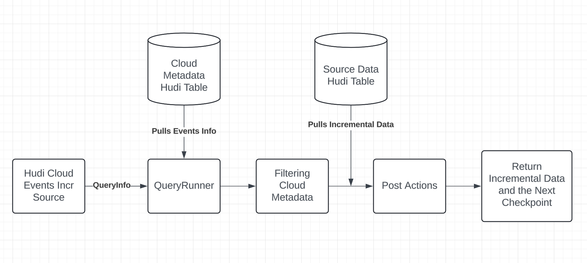
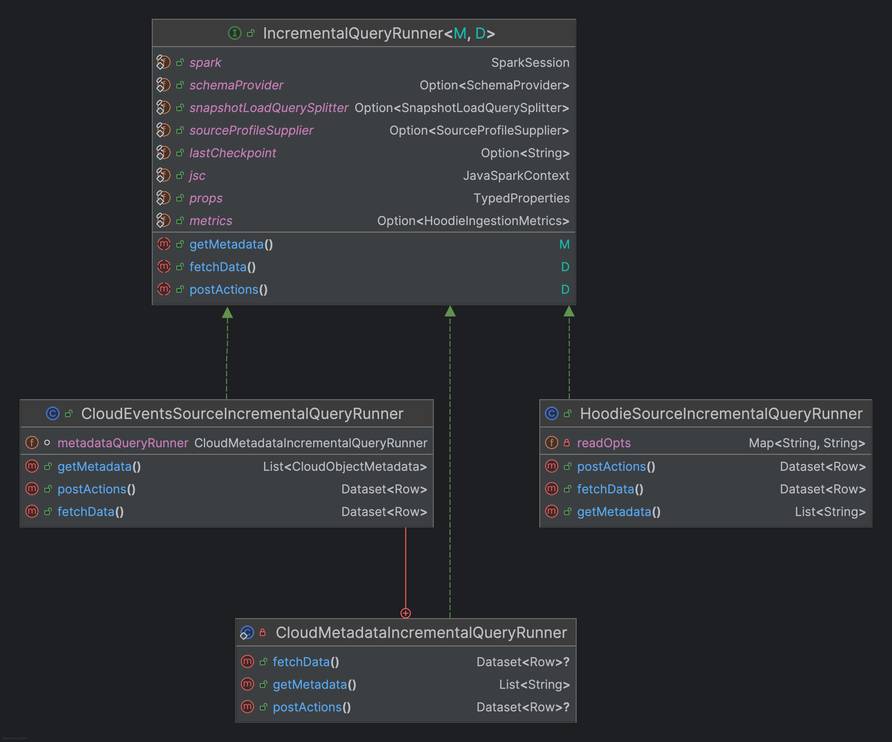

<!--
  Licensed to the Apache Software Foundation (ASF) under one or more
  contributor license agreements.  See the NOTICE file distributed with
  this work for additional information regarding copyright ownership.
  The ASF licenses this file to You under the Apache License, Version 2.0
  (the "License"); you may not use this file except in compliance with
  the License.  You may obtain a copy of the License at

       http://www.apache.org/licenses/LICENSE-2.0

  Unless required by applicable law or agreed to in writing, software
  distributed under the License is distributed on an "AS IS" BASIS,
  WITHOUT WARRANTIES OR CONDITIONS OF ANY KIND, either express or implied.
  See the License for the specific language governing permissions and
  limitations under the License.
-->
# RFC-83: Incremental Query with Completion Time

## Proposers

- @yihua
- @CTTY

## Approvers
- @<approver1 github username>
- @<approver2 github username>

## Status

JIRA: 
- [HUDI-8141](https://issues.apache.org/jira/browse/HUDI-8141)(Closed)([PR](https://github.com/apache/hudi/pull/11947))
- [HUDI-8354](https://issues.apache.org/jira/browse/HUDI-8354)

> Please keep the status updated in `rfc/README.md`.

## Abstract

For Hudi incremental queries, Hudi needs to scan the timeline to find the incremental commits to be pulled.
Current incremental queries use commits' start times(instant times) to sort the timeline and find eligible commits, 
but this introduces the necessity of handling hollow commits, which complicates the incremental logic.

Since Hudi 1.x, Hudi introduces completion time and each instant will now have two important timestamps: 
start time and completion time, making an instant no longer a "dot" in the timeline but a "range" which is more realistic
and offers finer control and management over the timeline.

This RFC aims to change Hudi incremental-related logic to use commits' completion times by default instead of start times 
to simplify the timeline scanning logic and improve the overall incremental experience.

## Background
### Problem 1: Hollow Commits
Let's take a look at the example Hudi timeline below:
```
Timeline —----------------------
C1              [------]
C2                    [---------
C3                       [----]
```
In the timeline above, there are three Hudi commits: C1, C2, and C3. Among which, C1 and C3 are completed instants, while C2 is still inflight.
Suppose a query is scanning the entire timeline that includes all three commits, then C2 would be considered a hollow commit 
as it hasn't completed yet. 

Incremental query relies on checkpointing, which also uses start times, and will return a new checkpoint when it finishes. 
If the query reads to C3, then the next checkpoint would be C3 and the future incremental queries 
would only read commits that start later than C3.
But C2, if completed normally after some time later, would never be read again because the checkpoint has already been moved 
to `C3.start`. This will cause the data loss.
```
If we ignore the hollow commit, then the checkpoint would be moved to C3.start
Timeline —----------------------
C1              [------]
C2                    [---------++++]   C2 would be skipped even if it completes normally later
C3                       [----]
                         *
                     Checkpoint
```

To avoid data loss, Hudi can either 1) only read until the hollow commit or 2) fail the incremental query. Either of these two 
ways will require Hudi to detect hollow commits first by scanning the timeline before running the actual incremental read, 
which is not ideal.

Let's use the same example here again but this time we will use completion time as the checkpoint.
```
                                Now
                                 *
Timeline —------------------------
C1              [------]
C2                    [-----------++++] 
C3                       [----]
                              *
                         Checkpoint
```
Assuming the input time range covers all three commits, C1 and C3 would be eligible as of now. The checkpoint 
would be moved to `C3.completion`. Even if C2 completes some time in the future, `C2.completion` would still be 
larger than `C3.completion` thus C2 can be picked up by future incremental query without issues. With this approach, 
we no longer need to concern about handling hollow commits when running incremental queries.

### Problem 2: Cloud Events Source Incremental Query
Existing Hudi supports S3/GCS events incremental source, it's tightly coupled with `QueryInfo` that uses 
instant start times everywhere.
To better support the new incremental assumptions and cleaner modularization, 
it's necessary to refactor the existing cloud events incremental classes and provide a unified interface that 
can work across Hudi incremental source, Flink incremental source, and cloud events incremental source.

For the background, let's first review how existing cloud events source operate. We will cover the refactoring
design in the implementation section.

The existing cloud events source is consisted of 
mainly five steps:
1. Generate `QueryInfo` based on last checkpoint and configs
2. Pass `QueryInfo` to `QueryRunner` and get events info from Hudi cloud metadata table
3. Apply filters (e.g. source limiting filters, file filters, etc.) to events info returned by `QueryRunner`
4. Fetch the cloud data from the actual Hudi data table with cloud events info
5. Post actions like dropping Hudi meta fields from returned dataset, reporting metrics, setting the next checkpoint, etc.

These steps can be concluded in the following diagram:



## Implementation
### Integrate with IncrementalQueryAnalyzer
#### Glossary
- `IncrementalQueryAnalyzer`: An existing Hudi class that is solely used by Flink's incremental logic. 
It helps read and filter the timeline to obtain commits that fall in completion time range.
- `QueryContext`: The result of `IncrementalQueryAnalyzer#analyze`, it contains a list of eligible commits.
- `IncrementalRelation`: Hudi's main class of incremental query logic. It accepts a time range (start, end] 
and helps scan the timeline to find eligible commits and use commits metadata to fetch the actual table data.
- `HoodieIncrSource`: An implementation of Hudi's `RowSource` that helps fetch incremental data from the source 
Hudi table. This class was the focus of [HUDI-8141](https://issues.apache.org/jira/browse/HUDI-8141).
- `QueryInfo`: This class contains the logic of finding timeline based on start time range.

Existing `HoodieIncrSource` will analyze the table timeline and generate `QueryInfo` that contains start and 
end instant times. This range would be passed to `IncrementalRelation` for further analyzing and filtering.
`IncrementalRelation` will fetch available commits within the range and build a scan RDD that covers the incremental data.
The filter would be applied on the returned dataset: 
```
spark.read.load(...)
...
.filter(String.format("%s > '%s'", HoodieRecord.COMMIT_TIME_METADATA_FIELD, startInstantTime))
.filter(String.format("%s <= '%s'", HoodieRecord.COMMIT_TIME_METADATA_FIELD, endInstantTime))
```

After switching to use completion time, there are these key changes:
1. `HoodieIncrSource` would use `IncrementalQueryAnalyzer` and `QueryContext` that work under completion time
semantics instead of using `QueryInfo`.
2. For filtering, we cannot rely on some range like (start, end] because there may be hollow commits in the range.
We will need to rely on the list of eligible commits stored in the `QueryContext`, so the new filter would look like this:
```
.filter(String.format("%s IN ('%s')", HoodieRecord.COMMIT_TIME_METADATA_FIELD,
              String.join("','", instantTimeList)));
```
This would enough to cover incremental query logic that goes through `HoodieIncrSource` and `IncrementalRelation`.
After the change, now `HoodieIncrSource` would behave like this:
1. Use the last checkpoint and query configs to build `IncrementalQueryAnalyzer` and get `QueryContext`.
2. Run snapshot/incremental query with the info from `QueryContext` and this will trigger the underlying `IncrementalRelation`.
3. Filter the returned data with plugins like `SnapshotLoadQuerySplitter`, drop metadata fields, report metrics, etc.

### Refactor Cloud Events Incremental Source
#### Incremental Logic Abstraction
Now let's move on to cloud events incremental source for S3/GCS. Due to its vastly different logic, 
it's very challenging to plug in `IncrementalQueryAnalyzer` and migrate logic we have for `HoodieIncrSource` to 
cloud events incremental source. Even if we managed to do so, the code would not be maintainable. Hence, a refactoring is necessary.

We've already covered the updated logic flow of `HoodieIncrSource` and cloud events incremental source.
By comparing them, we can come up with three abstract steps:
- Get metadata
- Fetch data
- Post actions

The following is a table to describe what `HoodieIncrSource` and cloud events incremental source need to do for each step.

| *                        | Get Metadata                                                                                                                                                                               | Fetch Data                                                                         | Post Actions                                         |
|--------------------------|--------------------------------------------------------------------------------------------------------------------------------------------------------------------------------------------|------------------------------------------------------------------------------------|------------------------------------------------------|
| `HoodieIncrSource`       | - Pass checkpoint and query config to `IncrementalQueryAnalyzer` and get `QueryContext`                                                                                                    | - Use `QueryContext` and `IncrementalRelation` to query data                       | - Filter the result<br/>- Report metrics<br/> - etc. |
| Cloud Events Incr Source | - Pass checkpoint and query config to `IncrementalQueryAnalyzer` and get `QueryContext`<br/>- Fetch eligible `CloudObjectMetadata` from cloud metadata Hudi table<br/>- Filter the results | - Use `QueryContext` and `CloudObjectMetadata` to fetch objects from cloud storage | - Report metrics<br/>- etc.                          |

Note that Flink's `IncrementalInputSplits` can also be abstracted into these flow, but it's not in the scope of this RFC.

#### IncrementalQueryRunner
With the abstraction above, we can come up with the interface `IncrementalQueryRunner`.
```java
public interface IncrementalQueryRunner<M, D> {
  
  M getMetadata();

  D fetchData();

  D postActions();
}
```
We can have the following implementations based on this interface:
- `HoodieSourceIncrementalQueryRunner`: Covers incremental logic in `HoodieIncrSource`
- `CloudEventsSourceIncrementalQueryRunner`: Covers incremental logic in `S3EventsHoodieIncrSource` and `GCSEventsHoodieIncrSource`
  - Noticing the `Get Metadata` phase of getting cloud events source incremental data follows the same flow of
    `getMetadata` -> `fetchData` -> `postActions`. We can add a nested query runner `CloudMetadataIncrementalQueryRunner` 
    to get cloud metadata
- (not in scope)`InputSplitsIncrementalQueryRunner`: Covers incremental logic in `IncrementalInputSplits`

The dependency graph is presented here:



## Rollout/Adoption Plan

- What impact (if any) will there be on existing users?
- If we are changing behavior how will we phase out the older behavior?
- If we need special migration tools, describe them here.
- When will we remove the existing behavior

## Test Plan

This RFC does not add a new feature, it's changing the behavior of incremental query and refactoring 
the incremental logic flow. Existing unit tests should be able to cover this change.