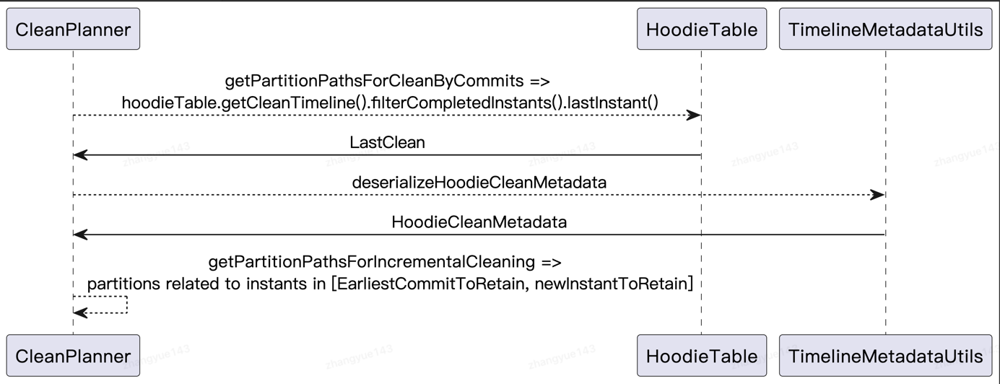

<!--
  Licensed to the Apache Software Foundation (ASF) under one or more
  contributor license agreements.  See the NOTICE file distributed with
  this work for additional information regarding copyright ownership.
  The ASF licenses this file to You under the Apache License, Version 2.0
  (the "License"); you may not use this file except in compliance with
  the License.  You may obtain a copy of the License at

       http://www.apache.org/licenses/LICENSE-2.0

  Unless required by applicable law or agreed to in writing, software
  distributed under the License is distributed on an "AS IS" BASIS,
  WITHOUT WARRANTIES OR CONDITIONS OF ANY KIND, either express or implied.
  See the License for the specific language governing permissions and
  limitations under the License.
-->
# RFC-83: Incremental Table Service

## Proposers

- @zhangyue19921010

## Approvers
- @danny0405
- @yuzhaojing

## Status

JIRA: https://issues.apache.org/jira/browse/HUDI-8780

## Abstract

In Hudi, when scheduling Compaction and Clustering, the default behavior is to scan all partitions under the current table. 
When there are many historical partitions, such as 640,000 in our production environment, this scanning and planning operation becomes very inefficient. 
For Flink, it often leads to checkpoint timeouts, resulting in data delays.
As for cleaning, we already have the ability to do cleaning for incremental partitions.

This RFC will draw on the design of Incremental Clean to generalize the capability of processing incremental partitions to all table services, such as Clustering and Compaction.

## Background

`earliestInstantToRetain` in clean plan meta

HoodieCleanerPlan.avsc

```text
{
  "namespace": "org.apache.hudi.avro.model",
  "type": "record",
  "name": "HoodieCleanerPlan",
  "fields": [
    {
      "name": "earliestInstantToRetain",
      "type":["null", {
        "type": "record",
        "name": "HoodieActionInstant",
        "fields": [
          {
            "name": "timestamp",
            "type": "string"
          },
          {
            "name": "action",
            "type": "string"
          },
          {
            "name": "state",
            "type": "string"
          }
        ]
      }],
      "default" : null
    },
    xxxx
  ]
}
```

`EarliestCommitToRetan` in clean commit meta

HoodieCleanMetadata.avsc

```text
{"namespace": "org.apache.hudi.avro.model",
 "type": "record",
 "name": "HoodieCleanMetadata",
 "fields": [
     xxxx,
     {"name": "earliestCommitToRetain", "type": "string"},
     xxxx
 ]
}
```
How to get incremental partitions during cleaning



**Note**
`EarliestCommitToRetain` is recorded in `HoodieCleanMetadata`
newInstantToRetain is computed based on Clean configs such as `hoodie.clean.commits.retained` and will be record in clean meta as new EarliestCommitToRetain

## Design And Implementation

### Changes in TableService Metadata Schema

Add new column `earliestInstantToRetain` (default null) in Clustering/Compaction plan same as `earliestInstantToRetain` in clean plan

```text
    {
      "name": "earliestInstantToRetain",
      "type":["null", {
        "type": "record",
        "name": "HoodieActionInstant",
        "fields": [
          {
            "name": "timestamp",
            "type": "string"
          },
          {
            "name": "action",
            "type": "string"
          },
          {
            "name": "state",
            "type": "string"
          }
        ]
      }],
      "default" : null
    },
```

We also need a unified interface/abstract-class to control the Plan behavior of the TableService including clustering and compaction.

### Abstraction

Use `BaseTableServicePlanStrategy` to control the behavior of getting partitions, filter partitions and generate table service plan etc.

Since we want to implement different strategies to control partition retrieval, partition filtering, and plan generation,
the first step is to use an abstraction to consolidate these logics into a strategy.

```java
package org.apache.hudi.table;

import org.apache.hudi.common.engine.HoodieEngineContext;
import org.apache.hudi.common.table.HoodieTableMetaClient;
import org.apache.hudi.common.table.timeline.HoodieInstant;
import org.apache.hudi.common.util.Option;
import org.apache.hudi.config.HoodieWriteConfig;

import java.io.IOException;
import java.util.List;

public abstract class BaseTableServicePlanStrategy<R,S> {

  /**
   * Generate table service plan based on given instant.
   * @return
   */
  public abstract R generateTableServicePlan(Option<String> instant) throws IOException;

  /**
   * Generate table service plan based on given instant.
   * @return
   */
  public abstract R generateTableServicePlan(List<S> operations) throws IOException;


  /**
   * Get partition paths to be performed for current table service.
   * @param metaClient
   * @return
   */
  public abstract List<String> getPartitionPaths(HoodieWriteConfig writeConfig, HoodieTableMetaClient metaClient, HoodieEngineContext engineContext);

  /**
   * Filter partition path for given fully paths.
   * @param metaClient
   * @return
   */
  public abstract List<String> filterPartitionPaths(HoodieWriteConfig writeConfig, List<String> partitionPaths);

  /**
   * Get incremental partitions from EarliestCommitToRetain to instantToRetain
   * @param instantToRetain
   * @param type
   * @param deleteEmptyCommit
   * @return
   * @throws IOException
   */
  public List<String> getIncrementalPartitionPaths(Option<HoodieInstant> instantToRetain) {
    throw new UnsupportedOperationException("Not support yet");
  }

  /**
   * Returns the earliest commit to retain from instant meta
   */
  public Option<HoodieInstant> getEarliestCommitToRetain() {
    throw new UnsupportedOperationException("Not support yet");
  }
}

```

Default action of `generateTableServicePlan`, `getPartitionPaths` and `filterPartitionPaths` API remains the same as it is now.

Let baseAbstraction `CompactionStrategy` and `ClusteringPlanStrategy` extends this `BaseTableServicePlanStrategy` which are
1. `public abstract class CompactionStrategy extends BaseTableServicePlanStrategy<HoodieCompactionPlan, HoodieCompactionOperation> implements Serializable`
2. `public abstract class ClusteringPlanStrategy<T,I,K,O> extends BaseTableServicePlanStrategy<Option<HoodieClusteringPlan>, HoodieClusteringGroup> implements Serializable`

**For Incremental Table Service including clustering and compaction, we will support a new IncrementalCompactionStrategy and 
new IncrementalClusteringPlanStrategy**


### Work Flow for Incremental Clustering/Compaction Strategy

Table Service Planner with Incremental Clustering/Compaction Strategy
1. Retrieve the instant recorded in the last table service `xxxx.requested` as **INSTANT 1**.
2. Calculate the current instant(Request time) to be processed as **INSTANT 2**.
3. Obtain all partitions involved from **INSTANT 1** to **INSTANT 2** as incremental partitions and perform the table service plan operation.
4. Record **INSTANT 2** in the table service plan.


### About archive

We record `EarliestCommitToRetain` in the TableService Request metadata file and use it as the basis for retrieving incremental partitions. 
Therefore, when Incremental Table Service is enabled, we should always ensure that there is a Clustering/Compaction request metadata in the active timeline.

## Rollout/Adoption Plan

low impact for current users

## Test Plan