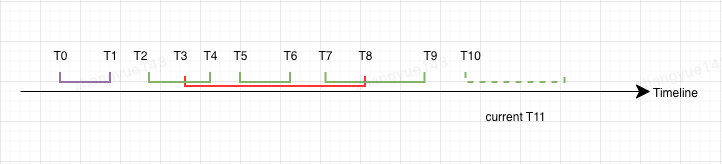

<!--
  Licensed to the Apache Software Foundation (ASF) under one or more
  contributor license agreements.  See the NOTICE file distributed with
  this work for additional information regarding copyright ownership.
  The ASF licenses this file to You under the Apache License, Version 2.0
  (the "License"); you may not use this file except in compliance with
  the License.  You may obtain a copy of the License at

       http://www.apache.org/licenses/LICENSE-2.0

  Unless required by applicable law or agreed to in writing, software
  distributed under the License is distributed on an "AS IS" BASIS,
  WITHOUT WARRANTIES OR CONDITIONS OF ANY KIND, either express or implied.
  See the License for the specific language governing permissions and
  limitations under the License.
-->
# RFC-83: Incremental Table Service

## Proposers
- @zhangyue19921010

## Approvers
- @danny0405
- @yuzhaojing

## Status
JIRA: https://issues.apache.org/jira/browse/HUDI-8780

## Abstract
Currently, Table Service, including Clustering and Compaction, need to scan all partitions of the table during the strategy 
plan phase. This is a very expensive operation. As the table partitions continue to increase, The pressure on the table 
service is increasing, which may affect the performance and stability of the entire lake table processing job.

Taking Flink's real-time Hudi ingestion as an example, Compaction and Clustering services are usually placed in the same 
job as common write. However, as the amount of table partition data continues to expand, the performance loss of Clustering 
and compaction plans becomes larger, resulting in a decrease in performance and stability(checkpoint timeouts, GC overhead, etc) 
of the entire Flink job.

The purpose of this RFC-83 is to design and implement an incremental table service including clustering and compaction 
to process incremental partitions related data. Also this feature is enabled by default.

## Background
Hudi has powerful out-of-the-box table service capabilities, such as Compaction and Clustering, to reorganize lake table 
data, balance read and write performance, and keep the overall lake table in a healthy state. Generally speaking, We always 
integrate table services with normal write jobs, executing table services asynchronously or synchronously.

In the Compaction/Clustering Plan stage, Hudi will get partitions, filtering them based on strategy and building 
related table service plan.

For now, Clustering and Compaction will obtain all table partitions at the beginning. This is an expensive and time-consuming 
operation. As the table partitions continue to increase, The pressure on table service is increasing, which may affect the 
performance and stability of the entire writing job.

## Design
In the design of Incremental Table service, the following principles are followed:
1. It is unaware of users, that is, it is fully adapted to the partition filtering, Target IO restrictions and other capabilities provided in the existing strategy.
2. All strategies are working under the incremental processing by default
3. Keep good extensibility for new table services

### Abstraction

### Strategy Interface
Add a new marking strategy interface `IncrementalPartitionAwareStrategy`. Any Strategy implement this `IncrementalPartitionAwareStrategy` 
could have the ability to perform incremental partitions processing. At this time, Incremental partitions should be 
passed to the current strategy.

```java
package org.apache.hudi.table;

import org.apache.hudi.config.HoodieWriteConfig;

import java.util.List;

public interface IncrementalPartitionAwareStrategy {
  /**
   * Filter the given incremental partitions.
   * @param writeConfig
   * @param incrementalPartitions 
   * @return Pair of final processing partition paths and filtered partitions which will be recorded as missing partitions.
   * Different strategies can individually implement whether to record, or which partitions to record as missing partitions.
   */
  Pair<List<String>,List<String>> filterPartitionPaths(HoodieWriteConfig writeConfig, List<String> incrementalPartitions);
}

```

### Abstract TableServicePlanActionExecutor
For table services like clustering and compaction, at plan stage, they will performance the same partition operations, 
that is, first obtain the partition, and then filter the partition. The difference is that clustering obtains partitions in strategy.

Considering that partition acquisition should be a general behavior of the engine, while partition filtering should be a
specific behavior of different strategies, here we perform a small refactoring to the clustering and compaction plan to achieve:
1. Unified partition acquisition in PlanActionExecutor
2. Unified partition filtering in strategy

```java
package org.apache.hudi.table;

import org.apache.hudi.config.HoodieWriteConfig;
import java.util.List;

public abstract class BaseTableServicePlanActionExecutor<T, I, K, O> extends BaseActionExecutor<T, I, K, O> {

  /**
   * Get partitions, if strategy implement `IncrementalPartitionAwareStrategy` then return incremental partitions, 
   * otherwise return all partitions of the table
   * @param strategy
   * @return
   */
  public List<String> getPartitions(Object strategy) {
    if (strategy instanceof IncrementalPartitionAwareStrategy) {
      // return incremental partitions.
    } else {
      // return all table partitions.
    }
  }
  
}
```

Then the inheritance relationship between `ScheduleCompactionActionExecutor` and `ClusteringPlanActionExecutor` will be modified, that is
1. `public class ScheduleCompactionActionExecutor<T, I, K, O> extends BaseTableServicePlanActionExecutor<T, I, K, O, Option<HoodieCompactionPlan>>`
2. `public class ClusteringPlanActionExecutor<T, I, K, O> extends BaseTableServicePlanActionExecutor<T, I, K, O, Option<HoodieClusteringPlan>>`

Table services to be added later directly extends `BaseTableServicePlanActionExecutor` to quickly get incremental partitions.

### Clustering/Compaction Plan Metadata
In order to prevent the loss of certain partitions during incremental partition processing, being consistent with the current behavior.

We decide to add a new column `missingSchedulePartitions` in `HoodieClusteringPlan.asvc` and `HoodieCompactionPlan.asvc`. 
,default value is null, to record ignored partitions during current table service planning.

Scenarios where partitions are missing or incomplete, such as
1. Being filtered.
2. The partition related file groups is not fully processed due to Target IO.

```avro schema
      {
        "name":"missingSchedulePartitions",
        "type":["null", {
           "type":"array",
           "items":"string"
        }],
        "default": null
      }
```

In the next round of scheduling, the Missing Partitions and the latest incremental partitions are combined as final incremental partitions.

### Work Flow for Incremental Clustering/Compaction Strategy

Assume the Hudi timeline is as follows, and the current time is T11


```text
T0_T1.delatacommit
T2_T4.delatacommit
T3_T8.commit
T3.compaction.requested
T5_T6.deltacommit
T7_T9.deltacommit
T10.deltacommit.requested
```

1. Construct a time window, obtain the instant time (T3) of the last completed TableService as the left boundary, and the instant time of the current compaction plan as the right boundary, that is, [T3, T11)
2. Traverse the completion time of the active commit instants, and select all the instants whose completion time is within the time window as incremental instants, that is, T2 and T5.
3. Get all incremental partitions involved in incremental instants as *PARTITIONS 1*
4. Get the missing partitions recorded in T3.compaction.requested as *PARTITIONS 2*
5. Merge and deduplicate *PARTITIONS 1* with *PARTITIONS 2* as final incremental partitions as *INCREMENTAL PARTITIONS 1*
6. Based on *INCREMENTAL PARTITIONS 1*, perform strategy custom partition filtering logic to obtain the final partition List *INCREMENTAL PARTITIONS 2* and the filtered *MISSING PARTITIONS*
7. Perform normal Table Service scheduling based on *INCREMENTAL PARTITIONS 2*. If partition scheduling is incomplete due to Target IO and other factors, add the corresponding partition to *MISSING PARTITIONS*
8. Finally generate the Table Service Plan and record *MISSING PARTITIONS* in it

Note: If the instant time of the last completed TableService cannot be obtained due to reasons such as archive, the partition
acquisition operation will fall back to obtaining all table partitions.

## Rollout/Adoption Plan


## Test Plan