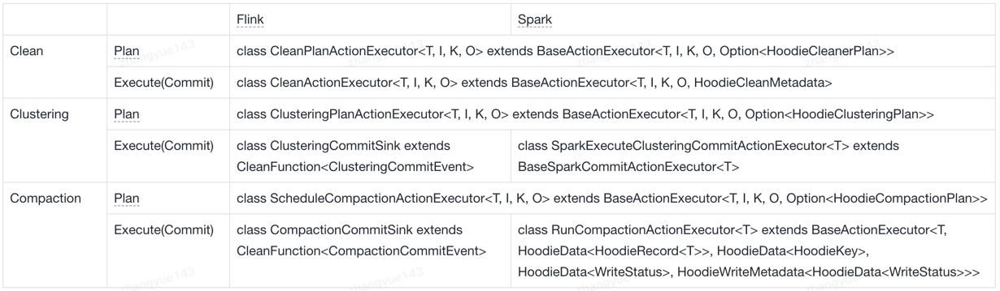
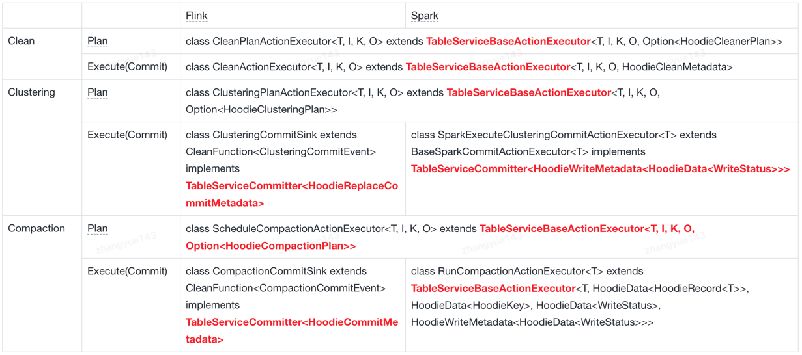

<!--
  Licensed to the Apache Software Foundation (ASF) under one or more
  contributor license agreements.  See the NOTICE file distributed with
  this work for additional information regarding copyright ownership.
  The ASF licenses this file to You under the Apache License, Version 2.0
  (the "License"); you may not use this file except in compliance with
  the License.  You may obtain a copy of the License at

       http://www.apache.org/licenses/LICENSE-2.0

  Unless required by applicable law or agreed to in writing, software
  distributed under the License is distributed on an "AS IS" BASIS,
  WITHOUT WARRANTIES OR CONDITIONS OF ANY KIND, either express or implied.
  See the License for the specific language governing permissions and
  limitations under the License.
-->
# RFC-83: Incremental Table Service

## Proposers

- @zhangyue19921010

## Approvers
- @danny0405
- @yuzhaojing

## Status

JIRA: https://issues.apache.org/jira/browse/HUDI-8780

## Abstract

In Hudi, when scheduling Compaction and Clustering, the default behavior is to scan all partitions under the current table. 
When there are many historical partitions, such as 640,000 in our production environment, this scanning and planning operation becomes very inefficient. 
For Flink, it often leads to checkpoint timeouts, resulting in data delays.
As for cleaning, we already have the ability to do cleaning for incremental partitions.

This RFC will draw on the design of Incremental Clean to generalize the capability of processing incremental partitions to all table services, such as Clustering and Compaction.

## Background

`earliestInstantToRetain` in clean plan meta

HoodieCleanerPlan.avsc

```text
{
  "namespace": "org.apache.hudi.avro.model",
  "type": "record",
  "name": "HoodieCleanerPlan",
  "fields": [
    {
      "name": "earliestInstantToRetain",
      "type":["null", {
        "type": "record",
        "name": "HoodieActionInstant",
        "fields": [
          {
            "name": "timestamp",
            "type": "string"
          },
          {
            "name": "action",
            "type": "string"
          },
          {
            "name": "state",
            "type": "string"
          }
        ]
      }],
      "default" : null
    },
    xxxx
  ]
}
```

`EarliestCommitToReta` in clean commit meta

HoodieCleanMetadata.avsc

```text
{"namespace": "org.apache.hudi.avro.model",
 "type": "record",
 "name": "HoodieCleanMetadata",
 "fields": [
     xxxx,
     {"name": "earliestCommitToRetain", "type": "string"},
     xxxx
 ]
}
```
How to get incremental partitions during cleaning


**Note**
`EarliestCommitToRetain` is recorded in `HoodieCleanMetadata`
newInstantToRetain is computed based on Clean configs such as `hoodie.clean.commits.retained` and will be record in clean meta as new EarliestCommitToRetain

## Design And Implementation

### Current Table Service Plan AND Execute Logic



### Changes in TableService Metadata Schema

Add new column `earliestInstantToRetain` in Clustering/Compaction plan same as `earliestInstantToRetain` in clean plan

```text
    {
      "name": "earliestInstantToRetain",
      "type":["null", {
        "type": "record",
        "name": "HoodieActionInstant",
        "fields": [
          {
            "name": "timestamp",
            "type": "string"
          },
          {
            "name": "action",
            "type": "string"
          },
          {
            "name": "state",
            "type": "string"
          }
        ]
      }],
      "default" : null
    },
```

Add `EarliestCommitToReta` in HoodieCommitMetadata extra meta MAP for clustering and compaction operation which are all written-commit

```text
{"name": "earliestCommitToRetain", "type": "string"}
```

We also need a unified interface/abstract-class to control the Plan behavior and Commit behavior of the TableService.

### Abstraction

Use `TableServiceCommitter` to control table service related commit action.

```java
package org.apache.hudi.table.action;

public interface TableServiceCommitter<R> {

  /**
   * Build table service related commit metadata, 
   * Especially `EarliestCommitToReta` column when enable incremental table service.
   * @return metadata to commit
   */
  R buildCommitMeta();
}
```

Use `TableServiceBaseActionExecutor` to control the behavior of getting partitions to be performed into current table service.

```java
package org.apache.hudi.table.action;

import org.apache.hudi.common.engine.HoodieEngineContext;
import org.apache.hudi.common.model.TableServiceType;
import org.apache.hudi.common.table.timeline.HoodieInstant;
import org.apache.hudi.common.util.Option;
import org.apache.hudi.config.HoodieWriteConfig;
import org.apache.hudi.exception.HoodieNotSupportedException;
import org.apache.hudi.table.HoodieTable;

import java.io.IOException;
import java.util.List;

public abstract class TableServiceBaseActionExecutor<T, I, K, O, R> extends BaseActionExecutor<T, I, K, O, R> implements TableServiceCommitter<R> {

  public TableServiceBaseActionExecutor(HoodieEngineContext context, HoodieWriteConfig config, HoodieTable<T, I, K, O> table, String instantTime) {
    super(context, config, table, instantTime);
  }

  /**
   * Returns the earliest commit to retain and will record in meta as new EarliestCommitToRetain
   */
  public Option<HoodieInstant> getEarliestCommitToRetain() {
    return null;
  }

  /**
   * get partitions to be performed in current table service
   * @param instantToRetain
   * @param type
   * @return
   * @throws IOException
   */
  public List<String> getPartitionPaths(Option<HoodieInstant> instantToRetain, TableServiceType type) {
    return null;
  }

  /**
   * Get incremental partitions from EarliestCommitToRetain to instantToRetain
   * @param instantToRetain
   * @param type
   * @param deleteEmptyCommit
   * @return
   * @throws IOException
   */
  private List<String> getIncrementalPartitionPaths(Option<HoodieInstant> instantToRetain, TableServiceType type) {
    return null;
  }

  /**
   * Get all table partitions related to current table
   * @param instantToRetain
   * @param type
   * @param deleteEmptyCommit
   * @return
   * @throws IOException
   */
  private List<String> getAllPartitionPaths(Option<HoodieInstant> instantToRetain, TableServiceType type) {
    return null;
  }

  public R buildCommitMeta() {
    return null;
  }

}

```

### Optimize the inheritance relationship of Table Service



### Work Flow for Incremental Table Service

Table Service Planner
1. Retrieve the instant recorded in the last completed table service commit as **INSTANT 1**.
2. Calculate the current instant to be processed as **INSTANT 2**.
3. Obtain all partitions involved from **INSTANT 1** to **INSTANT 2** as incremental partitions and perform the table service plan operation.
4. Record **INSTANT 2** in the table service plan.

Table Service Executor
1. Retrieve **INSTANT 2** from the table service plan.
2. Execute the corresponding table service plan.
3. Record **INSTANT 2** in the current table service commit. 

For cleaning, record it inHoodieCleanMetadata#earliestInstantToRetain 

For compaction and clustering, record it inHoodieCommitMetadata#extraMeta

## Rollout/Adoption Plan

low impact for current users

## Test Plan