<!--
  Licensed to the Apache Software Foundation (ASF) under one or more
  contributor license agreements.  See the NOTICE file distributed with
  this work for additional information regarding copyright ownership.
  The ASF licenses this file to You under the Apache License, Version 2.0
  (the "License"); you may not use this file except in compliance with
  the License.  You may obtain a copy of the License at

       http://www.apache.org/licenses/LICENSE-2.0

  Unless required by applicable law or agreed to in writing, software
  distributed under the License is distributed on an "AS IS" BASIS,
  WITHOUT WARRANTIES OR CONDITIONS OF ANY KIND, either express or implied.
  See the License for the specific language governing permissions and
  limitations under the License.
-->

# RFC-85: Hudi Issue and Sprint Management in Jira

## Proposers

- @yihua

## Approvers

- @vinothchandar

## Status

JIRA: https://issues.apache.org/jira/browse/HUDI-8255

## Abstract

We have been using [Hudi Project in Jira](https://issues.apache.org/jira/projects/HUDI) to manage and track progress
towards each release. There are inconsistencies among contributors on how the estimate and time spent are tracked. This
RFC aims to standardize the process to follow.

## Proposal

This RFC proposes a hierarchy to easily maintain the issues and subtasks, and sprints to manage week-to-week
development.

### Task Hierarchy

The task hierarchy is composed of three levels, **Epic**, **Issue**, **Sub-task**:

- **Epic**: represents a theme of work in one or multiple releases that span across one or multiple months.
  For example, The Epic of [1.0 Migration](https://issues.apache.org/jira/browse/HUDI-7856) for 1.0.0 release.

- **Issue**: represents a story achieving a single goal within an Epic, for one (or more) week(s). A story has a clear exit 
  criteria that spells out what impact is achieved when the story is completed. The Issue can also
  be a bug fix, addressing a known problem discovered. An Epic can contain multiple Issues. If an Issue does not fit
  into any existing epic, it is OK to leave Epic Link of the Issue empty.

- **Sub-task**: represents a small task contributing to a goal targeted by an Issue that can be finished in a day or
  two. An issue can contain multiple sub-tasks. The sub-tasks are created through Jira sub-task in Issue screen. A sub-task 
  maps to 1 or more actual Github pull requests. 

### Sprint Management

We manage the development towards Hudi releases through weekly sprints using the
[Hudi Sprint Board](https://issues.apache.org/jira/secure/RapidBoard.jspa?rapidView=611).

- Epics stay independent of sprints. Issues representing the stories are pulled into sprints. Sub-tasks are attached to
  Issues, and they will go to the corresponding sprints automatically (no action to pull in sub-tasks individually).

- An Issue can be rolled over from one sprint to the next sprint if necessary. When using the "Log work" workflow
  mentioned below, the work done in each sprint are properly attached to the sprint, not affected by the rollover.

- Before the Issues are pulled into a sprint, each sub-task must have an "Original Estimate" for tracking the scope.
  The Issue screen has a view to sum up the total of "Original Estimate" of all subtasks (there is no need to set
  "Original Estimate" of the Issue in this case).
  If the Issue stands on its own without a subtask, the "Original Estimate" should be set on the Issue.

- In a sprint, to properly track the time spent and remaining estimate, use Jira's "Log work" feature on a subtask to
  log time spent, and manually set remaining estimate if it has changed based on new estimates. The time spent and
  remaining estimate are used to generate sprint burndown chart for tracking.

- For estimates and time spent, use multiples of 0.5h (half hour).

### Example Workflow

Here is an example workflow of managing one Issue across multiple sprints, to illustrate the proposed sprint management
above.

1. Create an Issue representing a story, then create a sub-task of the Issue

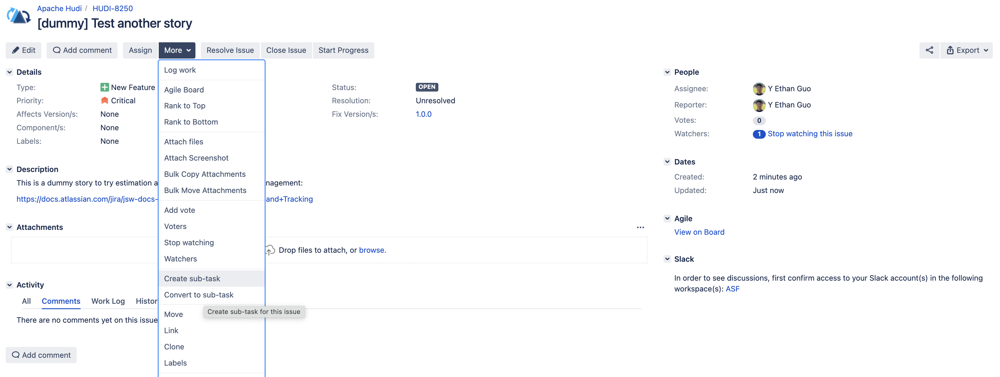
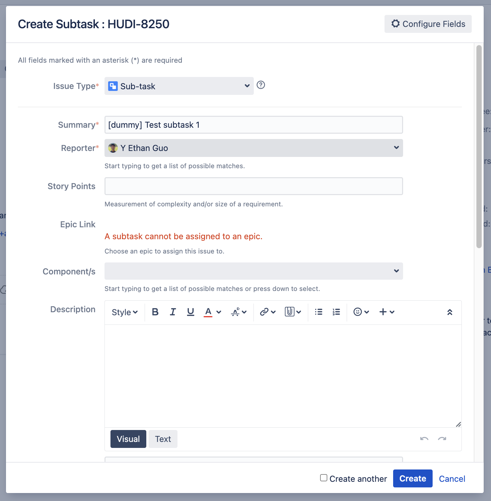

2. Set "Original Estimate" of the sub-task

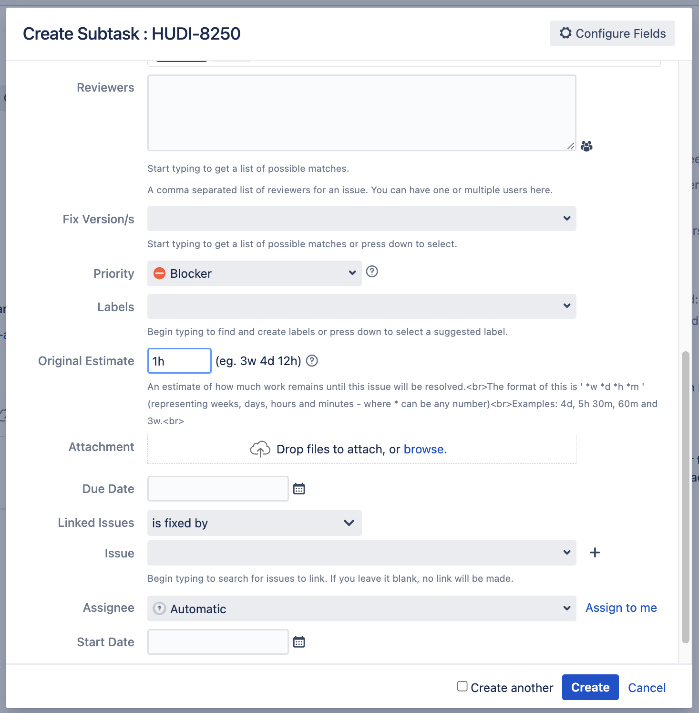

3. After creating multiple sub-tasks, the Issue and sub-task screen show the total estimate and remaining work in hours

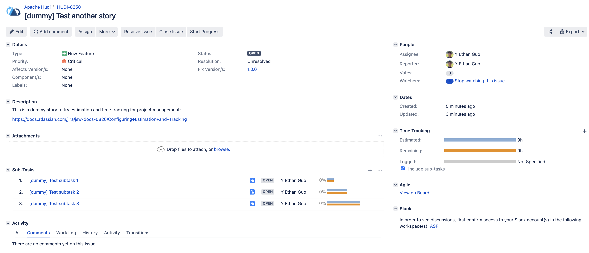
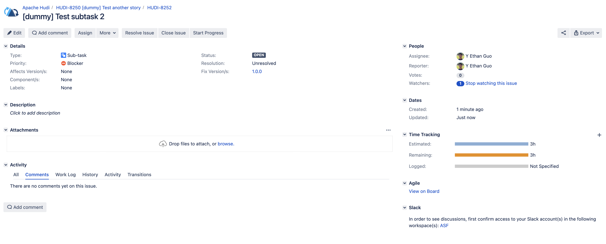

4. Move the Issue to a sprint

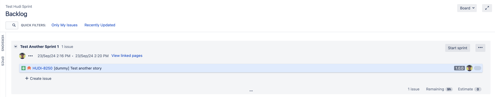

5. The sprint board is configured to use "Original Time Estimate" as the estimation statistic, "Remaining Estimate and
   Time Spent" as the time tracking, so the sprint has proper tracking

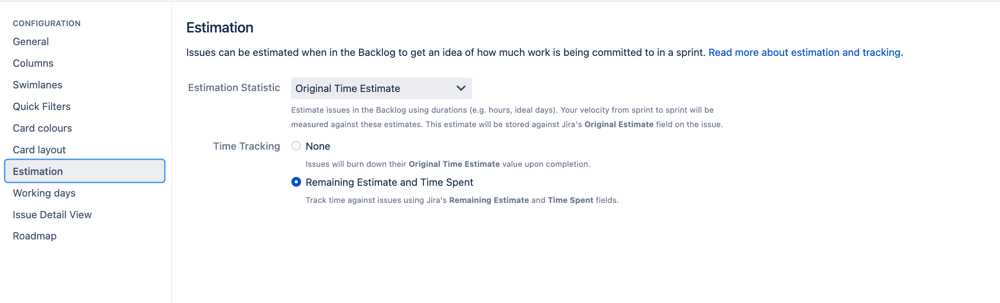

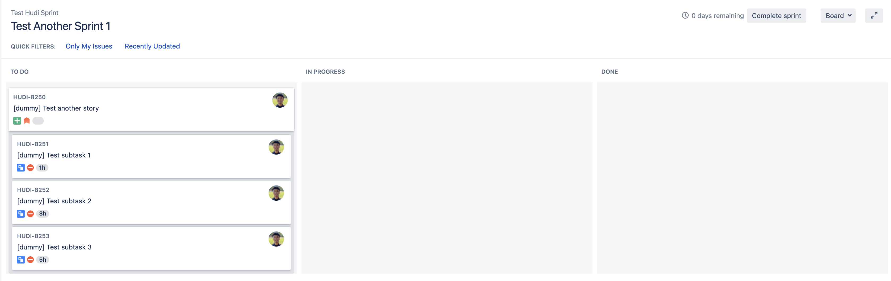

6. Log work to a subtask in a sprint after making progress (remaining estimate can be adjusted if needed)

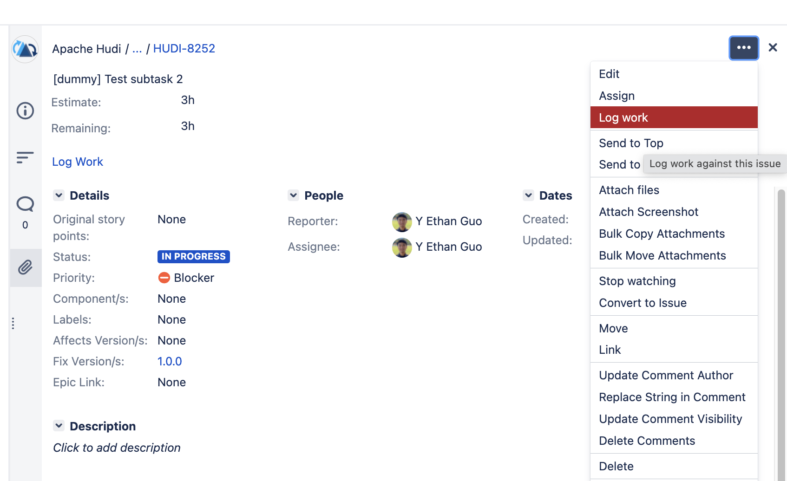

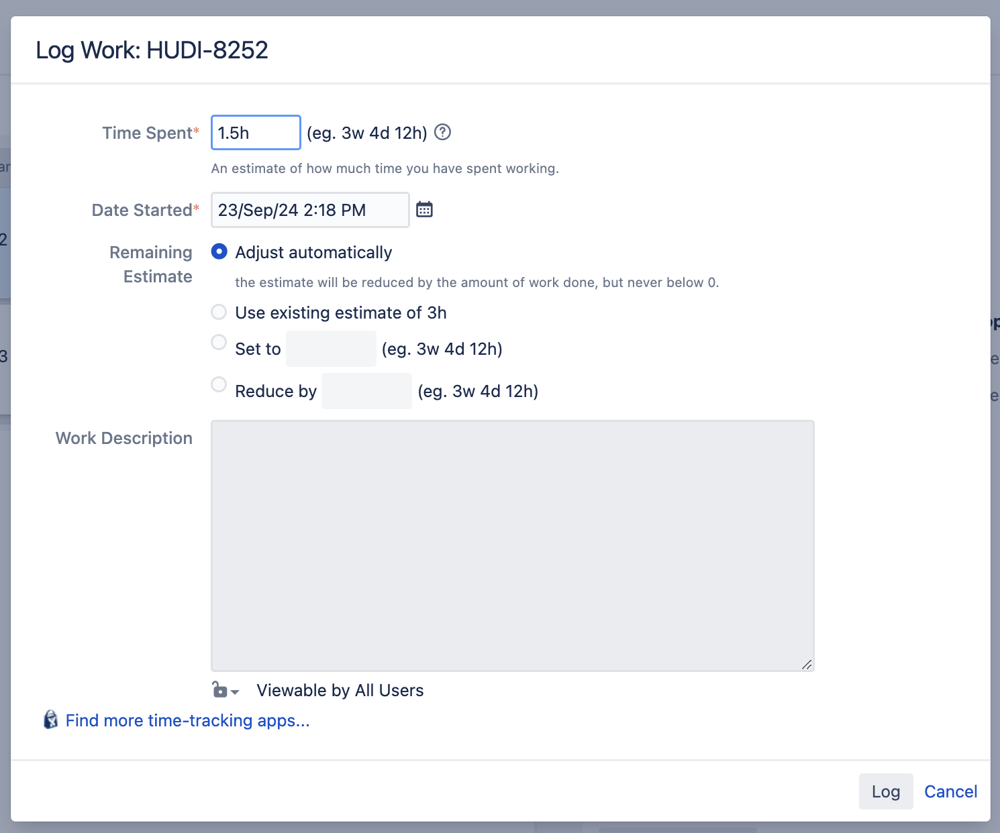

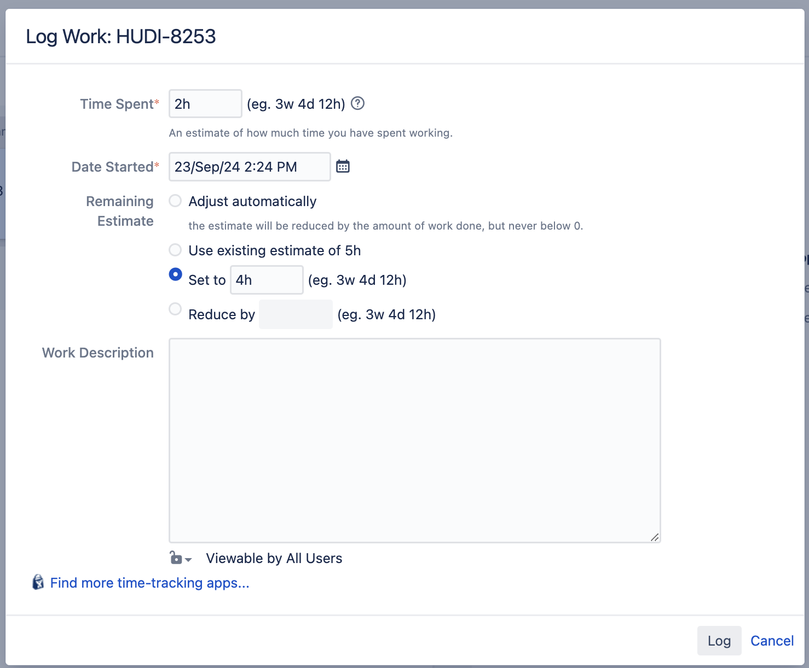

7. After logging work, the Issue and sub-task should reflect the update in the "Time Tracking"

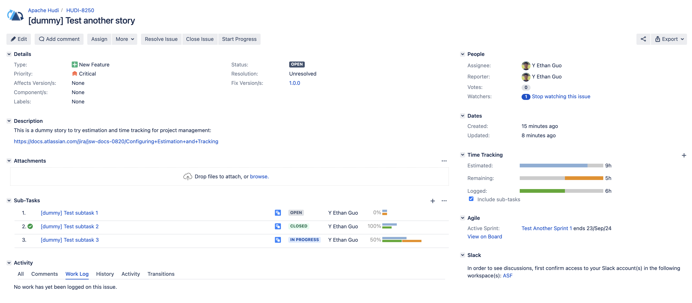

8. After the sprint is complete and the Issue is rolled over, the burndown chart shows the time tracking accurately,
   including over-estimates and under-estimates.

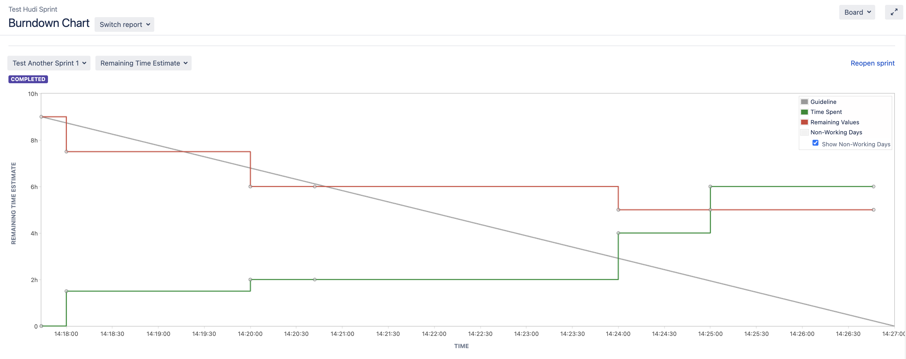

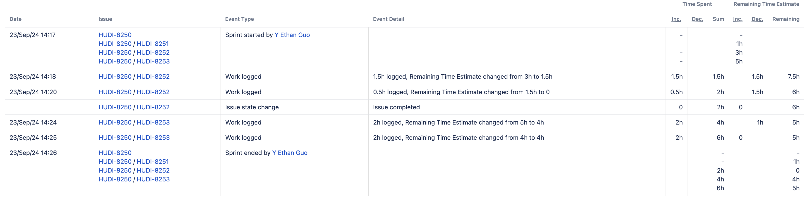

9. Make more progress in the Issue by adding a new subtask and logging more work in the next sprint

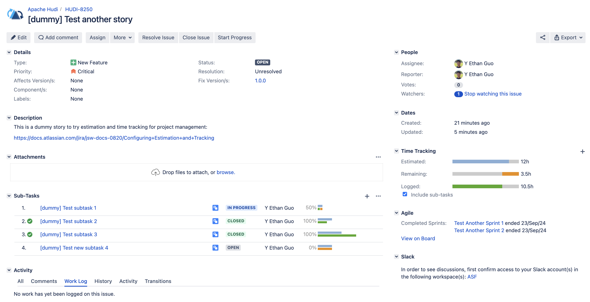

10. After the second sprint is complete, the time tracking is accurate, showing all the work down and remaining
    estimate.

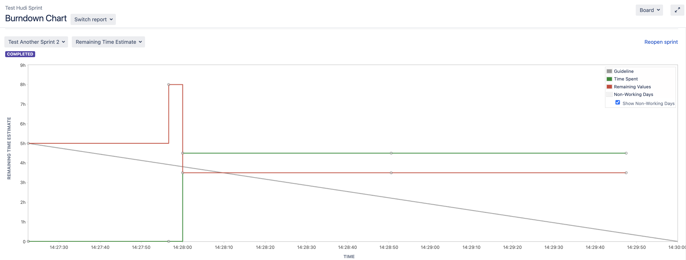

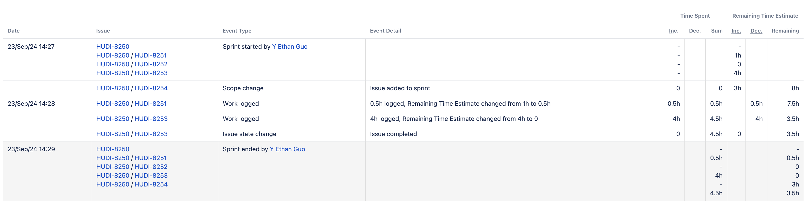
