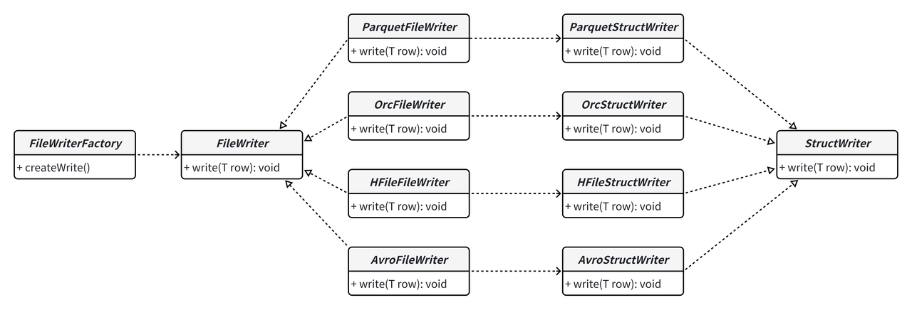

<!--
  Licensed to the Apache Software Foundation (ASF) under one or more
  contributor license agreements.  See the NOTICE file distributed with
  this work for additional information regarding copyright ownership.
  The ASF licenses this file to You under the Apache License, Version 2.0
  (the "License"); you may not use this file except in compliance with
  the License.  You may obtain a copy of the License at

       http://www.apache.org/licenses/LICENSE-2.0

  Unless required by applicable law or agreed to in writing, software
  distributed under the License is distributed on an "AS IS" BASIS,
  WITHOUT WARRANTIES OR CONDITIONS OF ANY KIND, either express or implied.
  See the License for the specific language governing permissions and
  limitations under the License.
-->
# RFC-88: New Schema/DataType/Expression Abstractions

## Proposers

- @cshuo
- @danny0405

## Approvers
- ..

## Status

JIRA: https://issues.apache.org/jira/browse/HUDI-8966

## Abstract

Hudi currently is tightly coupled with Avro, particularly in terms of basic data types, schema, and the internal record
representation used in read/write paths. This coupling leads to numerous issues, for example, record-level unnecessary 
Ser/De costs are introduced because of engine native row and Avro record converting, the data type can not be extended
to support other complex/advanced type, such as Variant and the basic read/ write functionality codes cannot be effectively 
reused among different engines. As for Expression, currently, different engines have their own implementation to achieve 
pushdown optimization, which is not friendly for extending as more indices are introduced.

This RFC aims to propose an improvement to the current Schema/Type/Expression abstractions, to achieve the following goals:
* Use a native schema as the authoritative schema, and make the type system extensible to support or customize other types, e.g, Variant.
* Abstract the common implementation of writer/readers and move them to hudi-common module, and engines just need implement getter/setters for specific rows(Flink RowData and Spark InternalRow).
* Add a concentrated and sharable expression abstraction for all kinds of expression pushdown for all engines and integrate it deeply with the MDT indices.


## Background
### Two 'Schema's
There exist two Schemas currently in Hudi's table management, Table schema in Avro format and a Hudi native `InternalSchema`. 
During the processes of reading, writing and other operations, there are numerous mutual conversions, reconciliations, 
and validation logics between the Avro table schema and `InternalSchema`, which incurs more difficulties in the understanding 
and maintaining of specific functionalities.

#### 1. Avro Schema
Hudi currently uses Avro schema as the table schema, to represent the structure of data written into the table. The table 
schema is stored in the metadata of each writing commit to ensure that data of different versions can be resolved and reading 
correctly, specifically:
* For reading: the Avro table schema is used throughout the scan process, to properly build readers, do some scan optimization and deserialize underlying data into specific records.
* For writing: the Avro table schema is used to check the validity of incoming data, build proper file writers, and finally commit the data with the schema itself stored in the commit metadata.

#### 2. InternalSchema
`InternalSchema` is introduced to support the comprehensive schema evolution in RFC-33. The most notable feature of 
`InternalSchema` is that it adds an `id` attribute to each column field, which is used to track all the column changes. 
Currently, `InternalSchema` is also stored in the metadata of each writing commit if the schema evolution is enabled.
* For reading, with schema evolution enabled, `InternalSchema` is used to resolving data committed at different instant properly by make reconciliation between current table schema and historical `InternalSchema`.
* For writing, `InternalSchema` is necessary to deduce the proper writing schema by reconciling the input source schema with the latest table schema. In this way, the compatibility of the reading and writing process in schema evolution scenario can be well guaranteed.

### Unnecessary AVRO Ser/De
Avro format is the default representation when dealing with records (reading, writing, clustering etc.). While it's simpler 
to share more common functionalities, such as reading and writing of log block, it incurs more unnecessary Ser/De costs 
between engine specific row (RowData for Flink, Internal for Spark).
Take Flink-Hudi as an example. For the upsert streaming writing cases, the basic data transforming flow is:


For the Flink streaming reading cases, the basic data transforming flow is:


As can be seen, there exists unnecessary record-level Avro Ser/De costs both in the log reading and writing process and 
the similar problem exists when spark writes hoodie logs with Avro HoodieRecord. The costs can be eliminated if Avro 
record can be substituted by engine specific row. Actually, RFC-46 has a good start to remove the need for conversion 
from engine-specific internal representation to Avro. Currently, only Spark and Hive have implemented the new `HoodieRecord`, 
and there arises another issue, i.e., no engine-agnostic basic infras for writers/readers for different engines and 
different formats. We elaborate on the issue in the next part.

### Separated File Readers/Writers for Different Engines
While Hudi works seamlessly with various query engines, such Spark, Flink, Hive etc., the underlying basic functionality 
infrastructures for file reader/writer are not highly abstracted. Out of all the engines, Spark and Hudi are the most 
seamlessly integrated. The Spark-Hudi integration leverages Spark's core read/write functionalities a lot. While these 
functionalities are well-tested and performant in Spark using cases, they cannot be reused in Hudi's integration with other engines.

As an example, Spark-Hudi integration uses `ParquetFileFormat` from Spark to build reader for parquet files, and uses 
`ParquetWriteSupport` to build writer to handle parquet file writing. These reading/write infras can not be reused directly
in other engine integrations without abstraction, e.g.,the Flink-Hudi module has to implement its own basic file readers/writers.

### Separated Expression optimization
Currently, the pushdown optimization for different engines do not share much in the integration between Expression and 
MDT indices. For instance, there is `HoodieFileIndex` for spark scan to support partition pruning and data filtering, 
which heavily relies on Spark DataFrame operations to evaluate Expressions against indices stats data(`SparkBaseIndexSupport`). 
Meanwhile, for Flink engine, a separate Expression evaluator is also implemented to support evaluating pushed-down Flink 
Expression against MDT stats data. There are quite a few common processing logics of index data between Flink FileIndex 
and Spark FileIndex, which introduces difficulties both for the development and maintaining of functionalities about index optimization.

## Goals
To make the scope of the RFC more clear, we emphasize the goals here:
* Propose a native schema as the authoritative schema for Hudi, making the type system more extensible and the semantic of data type clear and unified.
* Abstract out the basic functionality for writers/readers based on data type abstraction, then each engine just implements the getter/setter logic, and eliminate the unnecessary Ser/De cost for the avro writer/read path.
* Improve the expression abstractions and the integration with the Hudi file index and MDT indices, so that all these optimization can be shared between engines. Specifically, this should be used for expression indexes.

## Design/Implementation

### Abstraction of new Schema
As elaborated above, to support comprehensive schema evolution, the basic data type and `InternalSchema` are introduced 
and `InternalSchema#RecordType` can be losslessly converted to/from Avro schema.

Currently, `InternalSchema` is designed for internal use, and we are proposing a new Schema abstraction to serve as a 
public API, while retaining the existing capabilities of `InternalSchema`.
```java
/**
 * Definition of the schema for a Hudi table.
 */
@PublicAPIClass
public class Schema implements Serializable {
    private final RecordType record;
    private int maxColumnId;
    private long versionId;
    private List<String> recordKeys;
    private List<String> partitionKeys;

    private transient Map<Integer, Field> idToField = null;
    private transient Map<String, Integer> nameToId = null;
    private transient Map<Integer, String> idToName = null;
    private transient Map<String, Integer> nameToPosition = null;
    
    public Schema(List<Field> fields, long versionId, int maxColumnId, List<String> recordKeys, List<String> partitionKeys) {}    
    
    // return record type
    public RecordType recordType() {}
    // return all fields
    public List<Field> fields() {}
    // return name of record key fields
    public List<String> recordKeys() {}
    // return name of partition fields
    public List<String> partitionKeys() {}
    
    public static class Builder {
        private final List<Field> fields;
        ...
        private List<String> partitionKeys;
        
        public Builder addField(Field field) {..}
        ...
        public Schema build() {
            return new Schema(fields, versionId, maxColumnId, recordKeys, partitionKeys);
        }
    }
}

/**
 * Definition of the type of record in Hudi.
 */
@PublicAPIClass
public class RecordType implements Type {
    // name is necessary to provide for lossless conversion b/w Avro and Schema
    private final String name;
    private final Field[] fields;
    
    public RecordType(List<Field> fields) {}
    public RecordType(String name, List<Field> fields) {}
    
    public List<Field> fields() {}
    public Field field(String name) {}
    public Field field(int id) {}
}

/**
 * Definition of a column/field in RecordType.
 */
@PublicAPIClass
public static class Field implements Serializable {
    private final boolean isOptional;
    private final int id;
    private final String name;
    private final Type type;
    private final String doc;
    private final Object defaultValue;
    private NestedField() {}
    
    public static class Builder {
        private final String name;
        ...
        private final Object defaultValue;
        
        public Builder(String name) {
            this.name = name;
        }
        
        public Builder withId(int id) {..}
        ...
        public NestedField build() {
          return new Field(isOptional, id, name, type, doc, defaultValue);
        }
    }
}
```
For the first stated goal, the following changes are proposed:
* Substitute avro schema with `Schema` in commit metadata.
  - Persistence: SCHEMA_KEY: Avro schema string -> `Schema` string
  - Resolving compatibility: firstly try resolving as `Schema`, and fallback to Avro schema for compatibility.
* Substitute Avro schema with `Schema` in reader/writer path of all engines.
  - Replace schemas in configuration.
  - Replace schemas in reader/writer building process.
* Substitute Avro schema with `Schema` in log block.

### Abstraction of Writers/Readers
In the lake architecture, abstracting low-level file readers and writers is a crucial design choice. With a well defined 
reader/writer abstraction, we can make the system more flexible, extensible, and reduce the efforts required for development
and maintenance. Furthermore, the reading/writing behaviors among different engines can be unified, as well as sharing the performance optimization.
#### Writer Abstraction

The proposed abstraction of writer  is shown in the diagram. It's generally divided into two levels:
* FileWriter: FileWriter is the basic interface of writers for files in different formats. It's composed of a StructWriter and related writing interface provided by the underlying formats, such as ParquetWriter  and WriteSupport  for Parquet format.
    ```java
    public interface FileWriter<R> extends Closeable {
        void write(R value);
    }
    ```
* StructWriter: StructWriter is the abstraction for writing engine specific rows.
    ```java
    /**
     * Base value writer interface for writing values of different types.
     */
    public interface ValueWriter<T> {
      void write(T value);
    }
  
    /**
     * A base struct writer for writing struct record.
     */ 
    public abstract class StructWriter<R> implements ValueWriter<R> {
       // writers for specific fields
       private final ValueWriter<Object>[] writers;
       
       // get field from engine specific row
       public abstract Object get(R row, int index);
       
       // write row
       public abstract void write(R row);
    }
    ```
With the above Writer abstraction, implementations of different file formats can be more consistent. Here is a pseudo 
code to show how to build the writer for a specific format and engines.

* Pseudo code for a specific format, assuming XFormat:
```java
/**
 * Iterface for XFormat to provide wirte handle for writers.
 */
public interface XFormatWriteHandle {
   // Actual write handler provided by the underlying format,
   // e.g., RecordConsumer for Parquet.
   void setWriteHandle(XXWriteHandle writeHandle);
}

/**
 * Base class for primitive value writer.
 */
public abstract class XFormatValueWriter extends ValueWriter<R> implements XFormatWriteHandle {
    public final XXWriteHandle writeHandle;

    public PrimitiveValueWriter() {}
    
    public void setWriteHandle(XXWriteHandle writeHandle) {
        this.writeHandle = writeHandle;        
    }
}

/**
 * Example writer for a specific data type, e.g., Integer.
 */
public class IntegerWriter extends XFormatValueWriter<Integer> {
    public void write(Integer value) {
        writeHandle.writeInteger(value);
    }
}

/**
 * The abstract XFormat struct writer for different engines.
 */
public abstract class XFormatStructWriter<R> extends StructWriter<R> implements XFormatWriteHandle {
   
   public XFormatStructWriter(ValueWriter<Object>[] writers) {}
   
   public abstract void write(R row) {
       for (int i = 0; i < writers.length; i += 1) {
          Object fieldValue = get(row, i);
          writers[i].write(fieldValue);
       }    
   }
   
   public void setWriteHandle(XXWriteHandle writeHandle) {
       for (int i = 0; i < writers.length; i += 1) {
          writers[i].setWriteHandle(writeHandle);
       }    
   }
}
```
* Pseudo code for different engines, e.g., Spark and Flink.
```java
/**
 * The XFormat struct writer for Spark, which writes InternalRow to the storage.
 */
public class SparkXFormatStructWriter extends XFormatStructWriter<InternalRow> {
    private final DataType[] types;

    public SparkXFormatStructWriter() {}
    
    public Object get(InternalRow row, int index) {
        return row.get(row, types[index]);
    }
}

/**
 * The XFormat struct writer for Flink, which writes RowData to the storage.
 */
public class FlinkXFormatStructWriter extends XFormatStructWriter<RowData> {
    private final FieldGetter[] fieldGetter;

    public FlinkXFormatStructWriter() {}
    
    public Object get(RowData row, int index) {
        return fieldGetter[index].getOrNull(row);
    }
}
```
As shown in the pseudo code, the core write functionality has been abstracted and is reused across multiple engines, 
then engines need only implement the specific getters.

#### Reader Abstraction

The proposed abstraction of readers is also divided into two levels.
* FileReader: base interface for reading files in different formats. It's composed of a StructReader for reading bytes from file into engine rows, and return engine specific row iterators for callers.
    ```java
    public interface FileReader<R> extends Closeable {
        Iterable<R> read();
    }
    ```
* StructReader: the abstraction for reading data as engine specific rows.
    ```java
    /**
     * A base struct reader for reading struct record.
     */
    public abstract class StructReader<R> extends ValueReader<R> {
       // readers for specific field
       private final ValueReader<Object>[] readers;
       
       // set field into engine specific row
       public abstract void set(R row, int index, Object object);
       
       // read row
       public abstract R read(R reuse);
    }
    
    /**
     * Base value reader interface for read values of different types.
     */
    public interface ValueReader<T> {
      T read(T value);
    }
    ```
Just like the abstraction of writers, readers for different formats and different engines can also be implemented more 
consistently and concisely. Here is a pseudo code to show how to build the reader for formats and engines.

* Pseudo code for a specific format, assuming XFormat:
```java
/**
 * Iterface for XFormat to provide read handle for readers.
 */
public interface XFormatReadHandle {
   // Actual read handler provided by the underlying format,
   // e.g., PageReadStore/PageReader for Parquet.
   void setReadHandle(XReadHandle readHandle);
}

/**
 * Base class for primitive value reader.
 */
public abstract class XFormatValueReader extends ValueReader<R> implements XFormatReadHandle {
    public final XReadHandle readHandle;

    public PrimitiveValueWriter() {}
    
    public void setReadHandle(XReadHandle readHandle) {
        this.readHandle = readHandle;        
    }
}

/**
 * Example reader for a specific data type, e.g., Integer.
 */
public class IntegerReader extends XFormatValueReader<Integer> {
    public Integer read(Integer reuse) {
        return writeHandle.writeInteger();
    }
}

/**
 * An abstract XFormat struct reader for different engines.
 */
public abstract class XFormatStructReader<R> extends StructReader<R> implements XFormatReadHandle {   
   public XFormatStructReader(ValueReader<Object>[] readers) {}
   
   public abstract R read(R reuse) {
       R row = createRow(reuse);
       for (int i = 0; i < readers.length; i += 1) {
          set(row, i, readers[i].read());
       }
       return row;
   }
   
   public void setReadHandle(XXReadHandle readHandle) {
       for (int i = 0; i < readers.length; i += 1) {
          readers[i].setReadHandle(readHandle);
       }    
   }
   
   public abstract R createRow(R reuse);
}
```
* Pseudo code for different engines, e.g., Spark and Flink.
```java
/**
 * XFormat struct reader for Spark, which reads data as InternalRow.
 */
public class SparkXFormatStructReader extends XFormatStructReader<InternalRow> {
    private final DataType[] types;

    public SparkXFormatStructReader() {}
    
    public InternalRow createRow(InternalRow reuse) {
        return new GenericInternalRow(types.length);
    }
    
    public void set(InternalRow row, int index, Object object) {
        row.update(index, object);
    }
}

/**
 * XFormat struct reader for Flink, which reads data as RowData.
 */
public class FlinkXFormatStructReader extends XFormatStructReader<RowData> {
    private final DataType[] types;

    public FlinkXFormatStructReader() {}
    
    public RowData createRow(RowData reuse) {
        return new GenericRowData(types.length);
    }
    
    public void set(RowData row, int index, Object object) {
        row.setField(index, object);
    }
}
```
As shown, the fundamental functionality of the format reader can be shared by engines, and they only have to implement 
their own field setters for rows.

### HoodieRecord & Key Generator Refactoring
To use the common abstractions of readers and writers, engine-specific rows should be kept in the read/write path. 
As mentioned above, RFC-46 is a good start to remove the conversion from engine-specific rows to Avro record. Taking 
these into consideration, the following changes should be made:
* The engine specific `HoodieRecord` should be implemented for all integrations

    Spark and Hive integration have implemented the new interface proposed by RFC 46, while other engines have not, such 
    as Flink still uses Avro payload-based `HoodieRecord`. These engines should implement the specific `HoodieRecord` to
    leverage the new abstraction of reader and writer.

* New abstraction of Key Generator should be implemented

    Currently, the KeyGenerator is tightly coupled with the Avro `GenericRecord`, since Avro will no longer serve as the
    intermediate representation for Hudi's record payload, it naturally calls for a new abstract of the key generator, 
    and then each engine integration can customize their own implementations for different scenarios.
    ```java
    public interface KeyGenerator<R> extends Serializable {
        /**
        * Extract HoodieKey from the given engine specific row.
        */
        HoodieKey getRecordKey(R row);
    }
    ```

### Abstraction of Expression
Predicate pushdown is a key query optimization method in lakehouse storage systems, designed to push operations like 
filtering, and aggregation down to the storage layer, minimizing data transfer and computation costs while enhancing 
query performance. As illustrated before, Expression optimization with MDT indices is not abstract enough for reusing 
among engines. In order to achieve the goal of engine-agnostic integration between expression pushdown and MDT indices, a comprehensive 
expression engine should be implemented. Namely, the following part should be contained:

#### Expression
Currently, the Expression interface is already introduced for partition pushdown, which mainly contains predicate operators. 
We need to extend the expression to include more function call expressions and aggregate expressions , such as date 
functions / string functions to support Expression index.
```java
public interface Expression extends Serializable {
  enum Operator {
      TRUE("TRUE", "true"),
      FALSE("FALSE", "false"),
      AND("AND", "&&"),
      OR("OR", "||"),
      GT(">", ">"),
      ...
      // date function
      DAY("DAY", "day"),
      HOUR("HOUR", "hour"),
      ...
      // string function
      UPPER("UPPER", "upper"),
      TRIM("TRIM", "trim"),
      ...
      // aggregate function
      COUNT("COUNT", "count"),
      MAX("MAX", "max"),
      MIN("MIN", "min")
  }
}
```

#### Expression Evaluator
Evaluator is introduced for evaluating the expression against given data, such as using pushed filter expression 
evaluating against column stats to filter out files, or use function call expression to transform source field into target value.
```java
/**
 * Evaluator for evaluating the expression against given data.
 */ 
public interface Evaluator<T> extends Serializable {
    R eval(StructLike value);
}
```

#### Expression Visitor
Expression Visitor for traversing the expression and returning traversing result, such as buiding the evaluator for the given expression.
```java
/**
 * Visitor for traversing the expression and return traversing result
 */ 
public interface ExpressionVisitor<T> {
  T alwaysTrue();
  T alwaysFalse();
  T visitLiteral(Literal literal);
  T visitUnboundReference(UnboundReference attribute);
  T visitBoundReference(BoundReference boundReference);
  T visitAnd(Predicates.And and);
  T visitOr(Predicates.Or or);
  T visitPredicate(Predicate predicate);
  T visitCall(CallExression call);
  T visitAggregate(UnboundAggregate agg);  
  T visitAggregate(BoundAggregate agg);  
}
```

#### Integration with MDT Indices
Indices data are stored in different partitions in the metadata table. To support the engine agnostic evaluation of 
expressions against indices data, Hoodie internal Record should be introduced. The basic interface:(Currently, already 
introduced for partition pushdown)
```java
public interface StructLike {

  int numFields();

  <T> T get(int pos, Class<T> classTag);
}
```
The basic workflow for expression pushdown:
* Converting the pushed-down engine expressions into Hudi native `Expression`
* Constructing `Evaluator` for the converted `Expression`
* Load indices data from MDT index, and transform them into specific record implementation of `StructLike`.
* Evaluating the expression by applying Evaluators against the indices data and get the result.


## Rollout/Adoption Plan
* What impact (if any) will there be on existing users?
  - Changes are inside Hudi internal, so no adaption operations are needed for users.
  - Users should see enhanced performance for reading/ingestion based on the new reader/writer abstraction.
* If we are changing behaviour, how will we phase out older behavior?
  - For Avro schema used as table schema and read/write schema, they would be replaced once the rfc completed.
  - The legacy writers and readers will coexist with the new ones for several versions until the new reader/writers are matured, then legacy ones could be marked as deprecated.
  - For Expression optimization, the pushdown optimization with MDT indices would be gradually refactored, legacy implementation will be phased out then.
* If we need special migration tools, describe them here.
  - No migration tools are needed, for backward compatibility,  a SchemaAdapter can be provided to convert table schema stored as Avro into the new Schema, so that commit meta or log block generated by previous versions of code could be processed properly.
  - Potential problem: for Flink streaming pipelines with state, if there are necessary changes in the operator topology,  state restoring from old checkpoints may not be feasible, then stateless restart is needed to use the new pipeline.
* When will we remove the existing behavior
  - TBD

## Test Plan
No Hudi semantics are modified in the RFC, and current existing test suites can cover the logical correctness of table operations based on new Schema/Expression. Nevertheless, the following tests are needed:
* UT/IT tests for the newly introduced abstraction, schemas/expression/reader/writer.
* Benchmark test to ensure the performance promotion as unnecessary Avro converting and Ser/De is eliminated.