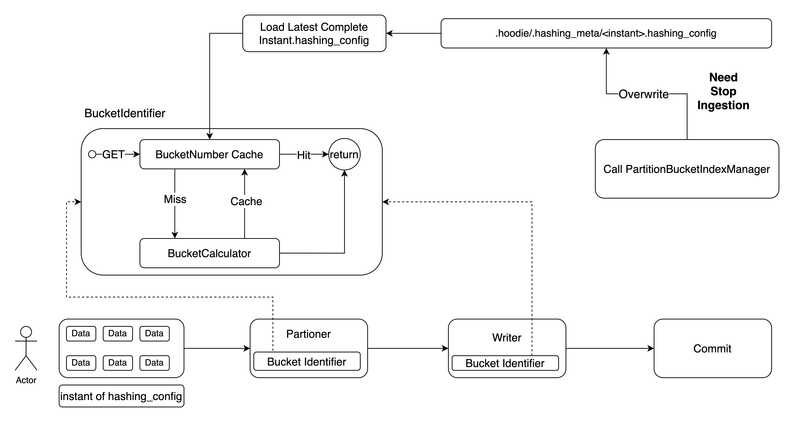

<!--
  Licensed to the Apache Software Foundation (ASF) under one or more
  contributor license agreements.  See the NOTICE file distributed with
  this work for additional information regarding copyright ownership.
  The ASF licenses this file to You under the Apache License, Version 2.0
  (the "License"); you may not use this file except in compliance with
  the License.  You may obtain a copy of the License at

       http://www.apache.org/licenses/LICENSE-2.0

  Unless required by applicable law or agreed to in writing, software
  distributed under the License is distributed on an "AS IS" BASIS,
  WITHOUT WARRANTIES OR CONDITIONS OF ANY KIND, either express or implied.
  See the License for the specific language governing permissions and
  limitations under the License.
-->
# RFC-89: Partition Level Bucket Index

## Proposers
- @zhangyue19921010

## Approvers
- @danny0405
- @xiarixiaoyao
- @LinMingQiang

## Status

JIRA: https://issues.apache.org/jira/browse/HUDI-8990

## Abstract

As we know, Hudi proposed and introduced Bucket Index in RFC-29. Bucket Index can well unify the indexes of Flink and
Spark, that is, Spark and Flink could upsert the same Hudi table using bucket index.

However, Bucket Index has a limit of fixed number of buckets. In order to solve this problem, RFC-42 proposed the ability
of consistent hashing achieving bucket resizing by splitting or merging several local buckets dynamically.

But from PRD experience, sometimes a Partition-Level Bucket Index and a offline way to do bucket rescale is good enough
without introducing additional efforts (multiple writes, clustering, automatic resizing,etc.). Because the more complex
the Architecture, the more error-prone it is and the greater operation and maintenance pressure.

In this regard, we could upgrade the traditional Bucket Index to implement a Partition-Level Bucket Index, so that users
can set a specific number of buckets for different partitions through a rule engine (such as regular expression matching).
On the other hand, for a certain existing partitions, an off-line command is provided to reorganize the data using insert
overwrite(need to stop the data writing of the current partition).

More importantly, the existing Bucket Index table can be upgraded to Partition-Level Bucket Index smoothly and seamlessly.

## Background
The following is the core read-write process of the Flink/Spark engine based on Simple Bucket Index
### Flink Write Using Simple Bucket Index
**Step 1**: re-partition input records based on `BucketIndexPartitioner`, BucketIndexPartitioner has **a fixed bucketNumber** for all partition path.
For each record key, compute a fixed data partition number and dispatch the record to its corresponding partition.

```java
/**
 * Bucket index input partitioner.
 * The fields to hash can be a subset of the primary key fields.
 *
 * @param <T> The type of obj to hash
 */
public class BucketIndexPartitioner<T extends HoodieKey> implements Partitioner<T> {

  private final int bucketNum;
  private final String indexKeyFields;

  private Functions.Function2<String, Integer, Integer> partitionIndexFunc;

  public BucketIndexPartitioner(int bucketNum, String indexKeyFields) {
    this.bucketNum = bucketNum;
    this.indexKeyFields = indexKeyFields;
  }

  @Override
  public int partition(HoodieKey key, int numPartitions) {
    if (this.partitionIndexFunc == null) {
      this.partitionIndexFunc = BucketIndexUtil.getPartitionIndexFunc(bucketNum, numPartitions);
    }
    int curBucket = BucketIdentifier.getBucketId(key.getRecordKey(), indexKeyFields, bucketNum);
    return this.partitionIndexFunc.apply(key.getPartitionPath(), curBucket);
  }
}
```
**Step 2**: Using `BucketStreamWriteFunction` upsert records into hoodie
- Bootstrap and cache `partition_bucket -> fileID` mapping from the existing hudi table
- Tagging: compute `bucketNum` and tag `fileID` based on record key and bucketNumber config through `BucketIdentifier`
- buffer and write records

### Flink Read Pruning Using Simple Bucket Index
**Step 1**: compute `dataBucket`
```java
  private int getDataBucket(List<ResolvedExpression> dataFilters) {
    if (!OptionsResolver.isBucketIndexType(conf) || dataFilters.isEmpty()) {
      return PrimaryKeyPruners.BUCKET_ID_NO_PRUNING;
    }
    Set<String> indexKeyFields = Arrays.stream(OptionsResolver.getIndexKeys(conf)).collect(Collectors.toSet());
    List<ResolvedExpression> indexKeyFilters = dataFilters.stream().filter(expr -> ExpressionUtils.isEqualsLitExpr(expr, indexKeyFields)).collect(Collectors.toList());
    if (!ExpressionUtils.isFilteringByAllFields(indexKeyFilters, indexKeyFields)) {
      return PrimaryKeyPruners.BUCKET_ID_NO_PRUNING;
    }
    return PrimaryKeyPruners.getBucketId(indexKeyFilters, conf);
  }
```
**Step 2**: Do partition pruning and get all files in given partitions
**Step 3**: do bucket pruning for all files from step2
```java
  /**
   * Returns all the file statuses under the table base path.
   */
  public List<StoragePathInfo> getFilesInPartitions() {
    ...
    // Partition pruning
    String[] partitions =
        getOrBuildPartitionPaths().stream().map(p -> fullPartitionPath(path, p)).toArray(String[]::new);
    if (partitions.length < 1) {
      return Collections.emptyList();
    }
    List<StoragePathInfo> allFiles = ...
    
    // bucket pruning
    if (this.dataBucket >= 0) {
      String bucketIdStr = BucketIdentifier.bucketIdStr(this.dataBucket);
      List<StoragePathInfo> filesAfterBucketPruning = allFiles.stream()
          .filter(fileInfo -> fileInfo.getPath().getName().contains(bucketIdStr))
          .collect(Collectors.toList());
      logPruningMsg(allFiles.size(), filesAfterBucketPruning.size(), "bucket pruning");
      allFiles = filesAfterBucketPruning;
    }
    ...
  }

```

### Spark Write/Read Using Simple Bucket Index
The read-write process of Spark based on Bucket Index is also similar.
- Use `HoodieSimpleBucketIndex` to tag location.
- Use `SparkBucketIndexPartitioner` to packs incoming records to be inserted into buckets (1 bucket = 1 RDD partition).
- Use `BucketIndexSupport` to Bucket Index pruning during reading.

## Design
### Overview
Implement a partition-level Bucket Index capability where users can set the calculation expression for the partition 
bucket number via `hoodie.bucket.index.partition.expressions`. For historical partitions, provide a `CALL command (call partitionBucketIndexManager(...)`
to support bucket rescaling which is a replace-commit.

Note: When users invoke the CALL command to modify the expression and resize historical partitions' bucket number, 
they must follow THREE STEPS
1. Firstly, stop all ingestion Jobs
2. Then, trigger call command and wait for bucket rescaling completed
3. Finally, restart all ingestion Jobs

This STEPS ensures that all writers load the same expression config, maintaining consistency between the expression and the data.



Next will introduce the implementation details.

### New Config

| Config                                    | type   | default | Description                                                                                                                                                                                                                                                     |
|-------------------------------------------|--------|---------|-----------------------------------------------------------------------------------------------------------------------------------------------------------------------------------------------------------------------------------------------------------------|
| hoodie.bucket.index.partition.rule.type   | string | regex   | Set rule parser for expressions.                                                                                                                                                                                                                                |
| hoodie.bucket.index.partition.expressions | string | null    | Users can use this parameter to specify expression and the corresponding bucket numbers (separated by commas).Multiple rules are separated by semicolons like `hoodie.bucket.index.partition.expressions=expression1,bucket-number1;expression2,bucket-number2` |
| hoodie.bucket.index.num.buckets           | int    | 4       | Hudi bucket number per partition.                                                                                                                                                                                                                               |

The above parameters are at table-level which need to be declared in the DDL. Users can't change this config through
runtime options like Flink /*+ OPTIONS(...) */

```sql
CREATE TABLE hudi_table(
  id BIGINT,
  name STRING,
  price DOUBLE
) WITH (
'connector' = 'hudi',
'path' = 'file:///tmp/hudi_table',
'table.type' = 'MERGE_ON_READ',
'index.type' = 'BUCKET',
'hoodie.bucket.index.partition.expressions' = '\\d{4}-(06-(01|17|18)|11-(01|10|11)),256',
'hoodie.bucket.index.num.buckets' = '10'
)
```

For the dates of 06-01, 06-17, 06-18 in June and 01-11, 10-11, 11-11 in
November of each year (in the format of yyyy-MM-dd), the corresponding bucket number for the partition is 256

For common partitions use 10 as partition bucket number

### Hashing Config And Management

The expression config will be persisted as `<instant>.hashing_config` for current table, it stores in
`.hoodie/.hashing_meta` directory and contains the following information in json format

```json
{
   "rule": "rule-engine",
   "expressions": "expression1,bucket-number1;expression2,bucket-number2",
   "default_bucket_number": "default-bucket-number"
}
```
#### Multi-version for <instant>.hashing_config

Apache Hudi natively supports multi-versioning and version rollback capabilities. For Bucket Rescale operation, 
we must also support Bucket Rescale rollbacks, even rolling back multiple completed Bucket Rescale operations at once. 
This requires tracking the instant and corresponding config version for each Bucket Rescale action. 
During rollback, both the data and config must be reverted to ensure consistency between the configuration and the data state.

So that we need to maintain config versions alongside commit instants which is multiple versions of hashing_config (multi-versioned configs). 
This necessitates implementing mechanisms for config creation, update, rollback, cleanup and loading

About Hashing_Config Creation

The initial version *must and can only* be created via DDL. During the DDL phase, hoodie will create a 
`00000000000000000.hashing_config` for the first time.

About Hashing_Config Update

A new version can only be updated via `call partitionBucketIndexManager(overwrite => 'new-expressions', dry-run => 'false')`, which is 
a replace-commit operation. 

The transactional relationship between the replace-commit operation and hashing_config updates will be explained in the 
PartitionBucketIndexManager section later.

*Note:* Before updating the hashing_config, users must manually stop all ingestion jobs.

```text
Firstly DDL phase creates initial version 
ls .hoodie/.hashing_meta/
.hoodie/.hashing_meta/00000000000000000.hashing_config
{
   "rule": "rule-engine",
   "expressions": "expression1,bucket-number1;expression2,bucket-number2",
   "default_bucket_number": "default-bucket-number"
}

Secondly call PartitionBucketIndexManager(overwrite => 'expression3,bucket-number3;expression1,bucket-number1;expression2,bucket-number2', 'dry-run' = 'false')
ls .hoodie/.hashing_meta/
.hoodie/.hashing_meta/00000000000000000.hashing_config (deprecated)
.hoodie/.hashing_meta/20250303095546020.hashing_config (used)
{
   "rule": "rule-engine",
   "expressions": "expression3,bucket-number3;expression1,bucket-number1;expression2,bucket-number2",
   "default_bucket_number": "default-bucket-number"
}
```

The expression written at the front has a higher priority, and the expression has a higher priority than the default_bucket_number.

About Hashing_Config Rollback

The Bucket Rescale operation is essentially an insert overwrite action and can seamlessly integrate with Hudi's rollback mechanism. 
One simplification here is that when rolling back a Bucket Rescale, the corresponding replace-commit.hashing_config is not immediately deleted. 
Instead, its cleanup is deferred to the version cleanup process (discussed later).

This approach achieves two goals:
1. Minimizes modifications to the rollback service logic.
2. Lazy cleanup does not impact config loading, as Hudi always loads the latest hashing_config associated with committed replace commit.

About Hashing_Config Cleanup

The cleanup of hashing_config versions (retaining the latest three) will be handled within the Archive Table Service, 
as illustrated in the following diagram.


**Key Points: Uncommitted hashing_config are identified via diff based on activeTimeline and cleaned up. This ensures that 
hashing_configs, which instants are before activeTimeline start, are all valid.**

About Loading Hashing_Config

loading hash_config steps:
1. List all version and get related replace-commit instants as instant group1
2. Get latest completed instant as `instant2` in instant group1 based on activeTimeline 
   1. If get empty after Step2, get instants(as instant group2) before activeTimeline start in instant group1 
   2. Get latest instant as `instant2` in instant group2
3. Loading instant2 related hashing_config

### SimpleBucketIdentifier

```java
public class SimpleBucketIdentifier extends BucketIdentifier {
  // use expressionEvaluator to compute bucket number for given partition path
  private BucketCalculator calculator;
  // get previous partition and bucket number from meta under .hoodie folder
  private Map<String, Integer> partition2BucketNumber;

  @Override
  public int getBucketId(String recordKey, String indexKeyFields, String partitionPath) {
    int numBuckets = getBucketNumber(partitionPath);
    return getBucketId(getHashKeys(recordKey, indexKeyFields), numBuckets);
  }
  // ...
  
  public int getBucketNumber(String partitionPath) {
     return partition2BucketNumber.computeIfAbsent(partitionPath, calculator::calculateBucketNumber);
  }
}
```
**WorkFlow for SimpleBucketIdentifier**

For the partition of the given data, try to get its corresponding bucket number from the cache. If the cache missed,
1. Calculate the expression through the Bucket Calculator to obtain the corresponding Bucket Number.
2. Put Calculated bucket number into cache

we would use `org.apache.commons.collections.map.LRUMap` (max-size 500,000 about 200M at most)to cache partitionToBucketNumber 
which could take good care of cache eviction.

Using SimpleBucketIdentifier to get `BucketNumber` or `BucketID` based on given partitionPath and corresponding expression

For new Partitioner:
`SparkBucketIndexPartitioner`-Spark and `BucketIndexPartitioner`-Flink use this new SimpleBucketIdentifier to do data repartition

For Writer:
Writer like `BucketStreamWriteFunction` in Flink also use this new `SimpleBucketIdentifier` to compute bucketID

NOTE：We need to get hashing_config `instant` at the beginning(JM or Driver) and pass it to each operator,
ensure the consistency of loading and avoid unnecessary listing action.

### BucketCalculator
The BucketCalculator calculates the bucket numbers for different partitions based on the different rules set by users.
Here, the types of supported Rules are extensible. In the first phase, regex expressions are mainly supported.

### Call PartitionBucketIndexManager

| Config        | type    | default | Description                                                                                                         |
|---------------|---------|---------|---------------------------------------------------------------------------------------------------------------------|
| overwrite     | string  | null    | Create a new version of hashing_config with new expression, also trigger bucket rescale action if necessary         |
| bucket-number | int     | -1      | Set default bucket number for current expression, if not set will reuse last hashing_config's default bucket number |
| add           | string  | null    | Update hashing_config with adding a new expression, also trigger bucket rescale action if necessary                 |
| dry-run       | boolean | true    | Just show which partitions need to be rescale and how many files need to be resizing instead of IO                  |
| rollback      | string  | null    | Rollback specific bucket rescale action                                                                             |
| show-config   | boolean | false   | Show all the committed hashing_config in order                                                                      |

Before proceeding, it is recommended to set dry-run to true to preview the impact of the current operation.

#### overwrite
**Note that all Ingestion tasks for the current table must be stopped before performing this operation.**

```sql
call partitionBucketIndexManager(overwrite => 'new-expressions', dry-run => 'false')
call partitionBucketIndexManager(overwrite => 'new-expressions', bucket-number => 'new-default-bucket-number', dry-run => 'false')
```


`do insert overwrite`, `create a new version of hashing_config with current replace-commit instant` and `do replace-commit 
commit action` are within a single transaction.

Avoid modifying the default bucket number casually, as it may trigger unexpected partition data reprocessing.

#### dry-run


Just show which partitions need to be rescale and how many files need to be resizing instead of doing IO actually

#### rollback
**Note that all Ingestion tasks for the current table must be stopped before performing this operation.**

Rollback specific bucket rescale action

#### show-config

Show all the committed hashing_config in order

## Original Bucket Index upgrade

Users can use followed command to upgrade simple bucket index into partition level bucket index
```sql
call partitionBucketIndexManager(overwrite => 'new-expressions', bucket-number => 'original-bucket-number', dry-run => 'false')
```

## Rollout/Adoption Plan
- First, support writing with Flink, and perform the Bucket rescale operation with Spark.
- Then, support writing with Spark.
- Finally, support the push-down of Bucket Index filtering at the partition level.

## Test Plan

Describe in few sentences how the RFC will be tested. How will we know that the implementation works as expected? How will we know nothing broke?.