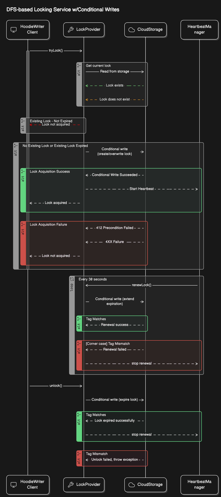
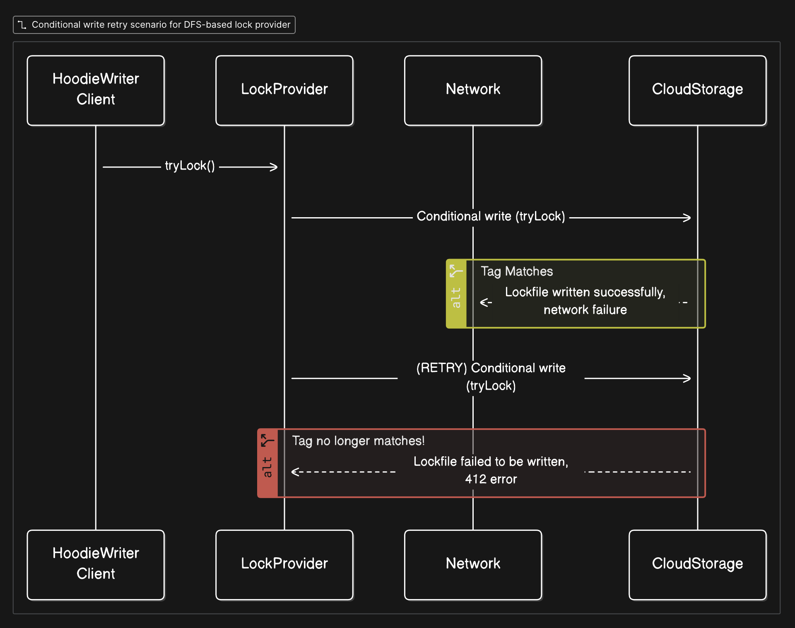

<!--
  Licensed to the Apache Software Foundation (ASF) under one or more
  contributor license agreements.  See the NOTICE file distributed with
  this work for additional information regarding copyright ownership.
  The ASF licenses this file to You under the Apache License, Version 2.0
  (the "License"); you may not use this file except in compliance with
  the License.  You may obtain a copy of the License at

       http://www.apache.org/licenses/LICENSE-2.0

  Unless required by applicable law or agreed to in writing, software
  distributed under the License is distributed on an "AS IS" BASIS,
  WITHOUT WARRANTIES OR CONDITIONS OF ANY KIND, either express or implied.
  See the License for the specific language governing permissions and
  limitations under the License.
-->
# RFC-91: Storage-based lock provider using conditional writes

## Proposers

- @alexr17

## Approvers

 - @yihua
 - @danny0405

## Status

JIRA: [HUDI-9122](https://issues.apache.org/jira/browse/HUDI-9122)

## Abstract

Currently in Hudi, distributed locking relies on external systems like Zookeeper, which add complexity and extra dependencies. This RFC introduces a storage-based implementation of the `LockProvider` interface that utilizes conditional writes in cloud storage platforms (such as GCS and AWS S3) to implement a native distributed locking mechanism for Hudi. By directly integrating lock management with cloud storage, this solution reduces operational overhead, and ensures robust coordination during concurrent writes.

## Background

There's a limitation of existing implementation in FileSystemBasedLockProvider (https://github.com/apache/hudi/pull/7440/files#r1061068482) and conditional writes of the file system / storage are required for the storage-based lock provider to operate properly. Hence, we cannot leverage existing implementations.

AWS S3 recently introduced conditional writes, and GCS and Azure storage already support them. This RFC leverages these features to implement a distributed lock provider for Hudi using a leader election algorithm. In this approach, each process attempts an atomic conditional write to a file calculated using the table base path. The first process to succeed is elected leader and takes charge of exclusive operations. This method provides a straightforward, reliable locking mechanism without the need for additional distributed system.

## Implementation

This design implements a leader election algorithm for Apache Hudi using a single lock file per table stored in .hoodie folder. Each table’s lock is represented by a JSON file with the following fields:
- owner: A unique UUID identifying the lock provider instance.
- expiration: A UTC timestamp indicating when the lock expires.
- expired: A boolean flag marking the lock as released.
Example lock file path: `s3://bucket/table/.hoodie/.locks/table_lock.json`.

### Diagram



Each `LockProvider` must implement `tryLock()` and `unlock()` however we also need to do our own lock renewal, therefore this implementation also has `renewLock()`. The implementation will import a service using reflection which writes to S3/GCS/Azure based on the provided location to write the locks. This ensures the main logic for conditional writes is shared regardless of the underlying storage.

`tryLock()`: guarantees that only one process can acquire the lock using the conditional write
- No Existing Lock: If the lock file doesn’t exist, a new lock file is created with the current instance’s details using a conditional write that only succeeds if the file is absent.
- Existing Lock – Not Expired: If a valid (non-expired) lock exists, the process refrains from taking the lock.
- Existing Lock – Expired: If the lock file exists but is expired, this is overwritten with a new lock file payload using conditional writes. This write has a precondition based on the current file’s unique tag from cloud storage to ensure the write succeeds only if no other process has updated it in the meantime. If another process manages to overwrite the lock file first, a 412 precondition failure will return and the lock will not be acquired.

`renewLock()`:  periodically extends the lock’s expiration (the heartbeat) to continue holding the lock if allowed.
- Update the lock file’s expiration using a conditional write that verifies the unique tag from the current lock state. If the tag does not match, the renewal fails, indicating that the lock has been lost.
- This process will continue to retry until the lock expiration and someone else will be able to acquire the lock.

`unlock()`: safely releases the lock.
- Update the existing lock file to mark it as expired. This update is performed with a conditional write that ensures the operation is only executed if the file’s unique tag still matches the one held by the lock owner. We do not delete the lock file, as S3 does not support conditional deletes.

### Heartbeat Manager

Once a lock is acquired, a dedicated heartbeat task periodically calls renewLock() (typically every 30 seconds) to extend the expiration. This ensures the lock remains valid as long as the owning process (thread) is active. The heartbeat manager oversees this process, ensuring no other updates occur concurrently on the lock file. Each lock provider has one heartbeat manager with a single executor thread.

### Edge cases
- If the thread which acquired the lock dies, we stop the heartbeat.
- If the renewal fails past the expiration, we log an error, and stop the heartbeat. Other Hudi lock provider implementations are susceptible to this behavior. If a writer somehow loses access to Zookeeper, there is no way to tell the writer to exit gracefully.
- If we are unable to start the heartbeat (renewal) we throw HoodieLockException and the lock is immediately released.
- Clock drift: we allow for a maximum of 500ms of clock drift between nodes. A requirement of this lock provider is that all writers competing for the same lock must be writing from the same cloud provider (AWS/Azure/GCP).
  - This will not be configurable at this time. If a storage-specific implementation needs to customize this the config can be added at that time but it should never go below 500ms.

See rfc-91-2.md for detailed edge case handling of conditional write retries

### New Hudi configs

- `hoodie.write.lock.storage.heartbeat.poll.secs`: default 30 sec, how often to renew each lock.
- `hoodie.write.lock.storage.validity.timeout.secs`: default 300 sec (5 min), how long each lock is valid for.
Also requires `hoodie.base.path`, if this does not exist it should fail.

The heartbeat should always be at minimum a factor 10 less than the timeout to ensure enough retries exist to acquire the heartbeat.

### Cloud Provider Specific Details

We will make the conditional write implementation pluggable so each cloud provider's conditional write logic can be added uniquely. For libraries like Hadoop and OpenDAL, conditional writes are on the verge of being supported in java, but not at this time, so we will default to using the client libraries.

### AWS/S3

- https://docs.aws.amazon.com/AmazonS3/latest/userguide/conditional-requests.html
- https://docs.aws.amazon.com/AmazonS3/latest/API/API_PutObject.html

When we create the new lock file in tryLock we will use the If-None-Match precondition. From AWS docs:
- *Uploads the object only if the object key name does not already exist in the bucket specified. Otherwise, Amazon S3 returns a 412 Precondition Failed error. If a conflicting operation occurs during the upload S3 returns a 409 ConditionalRequestConflict response. On a 409 failure you should retry the upload. Expects the '\*' (asterisk) character.*

#### Etags

- https://docs.aws.amazon.com/AmazonS3/latest/API/API_Object.html

Etags are unique hashes of the contents of the object. Since our payload has a unique owner uuid, as long as the expiration (which is calculated by System.currentTimeMillis()) changes across requests for the same node, the Etag will change (otherwise the request would return 304 instead of 201/202).

When we overwrite an existing file in any of the methods, we will use the If-Match precondition. From AWS docs:
- *Uploads the object only if the ETag (entity tag) value provided during the WRITE operation matches the ETag of the object in S3. If the ETag values do not match, the operation returns a 412 Precondition Failed error. If a conflicting operation occurs during the upload S3 returns a 409 ConditionalRequestConflict response. On a 409 failure you should fetch the object's ETag and retry the upload. Expects the ETag value as a string.*

#### GCP/GCS

- https://cloud.google.com/storage/docs/request-preconditions
- https://cloud.google.com/storage/docs/metadata#generation-number

GCS has ETags, but they also have generation numbers, which are even better, and work for more use cases. Our current implementation already uses them, so they do not need further validation.

When we create the new lock file in tryLock we will use generationMatch(0). From GCP docs:
- *Passing the if_generation_match parameter to a method which retrieves a blob resource (e.g., Blob.reload) or modifies the blob (e.g., Blob.update) makes the operation conditional on whether the blob’s current generation matches the given value. As a special case, passing 0 as the value for if_generation_match makes the operation succeed only if there are no live versions of the blob.*

We can use the same logic for preconditions with overwrite operations using the currently stored lock file's generation number.

## Rollout/Adoption Plan

 - What impact (if any) will there be on existing users?
   - None 
 - If we are changing behavior how will we phase out the older behavior?
   - N/A
 - If we need special migration tools, describe them here.
   - N/A
 - When will we remove the existing behavior
   - N/A

## Test Plan

We can write normal junit tests using testcontainers with GCS and S3 to simulate edge cases and general contention.

### Unit tests

We will add some high contention, high usage unit tests that create hundreds of threads to try and acquire locks simultaneously on the testcontainers to simulate load and contention. We can also use thread-unsafe structures like Arraylists to ensure concurrent modifications do not occur.


## RFC-91-update Nov 2025: Storage LP conditional write retry handling

Conditional writes with s3 which are retried due to transient issues are not idempotent, meaning that a successful PUT can go through but a retry can turn the response into a 412. This is an extremely, extremely rare case. It was not able to be reproduced, but was observed in production.

To reproduce, we needed a PUT request to succeed on S3 (changing the lock owner) while the client never receives the success response (thinks it failed). However, with artifical network-level toxics between the client and S3, we face a dilemma: blocking/delaying responses either prevents the PUT from completing on S3 (timeout toxic stops everything), or the SDK's aggressive retry logic eventually succeeds after waiting through the delays (latency toxic). We can't surgically "lose" just the response after the PUT completes because TCP requires bidirectional communication for the operation to succeed on S3.



The lock provider must assume that any 412 received can indicate a successful write, but the 412 is a transient retry which failed.

We need to handle this separately in 3 cases:

### during tryLock
Any check we do upon 412 after attempting to acquire the lock immediately becomes a safety violation.

#### Why Checking After Is Unsafe

The key insight is the time window between the write and any verification check:
```
  Time    Client A                S3 State                Client B
  ----    --------                --------                --------
  T0      PUT if-none-match:*     
  T1                              File created (A's data) 
  T2                              Returns 412 to A        
  T3      Receives 412            
  T4      Thinks: "I failed"      
          
          !!! IF CLIENT A CHECKS HERE:
  T5      GET to verify           
          
          BUT between T1 and T5, what could have happened?
          
          Scenario 1: Lock expired, Client B acquired it
                                                          Acquired lock (B's data)
  T5      Reads lock              Lock = Client B
          Sees Client B's data
          
          Scenario 2: Lock still has A's data
  T5      Reads lock              Lock = Client A
          Sees own data
```

Therefore, we have to live with this bad scenario which will produce dangling locks. Hopefully AWS can fix it. Note, we can add logic improvements to conditionally reject the transaction:

```
412 received, waiting for current owner to release the lock
- oh wait, we are the owner! How did this happen?
- Conditionally release the ghost lock and return false from tryLock()
  - If we are unable to release the lock that's fine. This is the exact safety violation we are trying to prevent.
  - emit a metric that indicates this inconsistency
- This avoids the 5min lock orphaning.
```

### during renewLock
Within the renewal section of the storage based lock provider, we assume that any 412 error means someone else has taken the lock. This scenario is irrecoverable, as we do not know the latest lock's ETag. Therefore, we have to handle this in renewLock()

The best way forward here, is to fetch the lock again after renew lock fails with 412.

#### If the owner in s3 does not match our owner
The lock provider has failed as two writers acquired the lock and there is nothing we can do other than set off alarm bells and exit the transaction.

#### When the owner in s3 still matches our owner
we can update the current state to reflect that we still own the lock rather than exiting with errors, **but we should renew again to ensure that we fully hold the lock.**

#### Why is this not a safety violation?

- This is not a safety violation assuming ETags/UUIDs always stay unique. It introduces additional places where long network timeouts or gc pauses can have severe effects, but as long as we are able to succeed the 2nd renewal, then we can be confident that no one else has acquired the lock.


### during unlock

This is where we have to be careful about detecting violations. If we go to release our lock and end up with 412, we can make a best effort check of the lock owner to see if we released it successfully, but there is a scenario where we unlock the lock successfully, get 412 → then the other writer comes in and successfully acquires the lock (happy path), but how do we distinguish this from a concurrent writer scenario?

Obviously logs will be clear and tell us exactly what happened, but from a client standpoint, it has to assume the worst, and therefore we could end up with noisy metrics. In a multiwriter scenario where we don't have access to the other writer's logs this becomes even more dangerous → this is where audit logs can step in to solve things, but audit logging should not be used at all times, only when validating correctness.

One approach is that we can add more metadata to the lock file that tells us the previous state of the lock. This does not solve all cases, as there can be a GC pause of any length, so there can be multiple acquisitions and releases in that timespan, but it at least gives a longer window for the 412 on lock release to not result in an unknown state.
