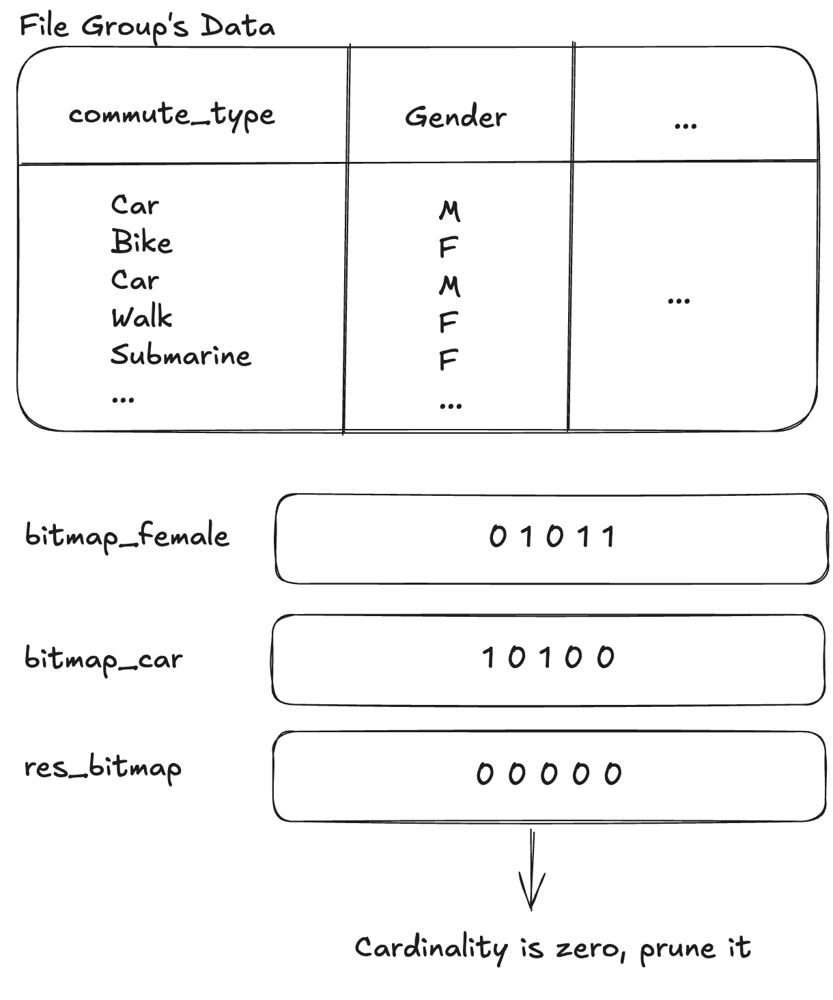

<!--
  Licensed to the Apache Software Foundation (ASF) under one or more
  contributor license agreements.  See the NOTICE file distributed with
  this work for additional information regarding copyright ownership.
  The ASF licenses this file to You under the Apache License, Version 2.0
  (the "License"); you may not use this file except in compliance with
  the License.  You may obtain a copy of the License at

       http://www.apache.org/licenses/LICENSE-2.0

  Unless required by applicable law or agreed to in writing, software
  distributed under the License is distributed on an "AS IS" BASIS,
  WITHOUT WARRANTIES OR CONDITIONS OF ANY KIND, either express or implied.
  See the License for the specific language governing permissions and
  limitations under the License.
-->
# RFC-92: Support Bitmap Index

## Proposers

- @CTTY

## Approvers

- @yihua

## Status

JIRA: [HUDI-9048](https://issues.apache.org/jira/browse/HUDI-9048)

## Abstract

Apache Hudi is actively expanding its support for different indexing strategies to optimize query performance and data retrieval efficiency. 
However, bitmap indexes—widely recognized for their effectiveness in filtering low-cardinality columns—are not yet supported. 
This project proposes the integration of bitmap indexing into Hudi’s indexing framework. 
Bitmap indexes offer compact storage and fast bitwise operations, making them particularly well-suited for analytical workloads where predicates involve columns with a limited number of distinct values. 
By introducing bitmap index support, we aim to enhance Hudi’s performance for a broader set of query patterns, especially in use cases with filtering on categorical or boolean fields.

## Background

A bitmap index is a specialized indexing technique that enhances query performance, particularly for columns with low cardinality (few distinct values). 
Instead of storing row pointers like traditional indexes, it represents data as bitmaps, where each distinct value in a column has a corresponding bit vector indicating the presence of that value in different rows.
The main advantage of a bitmap index is its ability to perform fast bitwise operations, which allow for quick filtering and combination of multiple conditions.
<p align="center">

</p>

In Hudi, bitmap indexes can provide significant performance benefits by helping to skip unnecessary files during query execution. 
Since Hudi organizes data into files and partitions, a bitmap index can track which files contain relevant values, allowing the query engine to efficiently prune irrelevant files before scanning. 
Additionally, bitmap indexes enable bitmap joins, where bitwise operations quickly determine matching records across datasets without performing costly row-by-row comparisons.

## Design

### Bitmap Metadata Structure
Bitmap indexes for all columns will be stored in the `bitmap_index` partition of the table's Hudi metadata table. (`<table_path>/.hoodie/metadata/bitmap_index`)

To support bitmap indexing, we plan to introduce a new type of metadata record along with a new metadata field, `BitmapIndexMetadata`.
This field will store the serialized and encoded bitmap string directly.
Each record's key will follow the format: `<column_name>$<column_value>$<file_group_id>`,
where file_group_id is defined as `<partition_path>$<file_id>`.
```
store_type$grocery$20250401$2aa10971-11b2-41b3-9baf-ab33c0000144-0
```

For non-partitioned tables, we use `.` as a placeholder for the partition path. In this case, the key would be:
```
store_type$grocery$.$2aa10971-11b2-41b3-9baf-ab33c0000144-0
```

The index key can be constructed on-the-fly by concatenating strings during both read and write operations.
Since the reader must know at least the column name and column value, searching bitmaps by key prefix is also supported.

Below is another example of how the index record looks like in the storage.


### Maintaining the Index
Just like other existing Hudi indexes, the logic for writing the bitmap index will be integrated with Hudi's metadata writer during commit operations.
Bitmap index maintenance during writes typically falls into the following categories: **Initialize**, **Insert**, **Update**, and **Delete**.
Before diving into each category, let’s define two bitmap meta operations that will be referenced frequently:

**addBitmapPosition**: 
1. For a given record, extract its indexed column name-value pairs and file group ID to construct the bitmap key.
2. Retrieve the existing bitmap using the key, or initialize an empty one if it doesn't exist.
3. Add the record’s position to the bitmap.
4. Write the bitmap record `<bitmap key, updated bitmap>` to the `bitmap_index` partition in the metadata table

**removeBitmapPosition**:
1. For a given record, extract its indexed column name-value pairs and file group ID to construct the bitmap key.
2. Retrieve the existing bitmap using the key; if it doesn’t exist, the operation becomes a no-op.
3. Remove the record’s position from the bitmap.
4. Write the bitmap record `<bitmap key, updated bitmap>` to the `bitmap_index` partition in the metadata table

> Note: We don’t need an operation to explicitly delete outdated bitmap records.
Since the bitmap key remains unchanged, the new record will overwrite the previous one.
#### Initialize
When initializing the bitmap index, the metadata writer scans all file groups to collect `existing_records`.
The bitmap records will be written into the `bitmap_index` partition of the table's Hudi metadata table.
Pseudocode:
```
for record in existing_records:
  addBitmapPosition(record)
```
#### Insert
The commit metadata for inserts includes files affected by new records.
The metadata writer extracts `inserted_records` from those files and updates the bitmap index accordingly.
Pseudocode:
```
for record in inserted_records:
  addBitmapPosition(record)
```
#### Update
Update commit metadata includes files impacted by updated records.
The metadata writer scans those files and compares the new records to those from the previous file slice.
If indexed columns have changed, we capture:
- `new_records`: records with updated indexed column values.
- `old_records`: corresponding records from the previous file slice.
The bitmap index is updated in two steps:
```
for record in new_records:
  addBitmapPosition(record)
for record in old_records:
  removeBitmapPosition(record)
```
> Note: the actual implementation doesn't have to be two for-loops because we can process (old column, new column) pairs directly
#### Delete
Delete commit metadata includes files impacted by deletions.
The metadata writer compares the current state to the previous file slice to identify `deleted_records`.
Then we will have steps to maintain bitmap index after deletes in pseudocode:
```
for record in deleted_records:
  removeBitmapPosition(record)
```
Unlike other indexes, updating or deleting records doesn't cause Hudi to remove bitmap index entries—even if the corresponding bitmap no longer has any positions stored.
This is because:
- Although the current file group may not contain the value, it could be added back in the future. 
  Removing the bitmap too aggressively would introduce unnecessary complexity and could even hurt performance.
- The total number of bitmap records stored in the metadata table is expected to remain manageable.
  Let `m` represent the number of columns indexed using bitmap indexes, and `n` be the average cardinality of these columns.
  Then, Hudi maintains `O(mn)` bitmap records for the table.

### Reading the Index
To enable file pruning using the bitmap index, we can extend `SparkBaseIndexSupport` with a new `BitmapIndexSupport`. 
The initial implementation will target Spark, but the design can be adapted for other engines.

Imagine a table tracking how people commute to work. 
We index the `gender` and `commute_type` columns using bitmap indexing.
We want to find the age of the youngest woman who commute by car:
```
SELECT MIN(age) FROM hudi_table
WHERE gender = 'female' AND commute_type = 'car';
```
This query can generate two filters: 
- `EqualTo(gender, female)`
- `EqualTo(commute_type, car)`

We can use the following logic to prune file groups:
```
for file_group in file_groups
  # 1. get bitmap for the gender filter
  bitmap_key_female = gender$female$file_group_id
  bitmap_female = metadata_table.getBitmap(bitmap_key_female)
  # 2. get bitmap for the commute_type filter
  bitmap_key_car = commute_type$car$file_group_id
  bitmap_car = metadata_table.getBitmap(bitmap_key_car)
  # 3. perform bit-wise and
  res_bitmap = bitmap_female.and(bitmap_car)
  # 4. If the result is non-empty, include the file group
  if res_bitmap.cardinality != 0
    then include file_group
```
<p align="center">

</p>

## Considerations
### No Row-level Skipping
One limitation is that Hudi currently lacks row-level skipping, so once a file group is selected, the entire file must be scanned.
Even so, bitmap indexes are valuable, especially when multiple low-cardinality columns are indexed and commonly used in joins or filters.
Bitwise operations on these indexes can efficiently narrow down relevant file groups.
In the future, as Hudi adds row-level or row-group-level skipping, bitmap indexes will offer even greater performance gains by enabling precise row filtering within files.

### Write Amplification
Like other indexes, bitmap indexes can amplify write operations and negatively impact writer performance.
This is especially true for updates, where Hudi needs to compare the previous file slice with the current one to identify which indexed field values have changed, in order to update the corresponding bitmaps.
This process is costly, and use cases with heavy write pressure should carefully evaluate the potential performance impact.

Write amplification could be reduced in the future if Hudi supports row lineage, allowing the system to know exactly which rows were updated in the last write.
With that, there's no need to scan both the previous and current file slices entirely.

### Memory Pressure
Using indexes introduces memory overhead.
When querying indexed columns, their bitmaps must be loaded into memory to enable efficient bitwise operations.
However, if the number of bitmaps becomes too large, it can lead to OOM errors.

Users should carefully evaluate their query patterns to decide which columns to index and consider the cardinality of those columns.

### Extra Storage
Bitmap indexes require additional storage.
Although RoaringBitmap is space-efficient (e.g., 100,000 positions take ~300KB), having too many indexed columns can still lead to storage concerns.
It’s important to strike a balance between query performance and storage footprint.

### Limited Predicate Support
As of now, the bitmap index only supports the `EqualTo` (`=`) query filter.
The `Not(EqualTo)` (`!=`) filter is not supported because the underlying implementation uses RoaringBitmap.
RoaringBitmap is a space-efficient, sparse bitmap format. It doesn't support global `not` or `flipAll` operations, as these require a well-defined range of record positions (this holds true for most compressed bitmap implementations).
In other words, we would need to know the full range of possible record positions in advance—which is not practical in most cases.

## Rollout/Adoption Plan

- What impact (if any) will there be on existing users?
    - None
- If we are changing behavior how will we phase out the older behavior?
    - N/A
- If we need special migration tools, describe them here.
    - N/A
- When will we remove the existing behavior
    - N/A

## Performance Benchmark
TBD
## Future Improvement
- Support `CREATE INDEX` SQL semantics for bitmap index and allow creating bitmap index asynchronously
- Adapt the bitmap index support for other engines
