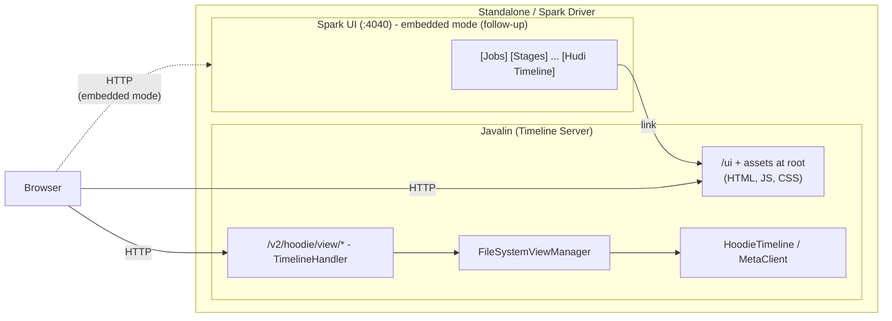
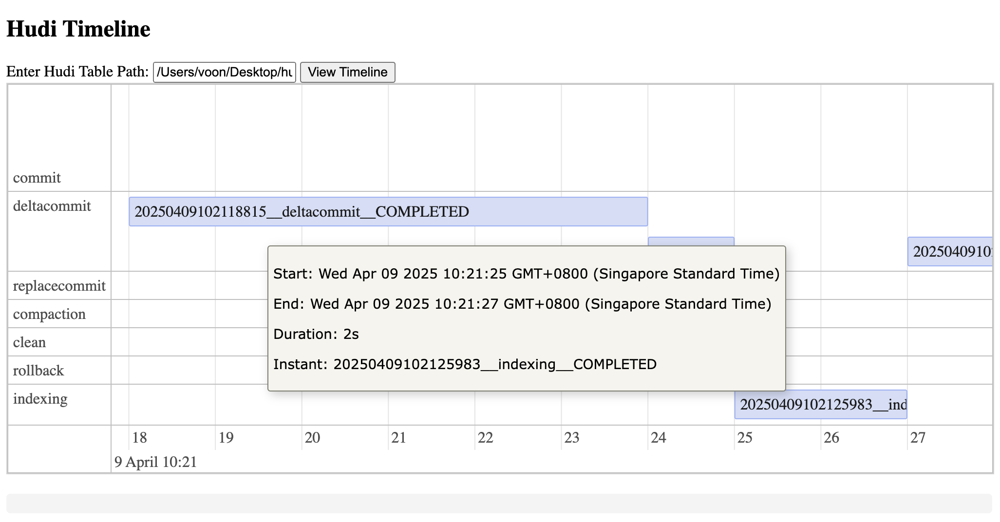
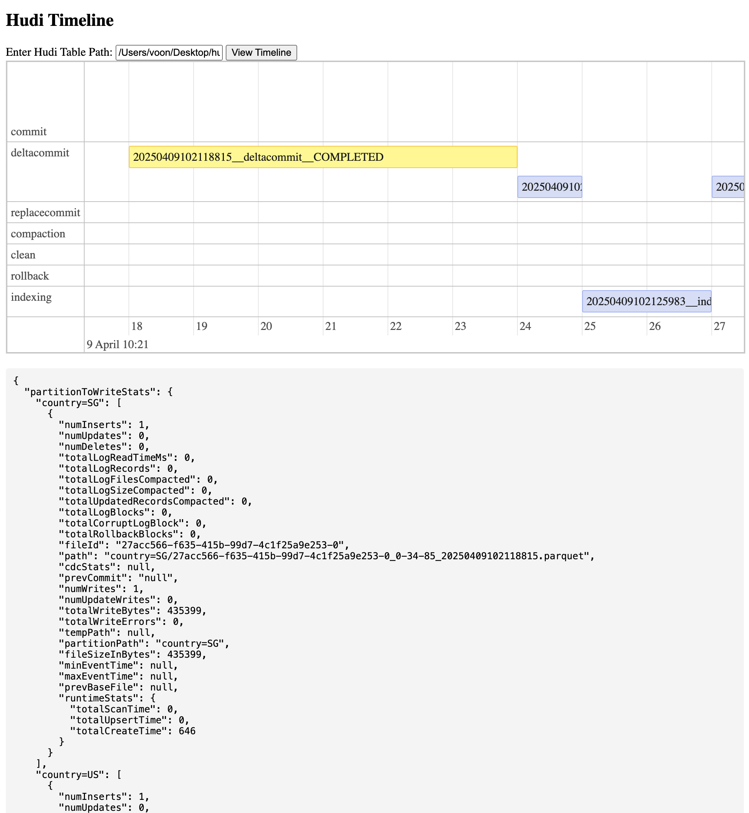

<!--
  Licensed to the Apache Software Foundation (ASF) under one or more
  contributor license agreements.  See the NOTICE file distributed with
  this work for additional information regarding copyright ownership.
  The ASF licenses this file to You under the Apache License, Version 2.0
  (the "License"); you may not use this file except in compliance with
  the License.  You may obtain a copy of the License at

       http://www.apache.org/licenses/LICENSE-2.0

  Unless required by applicable law or agreed to in writing, software
  distributed under the License is distributed on an "AS IS" BASIS,
  WITHOUT WARRANTIES OR CONDITIONS OF ANY KIND, either express or implied.
  See the License for the specific language governing permissions and
  limitations under the License.
-->

# RFC-94: Hudi Timeline User Interface (UI)

## Proposers

- @voonhous

## Approvers

- @danny0405
- @rahil-c
- @yihua

## Status

JIRA: [HUDI-9315](https://issues.apache.org/jira/browse/HUDI-9315)

## Abstract

Hudi Timeline metadata is stored as timestamped files representing state transitions of actions like `commit`,
`deltacommit` and `compaction`. These files are accessible via the CLI or a file explorer, but it's hard to visualize
concurrent actions, spot missing transitions, or tell how long each step took. Debugging timeline issues by reading
filenames is tedious.

This RFC proposes a UI-based timeline visualization tool that parses these metadata files, groups related actions, and
renders them in a time-ordered, interactive view. Users can track the lifecycle of each operation, see concurrency
patterns, and spot anomalies or long-running tasks. The implementation extends `hudi-timeline-service` with new `/v2/`
REST APIs and a static HTML + JavaScript frontend powered by [vis-timeline](https://github.com/visjs/vis-timeline),
served via Javalin's built-in static file serving with zero new Java compile-time dependencies.

## Background

Today, we rely on the CLI or direct filesystem inspection to understand timeline state through metadata files. These
files represent different actions (e.g., `deltacommit`, `compaction`) and their lifecycle states (`requested`,
`inflight`, `completed`), encoded in file names like:

```shell
20250409102118815.deltacommit.inflight
20250409102118815.deltacommit.requested
20250409102118815_20250409102124339.deltacommit
20250409102121593.compaction.inflight
20250409102121593.compaction.requested
20250409102121593_20250409102122232.commit
20250409102124581.deltacommit.inflight
20250409102124581.deltacommit.requested
20250409102124581_20250409102125667.deltacommit
20250409102124612.compaction.inflight
20250409102124612.compaction.requested
20250409102124612_20250409102124892.commit
20250409102127348.deltacommit.inflight
20250409102127348.deltacommit.requested
20250409102127348_20250409102128481.deltacommit
20250409102127500.compaction.inflight
20250409102127500.compaction.requested
20250409102127500_20250409102127721.commit
```

This works, but has a few problems:

1. No visibility into concurrency
    - Multiple actions (e.g., `deltacommit` and `compaction`) often run concurrently.
    - The CLI doesn't help correlate or visualize overlapping operations.
2. Lack of temporal context
    - Timestamps are embedded in filenames but are hard to compare visually - year, month and day can be quickly
      determined, but minutes and seconds are harder to parse.
    - No easy way to tell how long an action took or whether it's stalling unless you manually calculate the difference
      between requested and completion time.
3. Hard to spot inconsistencies or missing states
    - An `inflight` compaction without a corresponding `commit` can indicate a starved/stuck compaction, which usually
      blocks archiving/cleaning.
    - These gaps are easy to miss when scanning filenames.

On top of that, all timeline files are now stored as Avro binaries. Inspecting their contents requires custom Avro
readers to convert the binaries to JSON.

## Scope

This RFC covers visualization of metadata available in Hudi tables. All features are **READ-ONLY** - there is no support
for starting or spawning jobs that mutate a Hudi table.

Alongside the timeline, the UI surfaces two additional read-only metadata views: the table's configuration
(`hoodie.properties`) and its schema-change history.

The following are **out of scope**:

- **Archived timeline:** Only the active timeline is rendered. Loading instants from LSM-based archive files is left for
  future work.
- **Metadata table overlay:** The metadata table's own timeline is not shown alongside the main table timeline.
- **Write/mutation operations:** The UI cannot trigger compactions, clustering, or any write action.
- **Authentication/authorization:** No access control is added. The timeline server is assumed to run in a trusted
  network, same as today.

  **Threat model:** The UI does not widen the timeline server's exposure surface. The `/v2/` endpoints read the same
  active-timeline and filesystem metadata that the existing `/v1/` REST APIs already serve, on the same network
  interface (the server binds to all interfaces on the driver/standalone host). The UI is also opt-in and off by default
  (`--enable-ui`). Operators on untrusted networks should front the server with a reverse proxy or restrict it to a
  private interface / localhost via network policy.

## Implementation

Keeping the implementation lightweight is a priority - we should add as few dependencies as possible. Changes go into
the existing `hudi-timeline-service` module, which contains a Javalin web-application that caches filesystem metadata of
a Hudi table for job executors during tagging/writing.

The first cut runs the UI on the Timeline Server in **STANDALONE** mode (see [Configuration](#configuration)) and is
self-contained within `hudi-timeline-service`. Enabling the UI on the **EMBEDDED** timeline server inside a Spark
driver, together with a Spark UI tab, requires cross-module wiring (`hudi-client-common`, `hudi-spark-client`); it is
designed below but deferred to a follow-up to keep the initial PR small and focused. The standalone UI lands first; the
embedded/Spark linking lands next.

The Hudi Timeline UI has two parts: the frontend and backend.

### Architecture

The timeline server can run standalone or embedded inside a Spark driver. In embedded mode, a tab in the Spark UI links
directly to the Hudi Timeline UI. The embedded mode and Spark UI tab (right side of the diagram below) are a planned
follow-up; the first cut is standalone-only.


```mermaid
graph LR
    Browser["Browser"]

    subgraph Driver["Standalone / Spark Driver"]
        subgraph TimelineServer["Javalin (Timeline Server)"]
            Static["/ui + assets at root\n(HTML, JS, CSS)"]
            API["/v2/hoodie/view/* - TimelineHandler"]
            FSVM["FileSystemViewManager"]
            Meta["HoodieTimeline / MetaClient"]

            API --> FSVM --> Meta
        end

        subgraph SparkUI["Spark UI (:4040) - embedded mode (follow-up)"]
            direction TB
            SparkUIPad[ ] ~~~ Tabs["[Jobs] [Stages] ... [Hudi Timeline]"]
        end

        style SparkUIPad fill:none,stroke:none,color:none

        Tabs -- "link" --> Static
    end

    Browser -- "HTTP" --> Static
    Browser -- "HTTP" --> API
    Browser -. "HTTP\n(embedded mode)" .-> SparkUI
```

There are two categories of requests:

1. **Static file requests** - Javalin serves HTML, JavaScript, and CSS files from the classpath
   (`src/main/resources/public/`) at the server root; `UiHandler` serves `index.html` at `/ui`. No server-side
   rendering or template engine is needed.
2. **REST API requests** (`/v2/hoodie/view/*`) - `TimelineHandler` processes these requests, reading timeline data from
   the `FileSystemViewManager` (and a per-basepath `HoodieTableMetaClient` for table config/schema), returning JSON.

### Frontend

The frontend is static HTML pages with vanilla JavaScript, similar to the Spark Web UI. Javalin's built-in static file
serving handles files from the classpath - no template engine (e.g., Thymeleaf) is needed and no new Java compile-time
dependencies are added.

No frontend build pipeline (npm, webpack, vite) is needed. Contributing to the UI requires only a text editor. The only
external library is vis-timeline for timeline rendering.

#### File Structure

```
hudi-timeline-service/src/main/resources/public/
├── index.html                     # Landing page with basepath input form
├── js/
│   └── timeline.js                # vis-timeline initialization and REST API calls
├── css/
│   └── style.css                  # Basic styling
└── lib/
    └── vis-timeline/              # Bundled vis-timeline assets
        ├── vis-timeline-graph2d.min.js
        └── vis-timeline-graph2d.min.css
```

#### JavaScript Delivery: Bundled, No External Calls

The vis-timeline library is served from the bundled copy at `/lib/vis-timeline/`. The UI makes no external network
calls, so it works out of the box in air-gapped and security-conscious deployments with no extra configuration. The
bundled assets add ~300KB to the JAR.

Pinning a vendored copy (rather than loading from a CDN) keeps the UI deterministic and avoids a runtime dependency on
an external host being reachable. If automatic patch updates are wanted later, a CDN source can be added as an opt-in
config flag without changing this default.

#### vis-timeline Configuration

The timeline is configured with groups and items that map to Hudi's timeline model:

- **Groups:** One row per action type - `commit`, `deltacommit`, `compaction`, `clean`, `rollback`, `clustering`,
  `savepoint`, `logcompaction`, `indexing`, `restore`, `replacecommit`. These correspond to the actions in
  `HoodieTimeline.VALID_ACTIONS_IN_TIMELINE`.
- **Items:** Completed instants are rendered as range bars spanning from `requestedTime` to `completionTime`.
  Non-completed instants (requested or inflight) are rendered as point items at `requestedTime`.
- **Color coding:** Items are colored by state:
    - Green -> `COMPLETED`
    - Yellow -> `INFLIGHT`
    - Red -> `REQUESTED`
- **Tooltip:** On hover, shows the action type, requested time, completion time, and duration.
- **Click handler:** Clicking an instant fetches its detail via `/v2/hoodie/view/timeline/instant` and shows the
  deserialized JSON in a detail panel below the timeline.

### Backend

A `hudi-timeline-service` instance already serves filesystem metadata for multiple table basePaths since the
`FileSystemView`s are cached in a map keyed by basepath.

We extend this module with `/v2/` APIs to serve the timeline metadata needed by the UI.

#### API Specification

| Method | Path                                    | Parameters                                                            | Response        | Description                                                                                  |
|--------|-----------------------------------------|-----------------------------------------------------------------------|-----------------|----------------------------------------------------------------------------------------------|
| GET    | `/v2/hoodie/view/timeline/instants/all` | `basepath` (required)                                                 | `TimelineDTOV2` | All active instants (each with requested time, completion time, action, state), wrapped in a timeline DTO |
| GET    | `/v2/hoodie/view/timeline/instant`      | `basepath`, `instant`, `instantaction`, `instantstate` (all required) | JSON string     | Deserialized content of a specific instant's metadata (Avro -> JSON)                         |
| GET    | `/v2/hoodie/view/table/config`          | `basepath` (required)                                                 | JSON object     | The table's `hoodie.properties` (sorted)                                                     |
| GET    | `/v2/hoodie/view/table/schema/history`  | `basepath` (required), `limit` (optional, default 200, max 1000)      | JSON object     | Current table schema plus schema-change history from recent commits                          |

Static files (HTML, JS, CSS) are served from the classpath under `src/main/resources/public/` at the server root (e.g.,
`/js/timeline.js`, `/lib/...`). `UiHandler` additionally registers `GET /ui`, which returns `index.html` to give the UI
a stable entry URL.

**On response size and pagination:** `GET /v2/hoodie/view/timeline/instants/all` returns the full active timeline. The
active timeline is bounded by archiving (the unbounded archived timeline is out of scope), so instant counts are
typically modest. The first cut intentionally returns all active instants and relies on client-side zoom/scroll and
filtering for navigation. If active-timeline sizes become a concern, the endpoint can be extended additively with
optional `from`/`to` time-range query params (and/or a `limit`) without breaking the existing contract.

#### DTO Design

Two v2 DTOs are introduced in a `v2` package to avoid modifying the existing `/v1/` API contract:

- **`InstantDTO`** (`o.a.h.common.table.timeline.dto.v2`) - the v1 `InstantDTO` only exposes `action`, `timestamp`
  (requested time), and `state`; it lacks completion time, needed for rendering range bars. The v2 `InstantDTO` has:
    - `action` - the action type (e.g., `commit`, `deltacommit`, `compaction`)
    - `requestedTime` (JSON `requestTs`) - requested timestamp (`HoodieInstant.requestedTime()`)
    - `completionTime` (JSON `completionTs`) - completion timestamp (`HoodieInstant.getCompletionTime()`), null for
      non-completed instants
    - `state` - the instant state (`REQUESTED`, `INFLIGHT`, `COMPLETED`)
- **`TimelineDTOV2`** - wraps a `List<InstantDTO>` (`instants`); this is what `/v2/hoodie/view/timeline/instants/all`
  returns.

#### Handler Design

The v2 endpoints are served by the existing `TimelineHandler` (which already serves the v1 timeline routes); a separate
`UiHandler` serves only the UI entry page.

`TimelineHandler` methods:

1. `getTimelineV2(basePath)` - maps `viewManager.getFileSystemView(basePath).getTimeline()` to a `TimelineDTOV2` (the
   active timeline's instants, each including completion time).
2. `getInstantDetails(basePath, instant, action, state)` - reads the instant's Avro content via the active timeline's
   `getInstantDetails()` and deserializes it to JSON. The instant is created with the timeline's own layout-aware
   `InstantGenerator`; a malformed `state`/`action` returns 400, a read failure is logged and returns 500.
3. `getTableConfig(basePath)` / `getSchemaHistory(basePath, limit)` - serve the table-config and schema-history views.
   Both reuse a `HoodieTableMetaClient` cached per basepath in a `ConcurrentHashMap` (built once on first access), so
   repeated requests pay only the targeted read, not metaClient construction.

`UiHandler` registers `GET /ui`, returning `/public/index.html` from the classpath as the UI entry page.

#### Registration in RequestHandler

The v2 routes are registered following the existing pattern:

- The v1 timeline routes remain registered unconditionally in `registerTimelineAPI()`.
- The v2 UI routes are registered in `registerTimelineV2API()`, called from `register()` only when `--enable-ui` is set.
  `UiHandler` (serving `/ui`) and the static-file serving are gated by the same flag.

#### Error Handling

- **Invalid basepath** -> HTTP 400 with a descriptive error message (e.g., "Not a valid Hudi table path").
- **Empty timeline** -> Returns an empty list `[]`. The frontend displays "No instants found".
- **Failed instant detail read** -> HTTP 500 with error details (e.g., Avro deserialization failure).

### Feature

The first cut presents three read-only tabs for a Hudi table: **Timeline**, **Table Config**, and **Schema History**.

The permitted user actions are:

1. User is able to input a Hudi table basepath
2. User is able to click submit after inputting Hudi table basepath
3. The timeline of the Hudi table is rendered
4. User is able to scroll through timeline (horizontally)
5. User is able to zoom in and out of timeline
6. User is able to hover over instant for more details
7. User is able to click on a specific instant and the JSON string of the timeline details are rendered
8. User is able to view the table's configuration (`hoodie.properties`) in the Table Config tab
9. User is able to view the table's schema and schema-change history in the Schema History tab

Each action type occupies its own horizontal row so concurrent actions are visually separated. Completed instants appear
as horizontal bars whose width represents duration (requested -> completed). Inflight and requested instants appear as
point markers. Color indicates state: green for completed, yellow for inflight, red for requested.

### Examples

Proof of concept (PoC) snapshots:

**Main Page with Timeline Rendered**


**Hovering Over an Instant**


**Selecting an Instant**


## Configuration

### Standalone Mode

To start the Timeline Server in standalone mode with the UI enabled:

```shell
java -cp hudi-timeline-server-bundle-*.jar \
  org.apache.hudi.timeline.service.TimelineService \
  --server-port 26754 \
  --enable-ui
```

Once started, the UI is accessible at `http://localhost:26754/ui`.

The server port is configurable via the existing `--server-port` (or `-p`) flag (default: `26754`). The `--enable-ui`
flag controls whether the UI static files, the `/ui` page, and the `/v2/hoodie/view/` UI API endpoints are registered.
When the flag is not set, the timeline server behaves exactly as it does today - no UI-related routes are added.

### Embedded Mode (Spark-Shell / Spark Driver)

> **Status: deferred to a follow-up.** Embedded-mode UI enablement is intentionally split out of the initial PR to keep
> it small: the standalone UI ships first, then the embedded server is wired to enable it. The design below is retained
> for that follow-up.

When running Hudi inside a Spark application, the `EmbeddedTimelineService` already starts a timeline server within the
driver process. The UI can be enabled on this embedded server by setting a Spark configuration property:

```
hoodie.embed.timeline.server.ui.enable = true
```

This property defaults to `false`. When set to `true`, the embedded timeline server registers the same UI routes and
static file serving as the standalone mode.

#### Starting from spark-shell

```shell
spark-shell \
  --packages org.apache.hudi:hudi-spark3-bundle_2.12:1.2.0 \
  --conf "hoodie.embed.timeline.server.ui.enable=true"
```

Once a write operation initializes the `EmbeddedTimelineService`, the UI becomes available at
`http://<driver-host>:<embedded-server-port>/ui`. The embedded server port is logged at startup and can also be
retrieved from the Spark configuration via the `hoodie.embed.timeline.server.port` property.

#### Starting from a Spark application (driver)

Set the property programmatically on `HoodieWriteConfig` before creating the write client:

```java
HoodieWriteConfig config = HoodieWriteConfig.newBuilder()
    .withPath(basePath)
    .withEmbeddedTimelineServerEnabled(true)
    .withEmbeddedTimelineServerUIEnabled(true)  // enables UI on embedded server
    // ... other configs
    .build();
```

The UI is available for the lifetime of the `EmbeddedTimelineService` - it starts when the write client initializes and
stops when the client or `SparkContext` is closed.

## Spark UI Tab Integration

> **Status: deferred to a follow-up.** The Spark UI tab depends on embedded-mode enablement and cross-module Spark APIs,
> so it is split out of the initial PR for the same reason. The design below is retained for that follow-up.

When the `EmbeddedTimelineService` starts with the UI enabled inside a Spark application, a "Hudi Timeline" tab is
registered in the Spark web UI (typically at `http://localhost:4040`). This gives users a single place to discover and
access the Hudi Timeline UI without needing to know the embedded server's port.

### Approach

A custom class extending Spark's `WebUITab` is added to the `hudi-spark-client` module. The tab contains a single
`WebUIPage` that renders a link to the Hudi Timeline UI running on the embedded timeline server at
`http://<driver-host>:<timeline-server-port>/ui`.

The link approach is chosen over embedding the UI in an iframe to avoid layout and scrolling issues within the Spark UI
shell. Clicking the link opens the full Hudi Timeline UI in a new browser tab, providing the complete interactive
experience.

### Multiple Tables in One Application

A Spark application can write to multiple Hudi tables. The embedded timeline server is shared across them: when
`hoodie.embed.timeline.server.reuse.enabled` is set, `EmbeddedTimelineService` keeps a single server per driver and
tracks the set of basepaths using it (`EmbeddedTimelineService.basePaths`), adding each table on its first write. The
backend already caches one `FileSystemView` per basepath, so that single server serves every table.

The tab therefore links to a single UI instance rather than registering one tab per table. The user selects which
table to view inside the UI via the basepath input form (persisted in the `?path=` query parameter). Because the
server already knows the set of basepaths it serves, a natural follow-up is to pre-populate that input as a dropdown of
registered basepaths so users pick from known tables instead of typing.

Tab registration is guarded so the "Hudi Timeline" tab is registered once per driver, avoiding duplicate tabs when the
server is reused across tables.

### Registration and Lifecycle

```
SparkContext starts
  └─> EmbeddedTimelineService starts (with UI enabled)
        └─> HudiTimelineTab registered via SparkUI.attachTab()

SparkContext stops / write client closes
  └─> EmbeddedTimelineService stops
        └─> HudiTimelineTab detached via SparkUI.detachTab()
```

Registration happens in `EmbeddedTimelineService` after the embedded server has started successfully. The tab is
detached during shutdown to ensure clean cleanup. If the Spark UI is not available (e.g., `spark.ui.enabled=false`), the
tab registration is skipped silently.

### Module Placement

The Spark UI tab implementation lives in `hudi-spark-client`, not `hudi-timeline-service`, because it depends on Spark
APIs (`WebUITab`, `WebUIPage`) which are not available in the timeline service module. The `EmbeddedTimelineService`
(also in `hudi-client-common`) coordinates the registration by calling into the Spark-specific tab class when running
with a `HoodieSparkEngineContext`.

## Dependency Impact

- **Zero new Java compile-time dependencies.** The frontend uses Javalin's built-in static file serving; no template
  engine is added.
- **vis-timeline JS/CSS:** ~300KB bundled as static resources under `src/main/resources/public/lib/vis-timeline/`.
- **Spark UI tab (planned follow-up):** Will use existing `spark-core` APIs (`WebUITab`, `WebUIPage`), already provided
  in `hudi-spark-client`. No new JARs are added.
- **No impact on Spark/Flink bundles.** `hudi-timeline-server-bundle` is a separate artifact; adding static resources
  does not affect engine-specific bundles.
- **No frontend build pipeline.** No npm, webpack, or vite. The JS/CSS files are committed directly and served as-is.

## Additional Quality of Life (QoL) Features to be Considered

The following client-side enhancements were implemented alongside the core features above. These are purely frontend
additions - no new APIs, Java dependencies, or architectural changes beyond what is specified in this RFC.

- **Bootstrap 5 + renderjson styling** - Bootstrap 5 for layout and renderjson for collapsible, syntax-highlighted JSON
  in the detail panel.
- **Instant search and "Go to Now" button** - A search input that filters and focuses the timeline on a specific instant
  by requested time, plus a button to jump to the latest instant.
- **Summary statistics bar** - Counts of instants by state (completed, inflight, requested) computed client-side from
  the loaded data.
- **Filter controls (state + action)** - Dropdown filters for state and action type using vis-timeline's `DataView`
  filtering. Users can isolate specific instant types.
- **Color legend** - Maps colors to instant states for quick reference.
- **URL `?path=` persistence** - The basepath is stored in the URL query parameter so the view can be bookmarked and
  shared.
- **Keyboard navigation** - Left/right arrow keys to move between instants, Escape to close the detail panel.
- **Help modal** - Pressing `?` opens a modal listing all keyboard shortcuts and UI interactions.

## Future Improvements

Other features we can add later:

1. **Incremental clean range overlay** - A translucent overlay from `lastCompletedCommitTimestamp` to
   `earliestCommitToRetain` when clean metadata is available, showing which instants are protected from cleaning and
   which are eligible for removal.

2. **Partition/filegroup write heatmap** - Within one or multiple instants, render a grid colored by write volume from
   `HoodieCommitMetadata.partitionToWriteStats`. Helps identify skewed partitions or heavily-modified filegroups across
   commits.

3. **Metadata table timeline overlay** - Render the metadata table's timeline alongside the main table timeline. Useful
   for diagnosing cases where the metadata table is lagging or has stale entries.

4. **Archived timeline** - Load and render instants from the LSM-based archive files, extending the view beyond the
   active timeline to include historical actions.

5. **Per-state instant details** - Currently the plan for the UI is to only render the highest state for each instant
   (e.g., if requested, inflight, and completed all exist, only completed is shown). We should keep this as the default
   but also let users view the other states' metadata. The simplest approach would be adding state toggle buttons after
   selecting an instant, so users can fetch and view the JSON content for each state individually.

## Rollout/Adoption Plan

- **Backward compatibility:** Additive change only. All existing `/v1/` endpoints remain unchanged. UI endpoints are
  under `/v2/hoodie/view/` and the UI entry page at `/ui`. No existing behavior changes.
- **Release target:** 1.2.x
- **Documentation:** A new page on hudi.apache.org under the "Operations" section with screenshots, a startup guide, and
  a debugging walkthrough showing how to use the timeline UI to diagnose common issues (stuck compactions, long-running
  commits, etc.).
- **No migration needed:** Net-new feature behind an opt-in flag (`--enable-ui`), no impact on existing users or running
  systems.

## Test Plan

### Unit Tests

- **`TimelineHandler.getTimelineV2()`**: Verify correct mapping from `HoodieInstant` to v2 `InstantDTO`, including:
    - All action types in `HoodieTimeline.VALID_ACTIONS_IN_TIMELINE` are mapped correctly.
    - `completionTime` is populated for completed instants and null for requested/inflight instants.
    - Instants are returned in timeline order.
- **`TimelineHandler.getInstantDetails()`**: Verify correct Avro deserialization to JSON for various action types
  (commit metadata, compaction plan, clean plan, etc.).
- **Error cases**: Invalid basepath returns an appropriate error. Empty timeline returns an empty list.

### Integration Tests

Following the pattern established by `TestTimelineService.java`:

- Start `TimelineService` with the UI enabled (`--enable-ui`).
- Create synthetic instants via `HoodieTestUtils` covering multiple action types and states.
- Verify `GET /v2/hoodie/view/timeline/instants/all` returns the expected list of instants with correct fields.
- Verify `GET /v2/hoodie/view/timeline/instant` returns valid JSON for a completed instant.
- Verify `GET /v2/hoodie/view/table/config` and `GET /v2/hoodie/view/table/schema/history` return valid JSON.
- Verify `GET /ui` returns HTTP 200 with HTML content (static file serving works).

### Manual Testing Checklist

- Timeline renders correctly for tables with various action types (`commit`, `deltacommit`, `compaction`, `clean`,
  `rollback`, `clustering`).
- Concurrent actions are visually distinguishable across separate group rows.
- Zoom and scroll work smoothly with 100+ instants on the timeline.
- Detail panel shows correct JSON content when clicking on a completed instant.
- Hover tooltip displays action, requested time, completion time, and duration.
- Empty table basepath shows "No instants found" message gracefully.
- Invalid basepath shows a user-friendly error message.
- No external calls: UI loads fully from bundled assets (vis-timeline, Bootstrap, renderjson) with no network access.
