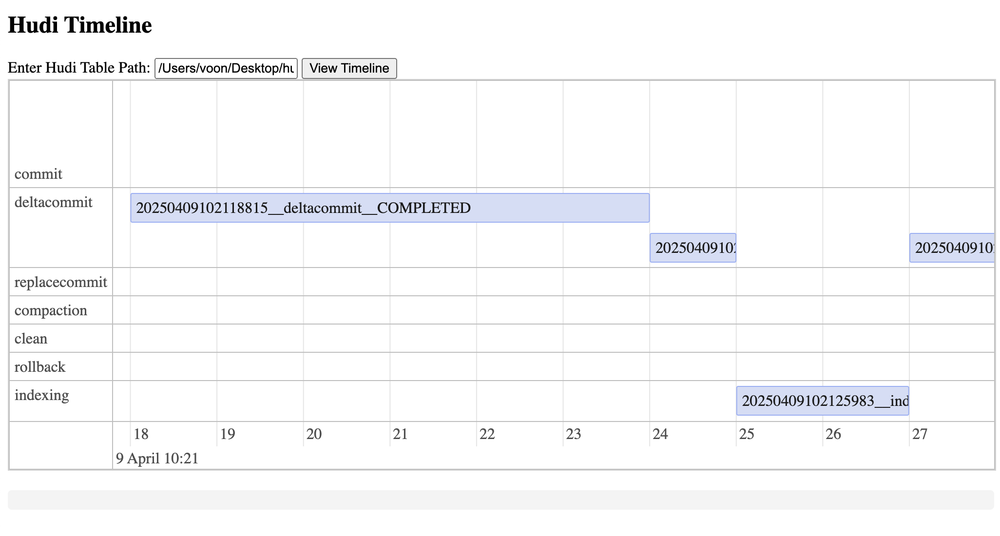

<!--
  Licensed to the Apache Software Foundation (ASF) under one or more
  contributor license agreements.  See the NOTICE file distributed with
  this work for additional information regarding copyright ownership.
  The ASF licenses this file to You under the Apache License, Version 2.0
  (the "License"); you may not use this file except in compliance with
  the License.  You may obtain a copy of the License at

       http://www.apache.org/licenses/LICENSE-2.0

  Unless required by applicable law or agreed to in writing, software
  distributed under the License is distributed on an "AS IS" BASIS,
  WITHOUT WARRANTIES OR CONDITIONS OF ANY KIND, either express or implied.
  See the License for the specific language governing permissions and
  limitations under the License.
-->
# RFC-94: Hudi Timeline User Interface (UI)

## Proposers

- @voonhous

## Approvers

- @danny0405
- @codope

## Status

JIRA: [HUDI-9315](https://issues.apache.org/jira/browse/HUDI-9315)

## Abstract

Hudi Timeline metadata in the filesystem is currently exposed as timestamped files representing
state transitions of actions such as `commit`, `deltacommit` and `compaction`. While these files are
accessible via the CLI or a file explorer, this method presents significant usability challenges:
it's difficult to visualize concurrent actions, identify missing transitions, or understand the
duration of each step. Manually interpreting sequences of timeline files hinders effective debugging
and monitoring.

To address these limitations, we propose a UI-based timeline visualization tool that can parse these
metadata files, group related actions, and render them in a time-ordered, interactive view. This
interface would enable users to intuitively track the lifecycle of each operation, observe
concurrency patterns, and quickly spot anomalies or long-running tasks. Such a visualization would
significantly improve observability and operational insight of jobs operating on a Hudi table.


## Background

In our current workflow, we rely on the command-line interface (CLI) or direct filesystem inspection
to understand the internal state of the system through metadata files. These files represent
different actions (e.g., `deltacommit`, `compaction`) and their lifecycle states (`requested`,
`inflight`, `completed`), encoded in file names as such:

```shell
20250409102118815.deltacommit.inflight
20250409102118815.deltacommit.requested
20250409102118815_20250409102124339.deltacommit
20250409102121593.compaction.inflight
20250409102121593.compaction.requested
20250409102121593_20250409102122232.commit
20250409102124581.deltacommit.inflight
20250409102124581.deltacommit.requested
20250409102124581_20250409102125667.deltacommit
20250409102124612.compaction.inflight
20250409102124612.compaction.requested
20250409102124612_20250409102124892.commit
20250409102127348.deltacommit.inflight
20250409102127348.deltacommit.requested
20250409102127348_20250409102128481.deltacommit
20250409102127500.compaction.inflight
20250409102127500.compaction.requested
20250409102127500_20250409102127721.commit
```

While this approach works at a basic level, several challenges arise:
1. No visibility into concurrency
   - Multiple actions (e.g., `deltacommit` and `compaction`) often occur concurrently.
   - CLI does not provide an intuitive way to correlate or visualize overlapping operations.
2. Lack of temporal context
   - Timestamps are embedded in filenames but are hard to compare visually, while year, month and
     day can be quickly determined, it is harder to see the minutes and seconds.
   - No easy way to perceive how long an action took or whether actions are stalling unless users
     manually calculate requested and completion time,
3. Difficult to spot inconsistencies or missing states
    - An `inflight` compaction action without a corresponding `commit` can indicate a starved/stuck
      compaction, which usually blocks archiving/cleaning.
    - The CLI makes it hard to spot such gaps or incomplete transitions easily. 

On top of that, we have recently standardized the format of all timeline files such that they are
stored as Avro binaries. As such, inspecting the contents of timeline files will require custom
Avro readers to convert the binaries to a JSON format.

## Scope

The current scope of work is to allow for visualisation of metadata that are available in Hudi
tables.
Hence, all features offered are on a **READ-ONLY** basis.
There will be no feature in this RFC that offers starting/spawning of jobs to mutate a Hudi table.

## Implementation

With being light-weighted as one of the key priorities, implementation should introduce as little
dependencies as possible to reduce bloat. Changes will be made to the existing
`hudi-timeline-service` module. This module contains a Javalin web-application that caches useful 
filesystem metadata of a Hudi table for job executors whenever tagging/writing is performed.

Therefore, to use the Hudi Timeline UI, users are only required to start the Timeline Server in 
**STANDALONE** mode, which is already supported as of now.

The Hudi Timeline UI can be split into two large sections. The frontend and backend.

### Frontend

The frontend can be implemented as static HTML pages enriched with vanilla javascript similar to 
how Spark Web UI does it. Javalin also supports rendering of HTML pages using popular template 
engines, of which, we will be using Thymeleaf, one of the more mature and well documented engines. 

Therefore, the dependencies used for the frontend are:
1. [Thymeleaf](https://www.thymeleaf.org/) - For templating
2. [visjs/vis-timeline](https://github.com/visjs/vis-timeline) - For rendering Hudi Timeline

No CSS framework will be used as the first cut.

### Backend

As of now, a `hudi-timeline-service` instance is able to serve filesystem metadata for multiple 
table basePath as the `FileSystemView`s are cached in a map that is keyed by the basepath.

As such, we can extend this module with a set of `/v2/` APIs to serve the timeline metadata that 
is required for the UI for specific table lookups.

The main implementation steps are to implement API endpoints required for serving Hudi Timeline 
information and they are:

1. Endpoint to return all active instants at their largest state with each instant containing the
   details below:
    - Requested time
    - Completion time
    - Action
    - State
2. Endpoint to return the contents of an instant

### Feature
The main feature that we are offering users as a first cut  is to visualise timeline for a Hudi 
table.

The main permitted user actions are:
1. User is able to input a Hudi table basepath 
2. User is able to click submit after inputting Hudi table basepath
3. The timeline of the Hudi table is rendered
4. User is able to scroll through timeline (horizontally)
5. User is able to zoom in and out of timeline
6. User is able to hover over instant for more details
7. User is able to click on a specific instant and the JSON string of the timeline details are
   rendered

### Examples

Attached below are proof of concept (PoC) snapshots

**Main Page with Timeline Rendered**


**Hovering Over an Instant**


**Selecting an Instant**

 

## Future Improvements

There are other features/improvements that we can add to the UI. For example:

1. Visualising incremental clean range
    - When an incremental clean is performed, render clean range spanning between
      `lastCompletedCommitTimestamp` to `earliestCommitToRetain`.
2. Visualising partition/filegroup level write heatmap to within one or multiple instants to allow
   users to see which partition/filegroups are modified heavily to identify skew. 
3. Overlay metadata table timeline
4. Visualising archive timeline


## Rollout/Adoption Plan

- No impact for existing users as this is a new feature.
- Add support in 1.1.x
- Add guide to start Timeline Server in Standalone mode.

## Test Plan

To test the RFC implementation, we will use a combination of synthetic and real metadata timelines
to validate that the UI correctly parses, groups, and renders action sequences. 

We'll verify that the visual timeline accurately reflects the expected order, duration, and 
completeness of operations like `commit` and `deltacommit`s. 
