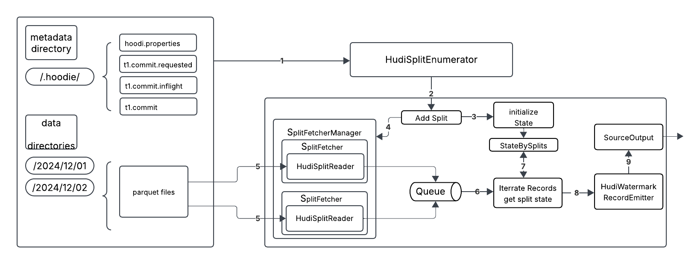

<!--
  Licensed to the Apache Software Foundation (ASF) under one or more
  contributor license agreements.  See the NOTICE file distributed with
  this work for additional information regarding copyright ownership.
  The ASF licenses this file to You under the Apache License, Version 2.0
  (the "License"); you may not use this file except in compliance with
  the License.  You may obtain a copy of the License at

       http://www.apache.org/licenses/LICENSE-2.0

  Unless required by applicable law or agreed to in writing, software
  distributed under the License is distributed on an "AS IS" BASIS,
  WITHOUT WARRANTIES OR CONDITIONS OF ANY KIND, either express or implied.
  See the License for the specific language governing permissions and
  limitations under the License.
-->
# RFC-95: Hudi Flink Source Implementation

## Proposers

- HuangZhenQiu

## Approvers
 - Danny Chan

## Status

JIRA: [HUDI-9483](https://issues.apache.org/jira/browse/HUDI-9483)

## Abstract
This RFC proposes support for new Flink source API for Flink hudi source. Hudi currently supports reading data via Flink Source Function APIs. However, it lacks a native Flink
Source API implementation for consuming Hudi tables as a first-class Flink source. The proposal aims to fill that gap by implementing a Flink Source that adheres to Flink's Source API
(introduced in Flink 1.11 and enhanced in 1.13+) to enable efficient, scalable and consistent reading of Hudi dataset in both streaming and batch modes.

## Background
Flink FLIP-27 solve several problems/shortcomings in the streaming source interface (SourceFunction) and simultaneously to unify the source interfaces between the batch and streaming APIs.
By adopting the new source interface, Flink can read hudi data in batch mode for better processing efficiency of bounded data. It also unblocks Flink Hudi user to use Flink hybrid source to seamless
switch reading data from hudi to kafka for back-fill use cases.

## Implementation
In the FLIP-27, the new source api split the reading logic into two major parts, SplitEnumerator, Reader. In the proposal, the implementation of native FlinkHudiSource using Flink's unified Source API 
will be discussed. It supports both snapshot and incremental modes, integrate with Hudi's metadata and file indexing, provide fault-tolerant Flink sources. For the Flink SQL user, the split order and 
watermark emitter for each split is very important for the correctness of result of window aggregation and window join. Thus, watermark emit and event-time processing will also be discussed below.



### Hudi Source

```java
public class HudiSource implements Source<RowData, HudiSourceSplit, HudiEnumeratorState> {
  
  //...
  @Override
  public Boundedness getBoundedness() {
    return scanContext.isStreaming() ? Boundedness.CONTINUOUS_UNBOUNDED : Boundedness.BOUNDED;
  }

  @Override
  public SourceReader<T, HudiSourceSplit> createReader(SourceReaderContext readerContext) {
    HudiSourceReaderMetrics metrics =
        new HudiSourceReaderMetrics(readerContext.metricGroup(), tableName);
    return new HudiSourceReader<>(
        emitter, metrics, readerFunction, splitComparator, readerContext);
  }

  @Override
  public SplitEnumerator<HudiSourceSplit, HudiEnumeratorState> createEnumerator(
      SplitEnumeratorContext<HudiSourceSplit> enumContext) {
    return createEnumerator(enumContext, null);
  }

  @Override
  public SplitEnumerator<HudiSourceSplit, HudiEnumeratorState> restoreEnumerator(
      SplitEnumeratorContext<HudiSourceSplit> enumContext, HudiEnumeratorState enumState) {
    return createEnumerator(enumContext, enumState);
  }

  @Override
  public SimpleVersionedSerializer<HudiSourceSplit> getSplitSerializer() {
    return new HudiSourceSplitSerializer(scanContext.caseSensitive());
  }

  @Override
  public SimpleVersionedSerializer<HudiEnumeratorState> getEnumeratorCheckpointSerializer() {
    return new HudiEnumeratorStateSerializer(scanContext.caseSensitive());
  }
  
  // ...
}
```

### Hudi Split
Similar to existing MergeOnReadInputSplit that implements InputSplit API, A new MergeOnReadSourceSplit and CdcSourceSplit will be implemented with the new SourceSplit interface.
FlinkRowDataReaderContext will be extended to be able to apply HudiSourceSplit and return a CloseableIterator that iterates `RecordsWithSplitIds`. RecordsWithSplitIds is a Flink interface 
that will be extended to support HudiSourceSplit. Base on the change, the HudiSourceSplitReader will be skeleton as below.

```java

class HudiSourceSplitReader implements SplitReader<RecordAndPosition<RowData>, HudiSourceSplit> {
  private final FlinkRowDataReaderContext readerContext;
  private final SerializableComparator<HudiSourceSplit> splitComparator;
  private final int indexOfSubtask;
  private final Queue<HudiSourceSplit> splits;

  private CloseableIterator<RecordsWithSplitIds<RecordAndPosition<RowData>>> currentReader;
  private HudiSourceSplit currentSplit;
  private String currentSplitId;

  HudiSourceSplitReader(
      FlinkRowDataReaderContext readerContext,
      SerializableComparator<HudiSourceSplit> splitComparator,
      SourceReaderContext context) {
    this.readerContext = readerContext;
    this.splitComparator = splitComparator;
    this.indexOfSubtask = context.getIndexOfSubtask();
    this.splits = Queues.newArrayDeque();
  }
  
  @Override
  public RecordsWithSplitIds<RecordAndPosition<T>> fetch() throws IOException {
    metrics.incrementSplitReaderFetchCalls(1);
    if (currentReader == null) {
      HudiSourceSplit nextSplit = splits.poll();
      if (nextSplit != null) {
        currentSplit = nextSplit;
        currentSplitId = nextSplit.splitId();
        currentReader = readerContext.apply(currentSplit);
      } else {
        return new RecordsBySplits<>(Collections.emptyMap(), Collections.emptySet());
      }
    }

    if (currentReader.hasNext()) {
      // Because Iterator#next() doesn't support checked exception,
      // we need to wrap and unwrap the checked IOException with UncheckedIOException
      try {
        return currentReader.next();
      } catch (UncheckedIOException e) {
        throw e.getCause();
      }
    } else {
      return finishSplit();
    }
  }

  @Override
  public void handleSplitsChanges(SplitsChange<HudiSourceSplit> splitsChange) {
    if (!(splitsChange instanceof SplitsAddition)) {
      throw new UnsupportedOperationException(
          String.format("Unsupported split change: %s", splitsChange.getClass()));
    }

    if (splitComparator != null) {
      List<HudiSourceSplit> newSplits = Lists.newArrayList(splitsChange.splits());
      newSplits.sort(splitComparator);
      splits.addAll(newSplits);
    } else {
      splits.addAll(splitsChange.splits());
    }
  }

  @Override
  public void wakeUp() {
  }

  @Override
  public void close() throws Exception {
    currentSplitId = null;
    if (currentReader != null) {
      currentReader.close();
    }
  }

  @Override
  public void pauseOrResumeSplits(
      Collection<HudiSourceSplit> splitsToPause, Collection<HudiSourceSplit> splitsToResume) {
  }
}
```

### Hudi Source Reader
```java 
public class HudiSourceReader<T>
    extends SingleThreadMultiplexSourceReaderBase<
        RecordAndPosition<T>, T, HudiSourceSplit, HudiSourceSplit> {
  
  // ... 
  @Override
  public void start() {
    // We request a split only if we did not get splits during the checkpoint restore.
    // Otherwise, reader restarts will keep requesting more and more splits.
    if (getNumberOfCurrentlyAssignedSplits() == 0) {
      requestSplit(Collections.emptyList());
    }
  }

  @Override
  protected void onSplitFinished(Map<String, HudiSourceSplit> finishedSplitIds) {
    requestSplit(Lists.newArrayList(finishedSplitIds.keySet()));
  }

  @Override
  protected HudiSourceSplit initializedState(HudiSourceSplit split) {
    return split;
  }

  @Override
  protected HudiSourceSplit toSplitType(String splitId, HudiSourceSplit splitState) {
    return splitState;
  }

  private void requestSplit(Collection<String> finishedSplitIds) {
    context.sendSourceEventToCoordinator(new SplitRequestEvent(finishedSplitIds));
  }
  
  // ...
}
```

### Hudi SplitEnumerator
Hudi split enumerator is responsible to monitor new hudi commit, get IncrementalInputSplits and converts to HudiSourceSplit. It functions the same as StreamReadMonitoringFunction, the difference is that
Hudi split enumerator runs in job manager. To need the requirement of streaming ETL and back-fill data from Hudi tables  within a time range. ContinuousHudiSplitEnumerator and StaticHudiSplitEnumerator 
will be implemented accordingly.

### Hudi Split Assignment
Hudi split assigner assign new discovered or unassigned discovered split to each of split requesters. Split will be sorted by using internal hudi commit time. Thus, splits from the same hudi commit will be processed 
first. It will be helpful for align watermark cross each of split reader.

### Hudi Watermark Emitter
If there is an event time column stats in parquet file, we can emit watermark base on the column stats. Otherwise, we can emit watermark by using hudi commit time.

### Hudi Table Source Integration
With the HudiSource implemented, it can be used for both streaming and batch mode in HudiTableSource. A new flink option USE_SOURCE_V2 will be defined to let user specify whether 
to use the new HudiSource in the HudiTableService. Below is the getScanRuntimeProvider function that needs to changed accordingly for the integration.

```java

  @Override
  public ScanRuntimeProvider getScanRuntimeProvider(ScanContext scanContext) {
     return new DataStreamScanProviderAdapter() {

         @Override
         public boolean isBounded() {
             return !conf.getBoolean(FlinkOptions.READ_AS_STREAMING);
         }

         @Override
         public DataStream<RowData> produceDataStream(StreamExecutionEnvironment execEnv) {
             @SuppressWarnings("unchecked")
             TypeInformation<RowData> typeInfo =
                     (TypeInformation<RowData>) TypeInfoDataTypeConverter.fromDataTypeToTypeInfo(getProducedDataType());
             OptionsInference.setupSourceTasks(conf, execEnv.getParallelism());
             if (conf.getBoolean(FlinkOptions.READ_AS_STREAMING)) {
                 if (conf.getBoolean(FlinkOptions.USE_SOURCE_V2)) {
                     return HudiSource
                             .properties(properties)
                             .metaClient(metaClient)
                             .schemaManager(internalSchemaManager)
                             .project(getProjectedSchema())
                             .limit(limit)
                             .filters(filters)
                             .flinkConfig(readableConfig)
                             .buildStream(env);
                 } else {
                     // original logic
                 }
             } else {
                 if (conf.getBoolean(FlinkOptions.USE_SOURCE_V2)) {
                     return HudiSource
                             .properties(properties)
                             .metaClient(metaClient)
                             .schemaManager(internalSchemaManager)
                             .project(getProjectedSchema())
                             .limit(limit)
                             .filters(filters)
                             .flinkConfig(readableConfig)
                             .buildStream(env);
                 } else {
                     // original logic
                 }
             }
         }
     };
 }
```


## Rollout/Adoption Plan

 - There is no impact to existing users who are using StreamingReadMonitoringFunction. User will need to switch use new source API to adopt the proposed solution. 
 - There is no plan to phase out the existing source function based solution.
 - No migration is needed

## Test Plan
We can write normal junit tests for each of the new components. Further adhoc testing will include the following scenarios:

### Continuous Reading from Hudi Merge On Read Table

Run a long-running Flink streaming read process that continuously read from merge on read Hudi table. Ensure that Flink Hudi Source can continuously read from data of new commits. Compare the data between original source table and sink table to ensure the data correctness.

### Continuous Reading from Hudi CDC Table

Run a long-running Flink streaming read process that continuously read from CDC Hudi table. Ensure that Flink Hudi Source can continuously read from data of new commits. Compare the data between original source table and sink table to ensure the data correctness.

### Time Range Reading from Merge On Read Table
Run a long-running Flink streaming read process that continuously read from merge on read Hudi table. Ensure that Flink Hudi Source can read only from data of commits between a time range. Compare the data between original source table and sink table to ensure the data correctness within the time period.

### Time Range Reading from CDC Table
Run a long-running Flink streaming read process that continuously read from CDC Hudi table. Ensure that Flink Hudi Source can read only from data of commits between a time range. Compare the data between original source table and sink table to ensure the data correctness within the time period.

###  Flink SQL Test with event time Window Aggregation
Run a long-running Flink streaming read process that continuously read from merge on read Hudi table with a Flink Tumbling window query. Ensure that Flink Hudi Source can emit watermark correctly for each hudi commit and window can be fired correctly in streaming mode.

###  Flink SQL Test with event time Window Join
Run a long-running Flink streaming read process that continuously read from two merge on read Hudi tables with a Flink Window Join query. Ensure that Flink Hudi Source can emit watermark correctly for each hudi commit and join result can be fired correctly in streaming mode.

### Long-Running Stream Stability Test
Initiate one or more continuous streaming processes that run for an extended period (few days). Monitor these processes for issues such as connection leaks, resource exhaustion, or performance degradation over time.

