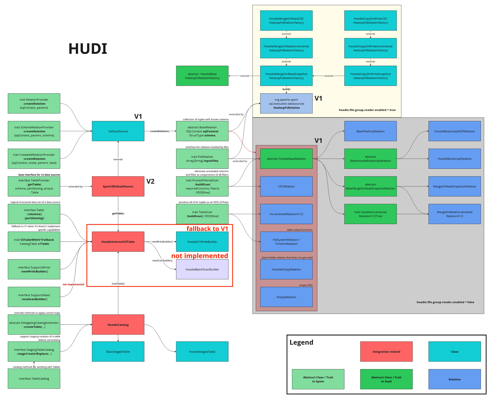

<!--
  Licensed to the Apache Software Foundation (ASF) under one or more
  contributor license agreements.  See the NOTICE file distributed with
  this work for additional information regarding copyright ownership.
  The ASF licenses this file to You under the Apache License, Version 2.0
  (the "License"); you may not use this file except in compliance with
  the License.  You may obtain a copy of the License at

       http://www.apache.org/licenses/LICENSE-2.0

  Unless required by applicable law or agreed to in writing, software
  distributed under the License is distributed on an "AS IS" BASIS,
  WITHOUT WARRANTIES OR CONDITIONS OF ANY KIND, either express or implied.
  See the License for the specific language governing permissions and
  limitations under the License.
-->

# RFC-98: Spark Datasource V2 Read

## Proposers

- @geserdugarov

## Approvers

- @

## Status

Umbrella ticket: [HUDI-4449](https://issues.apache.org/jira/browse/HUDI-4449)

## Abstract

Data source is one of the foundational APIs in Spark, with two major versions known as "V1" and "V2". 
The representation of a read in the physical plan differs depending on the API version used.
Adopting the V2 API is essential for enhanced control over the data source, deeper integration with the Spark optimizer, and improved overall performance.

First steps towards integrating of Spark Datasource V2 were taken in [RFC-38](../rfc-38/rfc-38.md). 
However, there are multiple issues with advertising Hudi table as V2 without actual implementing certain API, and with using custom relation rule to fall back to V1 API.
As a result, the current implementation of `HoodieCatalog` and `Spark3DefaultSource` returns a `V1Table` instead of `HoodieInternalV2Table`, 
in order to [address performance regression](https://github.com/apache/hudi/pull/5737).

There was [an attempt](https://github.com/apache/hudi/pull/6442) to implement Spark Datasource V2 read functionality as a regular task, 
but it failed due to the scope of work required.
Therefore, this RFC proposes to discuss design of Spark Datasource V2 integration in advance and to continue working on it accordingly.

## Background

The current implementation of Spark Datasource V2 integration is presented in the schema below:

## Implementation

<!--  -->

### Read

<!-- main part -->

### Table services

<!-- with read substages -->

## Rollout/Adoption Plan

<!-- 
    - rollback of some changes in HUDI-4178
    - check performance before and after, find what actually degrade when we use V1 workaround
    - implement absent V2 API functionality for read
    - benchmark again
-->

## Test Plan

<!-- It's important to agree on consistent benchmarks to evaluate changes step by step -->
