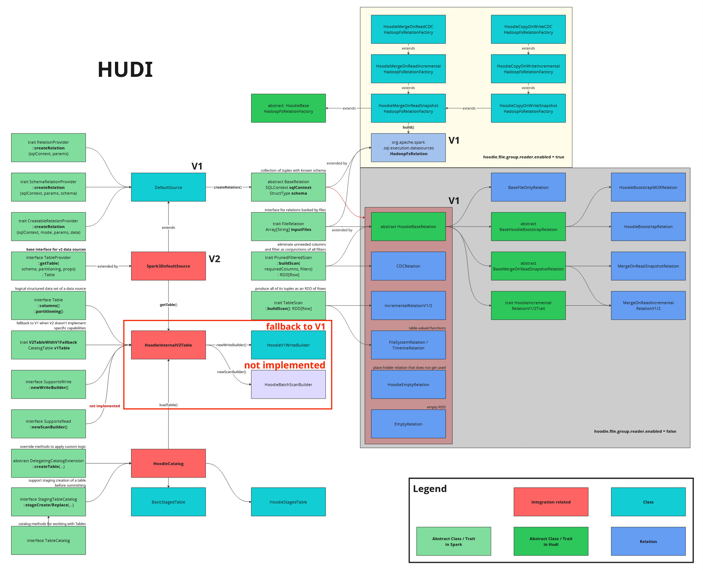
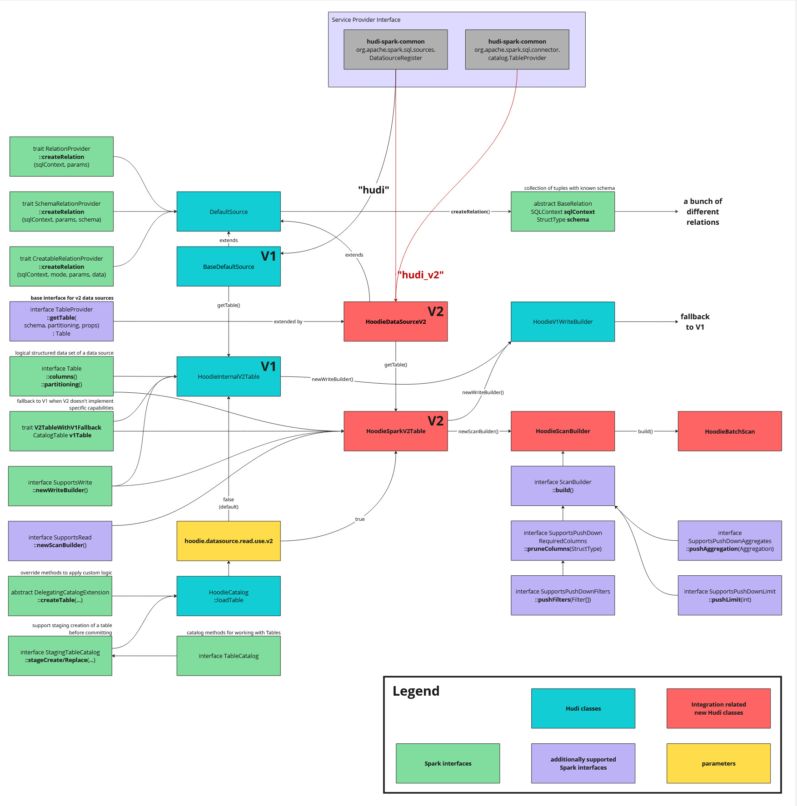

<!--
  Licensed to the Apache Software Foundation (ASF) under one or more
  contributor license agreements.  See the NOTICE file distributed with
  this work for additional information regarding copyright ownership.
  The ASF licenses this file to You under the Apache License, Version 2.0
  (the "License"); you may not use this file except in compliance with
  the License.  You may obtain a copy of the License at

       http://www.apache.org/licenses/LICENSE-2.0

  Unless required by applicable law or agreed to in writing, software
  distributed under the License is distributed on an "AS IS" BASIS,
  WITHOUT WARRANTIES OR CONDITIONS OF ANY KIND, either express or implied.
  See the License for the specific language governing permissions and
  limitations under the License.
-->

# RFC-98: Spark Datasource V2 Read

## Proposers

- @geserdugarov

## Approvers

- @yihua
- @vinothchandar
- @danny0405

## Status

GH Discussion: https://github.com/apache/hudi/discussions/13955

## Abstract

Data source is one of the foundational APIs in Spark, with two major versions known as "V1" and "V2".
Moving Hudi reads to the V2 API unlocks Spark-native pushdown interfaces that the V1 scan path cannot support:

- Aggregate pushdown (`SupportsPushDownAggregates`): queries like `SELECT COUNT(*)` or `MIN/MAX(col)` can be resolved from column statistics without scanning data files, dramatically reducing query time.
- Column pruning at scan level (`SupportsPushDownRequiredColumns`): the V2 scan prunes unneeded columns before data reaches Spark operators, reducing I/O for projection queries.
- Filter pushdown (`SupportsPushDownFilters`): predicate evaluation is pushed into the scan, enabling more efficient data skipping and partition pruning.
- Limit and TopN pushdown (`SupportsPushDownLimit`, `SupportsPushDownTopN`): Spark pushes row limits into the scan, avoiding full-table reads for `LIMIT` queries.

## Background

The current implementation of Spark Datasource V2 integration is presented in the schema below:



## Implementation

Hudi's write path is mature, and involves indexing, precombining, upsert/insert routing, file sizing, and table services (compaction/clustering/cleaning). 
Also `HoodieSparkSqlWriter::write` handles schema evolution, partition encoding, metadata updates, and multi-writer concurrency.
DSv2's `WriteBuilder` >> `BatchWrite` >> DataWriter API is too simplistic for this, and moving to this entirely would be a non-starter. Also, due to the flexibility of the V1 API in terms of allowing the writes to shuffle data after the `df.write.format....save` is invoked, Hudi supports a streaming DF write for its upsert operation. A good majority of Hudi jobs work this way today, and we cannot break all of these at once.

The proposed approach is hybrid: DSv2 for reads, with a DSv1 fallback for writes (`V2TableWithV1Fallback`) in the current state.
Later, if a DSv2 write path can be implemented without loss of performance or functionality, it may become possible to move to full DSv2 support.
However, this migration should still be incremental, please check the "Future Work" chapter for details.

Overall proposed architecture for the hybrid approach is shown in the following schema:



### DataFrame API

A new SPI short name, `"hudi_v2"`, activates the DSv2 read path when using the Spark DataFrame API.
The existing `"hudi"` path remains unchanged.
This is done to unblock incremental development of the DSv2 path and will be removed in the long term, please check the "Future Work" chapter for details.
It also allows switching later from the current DSv1 fallback to a DSv2 write path, if an implementation without performance degradation is found.
The DSv2 write path is currently under research.

<table>
<tr>
<th>Operation</th>
<th>Current implementation</th>
<th>Additional functionality proposed in this RFC</th>
</tr>
<tr>
<td>Write</td>
<td>
<pre>
df.write.format("hudi").mode(...).save(path)
        v
BaseDefaultSource (V1) -> DefaultSource
        v
CreatableRelationProvider.createRelation(...)
        v
HoodieSparkSqlWriter.write(...)
        v
SparkRDDWriteClient -> upsert/insert/bulk_insert
</pre>
</td>
<td>
<pre>
df.write.format("hudi_v2").mode(...).save(path)
        v
HoodieDataSourceV2 (TableProvider + DataSourceRegister + CreatableRelationProvider)
        v
Spark treats as V1 source for writes
        v
CreatableRelationProvider.createRelation(...)
        v
HoodieSparkSqlWriter.write(...)
        v
SparkRDDWriteClient -> upsert/insert/bulk_insert
</pre>
</td>
</tr>
<tr>
<td>Read</td>
<td>
<pre>
spark.read.format("hudi").load(path)
        v
V1 DataSource resolution (via ServiceLoader + DataSourceRegister)
        v
BaseDefaultSource found
(extends DefaultSource with DataSourceRegister)
(not a TableProvider)
        v
Spark treats as V1 DataSource
        v
DefaultSource.createRelation(...)
        v
MergeOnReadSnapshotRelation / BaseRelation
        v
LogicalRelation -> FileScan -> ...
</pre>
</td>
<td>
<pre>
spark.read.format("hudi_v2").load(path)
        v
DataSourceV2Utils.lookupProvider("hudi_v2")
        v
HoodieDataSourceV2 found
(extends TableProvider with DataSourceRegister)
(does not extend SupportsCatalogOptions)
        v
Spark uses TableProvider.getTable() directly
(no catalog routing since no SupportsCatalogOptions)
        v
HoodieDataSourceV2.getTable(...)
        v
HoodieSparkV2Table(...)
(no catalogTable, no tableIdentifier)
        v
HoodieScanBuilder -> HoodieBatchScan -> ...
</pre>
</td>
</tr>
</table>

### SQL Queries

Spark SQL API is managed by new configuration parameter `hoodie.datasource.read.use.v2`, together with the schema-on-read precedence and DSv2 supportability gate, which controls the returned table type.

<table>
<tr>
<th>Operation</th>
<th>Current implementation</th>
<th>Additional functionality proposed in this RFC</th>
</tr>
<tr>
<td>Write</td>
<td>
<pre>
INSERT INTO hudi_table VALUES (...);   -- table created with USING hudi
        v
Spark Analyzer resolves table via catalog
        v
HoodieCatalog.loadTable(Identifier("hudi_table"))
        v
isHoodieTable => true, v2ReadEnabled = false, schemaEvol = false
        v
RETURNS: V1Table(catalogTable) via v1TableWrapper
        v
Spark V1 write path -> InsertIntoHoodieTableCommand (analysis rule)
        v
HoodieSparkSqlWriter.write(...)
</pre>
</td>
<td>
<pre>
INSERT INTO hudi_table VALUES (...);   -- table created with USING hudi
        v
Spark Analyzer resolves table via catalog
        v
HoodieCatalog.loadTable(Identifier("hudi_table"))
        v
isHoodieTable => true, schemaEvolutionEnabled = false,
v2ReadEnabled = true, isSupportedByDSv2 = true
        v
RETURNS: HoodieSparkV2Table(...)
        v
HoodieSpark{33,34,35,40,41}DataSourceV2ToV1Fallback
converts InsertIntoStatement(DataSourceV2Relation) to a V1 LogicalRelation
        v
Spark V1 write path -> InsertIntoHoodieTableCommand (analysis rule)
        v
HoodieSparkSqlWriter.write(...)
</pre>
</td>
</tr>
<tr>
<td>Read</td>
<td>
<pre>
SELECT * FROM hudi_table;   -- table created with USING hudi
        v
Spark Analyzer resolves table name via catalog
        v
HoodieCatalog.loadTable(Identifier("hudi_table"))
        v
super.loadTable(ident)
        v
V1Table(catalogTable) where catalogTable.provider = "hudi"
        v
isHoodieTable(catalogTable) => true
        v
v2ReadEnabled = false, schemaEvolutionEnabled = false (defaults)
        v
RETURNS: HoodieInternalV2Table(...).v1TableWrapper = V1Table(catalogTable)
        v
Spark uses V1 fallback -> DefaultSource.createRelation()
        v
HoodieFileIndex -> FileScan -> ...
</pre>
</td>
<td>
<pre>
SELECT * FROM hudi_table;   -- table created with USING hudi
        v
Spark Analyzer resolves table name via catalog
        v
HoodieCatalog.loadTable(Identifier("hudi_table"))
        v
super.loadTable(ident)
        v
V1Table(catalogTable) where catalogTable.provider = "hudi"
        v
isHoodieTable(catalogTable) => true
        v
schemaEvolutionEnabled = conf("hoodie.schema.on.read.enable") = false
(if true => RETURNS: HoodieInternalV2Table, schema-evolution path wins)
        v
v2ReadEnabled = conf("hoodie.datasource.read.use.v2") = true
HoodieV2ReadSupport.isSupportedByDSv2(metaClient, options) = true
(COW snapshot or MOR read_optimized, single Parquet base format,
 not incremental/CDC/bootstrap)
(if false => RETURNS: V1Table wrapper, V1 read path)
        v
RETURNS: HoodieSparkV2Table(...)
        v
SupportsRead.newScanBuilder() -> HoodieScanBuilder
        v
HoodieBatchScan -> ...
</pre>
</td>
</tr>
</table>

### Read

All new classes go into package `org.apache.spark.sql.hudi.v2` inside `hudi-spark-common`.

| Class                           | Spark Interface                                                                                                                          | Responsibility                                                                                                                                                                                                                                                                     |
|---------------------------------|------------------------------------------------------------------------------------------------------------------------------------------|------------------------------------------------------------------------------------------------------------------------------------------------------------------------------------------------------------------------------------------------------------------------------------|
| `HoodieDataSourceV2`            | `TableProvider`, `DataSourceRegister`, `CreatableRelationProvider`                                                                       | SPI entry point for `format("hudi_v2")`. `CreatableRelationProvider` enables DataFrame API writes via `df.write.format("hudi_v2")`.                                                                                                                                                |
| `HoodieSparkV2Table`            | `Table`, `SupportsRead`, `SupportsWrite`, `V2TableWithV1Fallback`                                                                        | Routes reads to DSv2, writes to DSv1 fallback via `HoodieV1WriteBuilder`. Resolves schema, capabilities, and partitioning from `HoodieCatalogTable` (SQL/catalog path) or directly from `HoodieTableMetaClient` plus the constructor `options` map (DataFrame `format("hudi_v2")` path). Per-query options — including `as.of.instant` and the incremental options `query.type`/`begin.instanttime`/`end.instanttime` — arrive on the DataFrame path through the `properties` argument of `TableProvider.getTable`, are stored on the table instance, and are merged into the scan options inside `newScanBuilder`. The merged map is what the supportability gate, schema resolution, and `HoodieFileIndex` see; see "Read-options propagation on the DataFrame path" below for the full flow. |
| `HoodieV2ReadSupport`           | (Scala object)                                                                                                                           | Supportability gate (`isSupportedByDSv2`) and read-options resolver (`resolveReadOptions`) consumed by both `HoodieCatalog.loadTable` and `HoodieSparkV2Table.newScanBuilder`. Restricts DSv2 to COW snapshot or MOR read_optimized, single Parquet base format, no bootstrap/incremental/CDC. Time-travel snapshot reads (`as.of.instant`) are intentionally NOT excluded — they are honored by threading the option into `HoodieFileIndex.specifiedQueryInstant` and `TableSchemaResolver.getTableSchema(ts)`. Incremental/CDC queries (`query.type=incremental` or `incremental.format=cdc`, which is what gives `begin.instanttime`/`end.instanttime` their effect) are excluded by the `isIncremental`/`isCdc` checks: on `format("hudi_v2")` the user gets an explicit error, on the SQL/catalog path the read falls back to V1. |
| `HoodieScanBuilder`             | `ScanBuilder`, `SupportsPushDownFilters`, `SupportsPushDownRequiredColumns`, `HoodiePartialLimitPushDown`, `SupportsPushDownAggregates`  | Collects filter, column pruning, limit, and aggregate pushdowns. Plans `HoodieInputPartition`s via `HoodieFileIndex` in `build()`. Aggregates resolve to a `HoodieLocalScan` from column-stats metadata only when no filters were pushed (data, partition, or post-scan); any pushed filter forces `pushAggregation` to return `false` and the regular base-file scan runs. `pushLimit` returns `false` on Spark 3.3 — where the optimizer ignores `isPartiallyPushed` and would treat any successful pushdown as complete — and on Spark 3.4+ also when any filter is re-applied above the scan; `LIMIT` is therefore only pushed when capping rows per input partition is provably equivalent to a global cap. |
| `HoodiePartialLimitPushDown`    | extends `SupportsPushDownLimit`                                                                                                          | Custom Hudi Java interface providing `isPartiallyPushed() = true` as a default method. The interface is declared unconditionally on every supported Spark version. Two purposes: (1) on Spark 3.4+, `isPartiallyPushed=true` keeps a global `LocalLimit` above the scan, which is required because `HoodieBatchScan` only caps rows per `HoodieInputPartition` (otherwise `LIMIT N` could return up to `numPartitions × N` rows); (2) defining the method as a Java default avoids the Scala `override` incompatibility between Spark 3.3 (method absent) and 3.4+ (default method present), so the same Scala source compiles for both. Spark 3.3 ignores `isPartiallyPushed` entirely and would treat any successful pushdown as complete; correctness on 3.3 is preserved by `HoodieScanBuilder.pushLimit()` returning `false` for `gteqSpark3_4 == false`, so Spark 3.3 sees no pushdown, leaves the original `LocalLimit` in place, and applies the global cap itself. No coalescing or single-partition workaround is required. |
| `HoodieBatchScan`               | `Scan`, `Batch`, `SupportsReportStatistics`                                                                                              | Holds the pre-planned input partitions, broadcasts the Parquet reader/conf, exposes byte-size statistics for the optimizer, and creates `HoodiePartitionReaderFactory`.                                                                                                            |
| `HoodieLocalScan`               | `Scan`, `LocalScan`                                                                                                                      | Returns pre-computed rows without reading any files. Used for fully pushed-down aggregates (e.g. `COUNT(*)`/`MIN`/`MAX`) resolved from column-stats metadata. Hudi does not refine column-stats results against unevaluated predicates, so `HoodieScanBuilder` only returns this scan when `pushFilters` admitted no filters at all, guaranteeing that e.g. `SELECT COUNT(*) FROM t WHERE col > x` cannot be answered from the unfiltered count.                                                                                                                      |
| `HoodieStatistics`              | `Statistics`                                                                                                                             | Reports `sizeInBytes` (and optionally `numRows`) from `HoodieBatchScan` for Spark CBO.                                                                                                                                                                                             |
| `HoodieInputPartition`          | `InputPartition`                                                                                                                         | Serializable descriptor for a contiguous byte range of a single base file (large files are sub-divided per `spark.sql.files.maxPartitionBytes`). Carries partition-column values in Spark internal format.                                                                         |
| `HoodiePartitionReaderFactory`  | `PartitionReaderFactory`                                                                                                                 | Creates row-based partition readers on executors for COW snapshot reads.                                                                                                                                                                                                           |
| `HoodiePartitionReader`         | `PartitionReader[InternalRow]`                                                                                                           | Row-based reader for COW base files (and MOR read_optimized). Uses `SparkColumnarFileReader` with optional pushed filters, internal-schema-evolution support, time-travel-aware Avro/Parquet schema repair, and a per-partition limit cap.                                         |
| `HoodieV1WriteBuilder` (reused) | `SupportsTruncate`, `ProvidesHoodieConfig`                                                                                               | Existing V1 write fallback builder, defined as `private[hudi]` in `HoodieInternalV2Table.scala`. `HoodieSparkV2Table` directly instantiates it (sibling class, not a subclass of `HoodieInternalV2Table`). `HoodieInternalV2Table` is retained for the schema-evolution code path. |

### Read-options propagation on the DataFrame path

On `spark.read.format("hudi_v2").option(k, v).…load(path)` there is no `HoodieCatalogTable`
and `HoodieTableMetaClient` itself does not carry a per-query instant, so query-level
options must be threaded through explicitly. The chain is:

```
spark.read.format("hudi_v2").option("as.of.instant", ts).load(path)
        v
TableProvider.getTable(schema, partitioning, properties)
   properties = { path -> ..., as.of.instant -> ts, ... }
        v
HoodieSparkV2Table(spark, path, options = CaseInsensitiveStringMap(properties))
        v
HoodieSparkV2Table.tableSchema:
   TableSchemaResolver(metaClient).getTableSchema(ts)   (time-travel-aware schema)
        v
HoodieSparkV2Table.newScanBuilder(scanOptions):
   explicitOpts = { path } ++ constructorOpts ++ tableProps ++ scanOptions
   mergedOpts   = HoodieV2ReadSupport.resolveReadOptions(spark, explicitOpts)
        v
HoodieV2ReadSupport.isSupportedByDSv2(metaClient, mergedOpts)
   -> rejects query.type=incremental and incremental.format=cdc
        v
new HoodieScanBuilder(spark, metaClient, tableSchema, mergedOpts)
        v
HoodieFileIndex(spark, metaClient, Some(tableSchema), mergedOpts, ...):
   specifiedQueryInstant = mergedOpts.get(TIME_TRAVEL_AS_OF_INSTANT.key)
                                     .map(formatQueryInstant)
   startCompletionTime   = mergedOpts.get(START_COMMIT.key)   (only for incremental)
   endCompletionTime     = mergedOpts.get(END_COMMIT.key)     (only for incremental)
```

Concretely:

- **`as.of.instant` (time-travel snapshot)** flows verbatim from the user's
  `.option("as.of.instant", ts)` call into the `properties` map of
  `TableProvider.getTable`, into `HoodieSparkV2Table.options`, into the merged scan
  options, and finally into `HoodieFileIndex.specifiedQueryInstant`. The same option is
  read in `HoodieSparkV2Table.tableSchema`, in `HoodieScanBuilder.fetchTableAvroSchema` /
  `fetchInternalSchema`, and in `HoodiePartitionReader`'s schema-repair path, so the
  schema, the file slices, the column-stats aggregate fast path, and the columnar reader
  all observe the same instant. A time-travel read therefore cannot silently fall back to
  the latest snapshot.

- **`begin.instanttime` / `end.instanttime`** only have effect when paired with
  `query.type=incremental` (or `incremental.format=cdc`). Both are rejected by the
  supportability gate (`isIncremental`, `isCdc`), so on `format("hudi_v2")` the user gets a
  `HoodieException` explaining the unsupported configuration, and on the SQL/catalog path
  `HoodieCatalog.loadTable` returns the `V1Table` wrapper and the read uses the V1
  incremental relation. Setting `begin.instanttime` without `query.type=incremental` is
  treated identically by DSv1 and DSv2: the option is parsed but does not change the
  query semantics, since the query type stays `snapshot`.

The same merge happens on the SQL/catalog path: `HoodieCatalog.loadTable` constructs the
`HoodieSparkV2Table` with a `preResolvedCatalogTable` and an empty options map, the SQL
analyzer attaches the user-supplied options (including `as.of.instant` from the
`TIMESTAMP AS OF` clause) when building the relation, and `newScanBuilder` merges them
into `mergedOpts` exactly as above. The supportability gate and `HoodieFileIndex` see the
same option set on both paths.

### Table services

Table services (compaction, clustering, cleaning) are not affected by this change.
They operate via the write client and are triggered independently of the read path.

### Implementation phases

The phases below describe the logical design ordering. 
In practice, `HoodieScanBuilder` declares all pushdown interfaces from the outset with working implementations, and the PRs may ship multiple phases together.

1. **Coexistence POC.** All new classes return empty read results, SPI registration, reuse of `HoodieV1WriteBuilder` for V1 write fallback, `hoodie.datasource.read.use.v2` config, 
`HoodieV1OrV2Table` extractor update in `HoodieSparkBaseAnalysis` to recognize `HoodieSparkV2Table` for DDL operations.
2. **Base-file snapshot/read-optimized reads.** Wire `HoodieBatchScan.planInputPartitions()` to `HoodieFileIndex`, implement base-file reading in `HoodiePartitionReader`, and support column pruning.
3. **Filter pushdown.** Implement `HoodieScanBuilder.pushFilters()` for partition pruning and data skipping via `HoodieFileIndex`.
4. **Vectorized base-file reads.** Enable columnar batch output for base-file-only reads to match V1 performance.
5. **Log-merge snapshot reads.** Extend `HoodiePartitionReader` with base + log merge logic for MOR snapshot queries, reusing `HoodieFileGroupReader`.
6. **Incremental and CDC queries.** Route based on query type option in `HoodieScanBuilder` and support both COW and MOR timelines.
7. **Bootstrap and format coverage.** Support bootstrap tables and expand beyond the initial single-Parquet-base-file path to the file formats and mixed-format cases supported by the V1 reader.
8. **Advanced pushdowns.** `SupportsPushDownAggregates`, `SupportsPushDownLimit`, `SupportsPushDownTopN`.

#### Current state

Phases 1-3, plus `SupportsPushDownAggregates` (resolved from column-stats metadata via `HoodieLocalScan`) and `HoodiePartialLimitPushDown` (per-partition limit, Spark 3.4+) from phase 8, are implemented and under review in [PR #18277](https://github.com/apache/hudi/pull/18277). This PR is the first delivery slice of the broader RFC: the implemented reader is base-file-only and Parquet-only, so it supports COW snapshot reads and explicitly requested MOR read_optimized queries that skip log-file merging. Other table/query cases still trigger a fall-back to the V1 read path (SQL/catalog) or an explicit error (DataFrame `format("hudi_v2")`) until their phases are implemented. Phases 4-7 and the `SupportsPushDownTopN` part of phase 8 are future work.

## Rollout/Adoption Plan

- The existing `format("hudi")` path is completely untouched, so regression risk is minimized.
- For DataFrame API, users opt in by using `format("hudi_v2")`. No config needed.
- For SQL queries, users set `hoodie.datasource.read.use.v2=true` to route supported reads through DSv2.
- If `hoodie.schema.on.read.enable=true` is set on the SQL/catalog path, schema evolution takes precedence and the query uses the existing V1 schema-evolution-aware FileScan, even when `hoodie.datasource.read.use.v2=true`.
- During the incremental rollout, unsupported table/query combinations remain on the V1 read path for SQL/catalog reads or fail explicitly for `format("hudi_v2")`; after all phases are complete, the supportability gate should admit all Hudi table types and read modes.
- Rollback: switch back to `format("hudi")` or set the config to `false`.

### Config interaction: `hoodie.datasource.read.use.v2` vs `hoodie.schema.on.read.enable`

In `HoodieCatalog.loadTable()`, `schemaEvolutionEnabled` is evaluated first and takes strict precedence over `v2ReadEnabled`:

| `hoodie.schema.on.read.enable` | `hoodie.datasource.read.use.v2` | DSv2 supportability gate           | Table returned                                           |
|--------------------------------|---------------------------------|------------------------------------|----------------------------------------------------------|
| `true`                         | any                             | not consulted                      | `HoodieInternalV2Table` (existing schema-evolution path) |
| `false`                        | `true`                          | passes (`isSupportedByDSv2=true`)  | `HoodieSparkV2Table` (DSv2 read)                         |
| `false`                        | `true`                          | fails                              | `V1Table` wrapper (V1 fallback)                          |
| `false`                        | `false`                         | not consulted                      | `V1Table` wrapper (existing default)                     |

When both `hoodie.schema.on.read.enable` and `hoodie.datasource.read.use.v2` are `true` on the SQL/catalog path, schema evolution wins (`HoodieInternalV2Table`). `HoodieInternalV2Table` preserves the existing schema-evolution DDL rewrite path and falls back through `V2TableWithV1Fallback` to the V1 schema-evolution-aware FileScan.

The DataFrame API path (`format("hudi_v2")`) bypasses `HoodieCatalog.loadTable()` and the SQL-side precedence rule. The DSv2 reader still honors `hoodie.schema.on.read.enable` directly: `HoodieScanBuilder.fetchInternalSchema` checks the flag (read from either the option map or the Spark session conf, mirroring `HoodieBaseRelation.isSchemaEvolutionEnabledOnRead`), pulls the internal schema from commit metadata, and embeds it in the hadoop conf so the columnar Parquet reader does type repair against the evolved column IDs. The user contract therefore matches DSv1: schema-on-read is opt-in via the flag. Reading a schema-evolved table through `format("hudi_v2")` without the flag set may surface stale or missing columns in exactly the same way as the V1 path without the flag — `HoodieV2ReadSupport.isSupportedByDSv2` does not gate on the table's internal-schema state, intentionally, so the two readers behave consistently.

## Test Plan

- Verify that `EXPLAIN` plans show `BatchScanExec` (DSv2) instead of `FileSourceScanExec` (DSv1) when DSv2 is enabled, the supportability gate passes, and SQL schema-on-read precedence is not active.
- Existing unit and functional tests must pass unchanged (no regressions in DSv1 path).
- New tests for DSv2 read path: base-file snapshot/read-optimized reads, MOR snapshot/log-merge reads, incremental and CDC queries for COW and MOR tables, bootstrap tables, non-Parquet/mixed-format coverage where supported by the V1 reader, filter pushdown, column pruning, aggregate/limit/TopN pushdowns, and SQL schema-evolution precedence.
- TPC-H benchmark to compare DSv1 vs DSv2 read performance at each implementation phase.
  Success criteria:
    - DSv2 full data reads should show no regression versus DSv1 for each supported table/query type.
    - DSv2 reads with projections and filter pushdowns should show 10% faster wall-clock time.
    - DSv2 reads with limit and aggregate pushdowns should show 20% faster wall-clock time.
    - MOR snapshot/log-merge, incremental, CDC, bootstrap, and mixed-format benchmarks are added as those phases land.

## Future Work

1. DSv2 read support using `hudi_v2` for the DataFrame API, and `hoodie.datasource.read.use.v2` for the SQL API (`false` by default).
   This means that all stages from "Implementation phases" chapter are completed.
2. (Optional) DSv2 write support using `hudi_v2` for the DataFrame API, and `hoodie.datasource.write.use.v2` for the SQL API (`false` by default).
3. `hoodie.datasource.read/write.use.v2` is `true` by default.
4. Switch format short names: `hudi_v2` -> `hudi`, `hudi` -> `hudi_v1`.
5. Deprecate use of `hudi_v1`, `hoodie.datasource.read/write.use.v2`.
6. Remove `hudi_v1`, `hoodie.datasource.read/write.use.v2` from the codebase.

### SPI short name mapping at each step

| Step from Future Work | `BaseDefaultSource` | `HoodieDataSourceV2` | `DefaultSource`        |
|-----------------------|---------------------|----------------------|------------------------|
| 1 (this RFC)          | `"hudi"`            | `"hudi_v2"`          | `"hudi_v1"` (internal) |
| 4 (name swap)         | `"hudi_v1"`         | `"hudi"`             | removed or aligned     |
| 6 (removal)           | removed             | `"hudi"`             | removed                |

Note: `DefaultSource.shortName() = "hudi_v1"` is an internal SPI name that is never user-facing because `BaseDefaultSource` overrides it to `"hudi"`. 
This existing naming aligns naturally with the planned swap at step 4.
