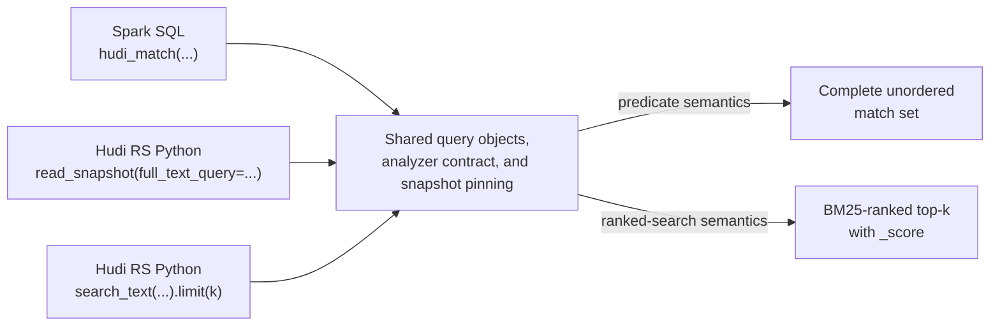
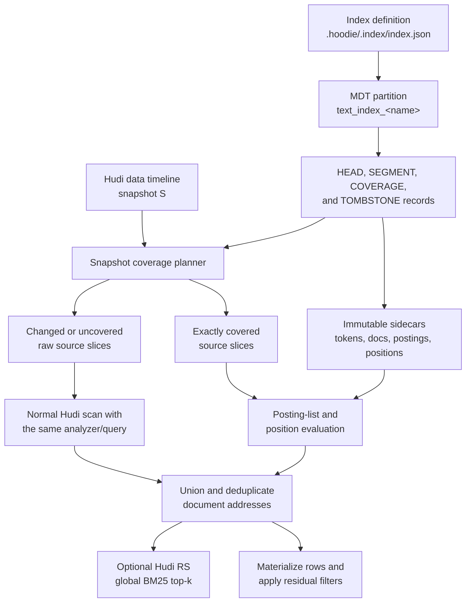
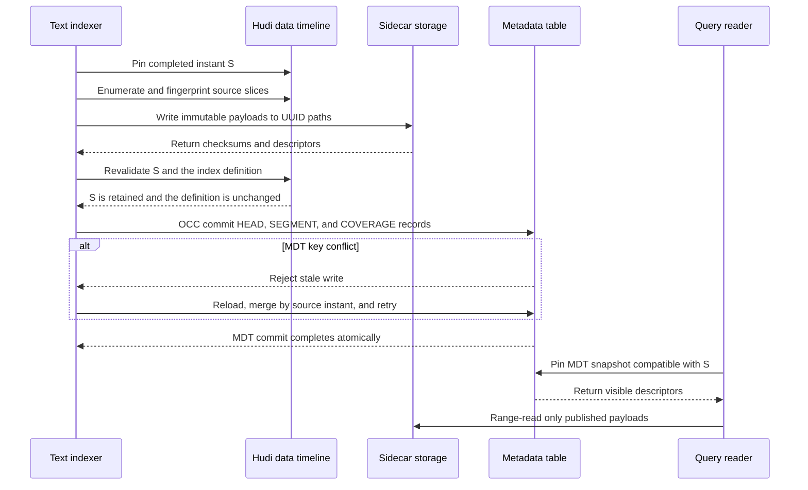
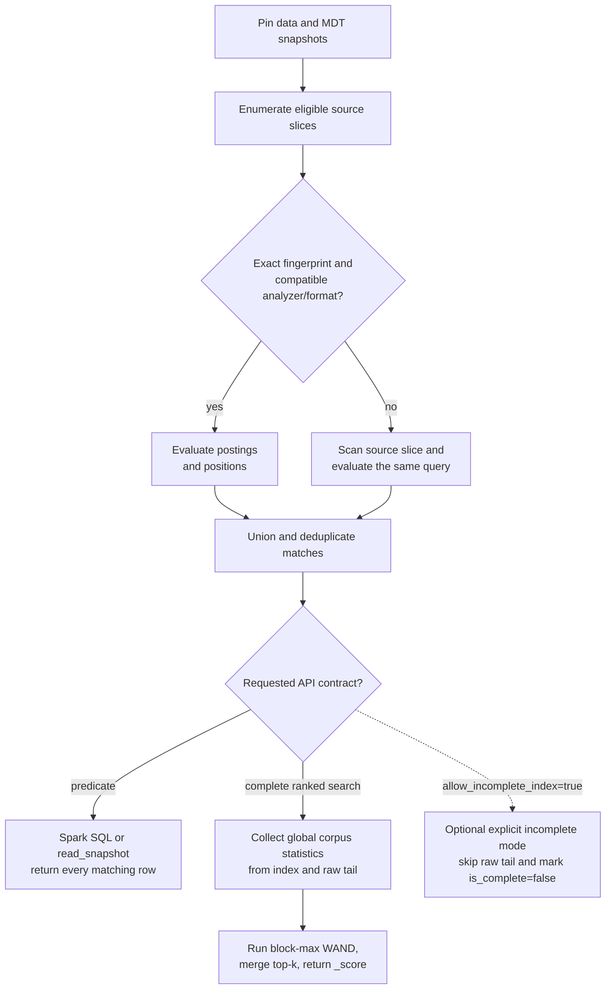

<!--
  Licensed to the Apache Software Foundation (ASF) under one or more
  contributor license agreements.  See the NOTICE file distributed with
  this work for additional information regarding copyright ownership.
  The ASF licenses this file to You under the Apache License, Version 2.0
  (the "License"); you may not use this file except in compliance with
  the License.  You may obtain a copy of the License at

       http://www.apache.org/licenses/LICENSE-2.0

  Unless required by applicable law or agreed to in writing, software
  distributed under the License is distributed on an "AS IS" BASIS,
  WITHOUT WARRANTIES OR CONDITIONS OF ANY KIND, either express or implied.
  See the License for the specific language governing permissions and
  limitations under the License.
-->

# RFC: Hudi Full-Text Search Index

## Proposers

- @danny0405

## Approvers

- TBD

## Status

Issue: TBD

> This proposal intentionally does not claim an RFC number. The number and
> catalog entry will be reserved through the separate RFC-number process.

## Abstract

This RFC proposes a full-text index for Apache Hudi. It supports token, phrase,
and multi-column search over string columns, exposes standard predicates through
Spark SQL, and offers a Lance-style direct table API through Hudi RS Python.
Indexes are built and maintained through the Hudi metadata table (MDT)
indexing lifecycle.

The search engine follows Lance's useful architectural choices without making
Lance a storage dependency: immutable segments, a compact term dictionary,
compressed posting lists, document-length statistics, BM25 ranking, positions,
and block-max WAND. Hudi owns the analyzer contract and on-disk format. Spark
integration remains in the main Hudi repository; Rust and Python implementation
work belongs in Hudi RS and consumes the same versioned format.

The MDT remains authoritative for index definitions, visibility, coverage,
rollbacks, and cleaning. Large immutable posting payloads are sidecar files in
an auxiliary directory owned by the MDT rather than values embedded in HFiles.
An MDT commit atomically publishes descriptors for already durable payloads.

Queries are snapshot-safe. SQL predicates always combine index results with a
raw scan of source file slices not covered by a compatible segment, so using an
index never changes SQL results. The direct search API also defaults to complete
results and may offer an explicitly incomplete low-latency mode.

## Background

Hudi indexes currently answer questions such as which files might contain a
record key or a value range. Full-text search has a different contract: analyze
free text into terms, locate matching documents, optionally verify positions,
and, for direct search APIs, rank the best documents. Sending this workload to
Elasticsearch or OpenSearch is effective, but creates a second ingestion
pipeline and a second source of snapshot and retention truth.

This proposal builds on:

- [RFC-45](../rfc-45/rfc-45.md), which introduced asynchronous MDT indexing;
- [RFC-77](../rfc-77/rfc-77.md), which established dynamically named secondary
  index partitions and index definitions;
- the standard Spark SQL predicate model, which keeps index acceleration
  transparent to relational queries; and
- RFC-109, the native vector-index proposal listed in the RFC catalog. Text and
  vector search may share Hudi RS storage adapters and top-k utilities, but
  their persistent formats remain independent.

### Design principles

1. The Hudi timeline is the source of snapshot truth.
2. Index creation, visibility, rollback, and cleaning use MDT components.
3. Immutable payloads support object-store range reads and safe caching.
4. Index use never changes the result of a Spark SQL predicate.
5. Ranking is independent of how the index is physically partitioned.
6. JVM and Hudi RS clients share query semantics and format versions.

### Goals

- Match token, boolean, prefix, fuzzy, phrase, and multi-column queries.
- Support copy-on-write (COW) and merge-on-read (MOR) tables.
- Build asynchronously and incrementally using the MDT indexer lifecycle.
- Guarantee snapshot-correct results for SQL and the default direct API mode.
- Provide an object-store-friendly text-index format with bounded memory usage.
- Provide a direct Hudi RS Python API alongside Spark SQL.

### Non-goals

- Elasticsearch API, aggregation, highlighting, or percolator compatibility.
- Highlighting and custom relevance models in the first format version.
- Updating posting lists in place.
- Replacing SQL predicate indexes or the record index.
- Adding Rust code or native build integration to the main Hudi repository.

### Alternatives considered

**External Elasticsearch/OpenSearch.** This remains a valid integration, but it
requires change-data-capture coordination, separate retention, and explicit
mapping between external documents and a Hudi snapshot.

**Embedding Tantivy.** Tantivy is mature and Rust-native. Its archive and
directory abstractions, however, become a second persistent compatibility
contract. A smaller Hudi-owned format gives the project control over source
file-slice identity, range-read layout, and MDT publication semantics.

**Posting lists as MDT record values.** This would make MDT storage atomic, but
multi-gigabyte postings, merges, and random term reads fight the metadata
table's record-oriented HFile/MOR strengths. Small authoritative descriptors in
the MDT plus immutable sidecars preserve the lifecycle benefits without that
cost.

## Implementation

### Terminology

| Term | Meaning |
| --- | --- |
| Logical index | A named SQL index and its immutable analyzer configuration. |
| MDT index partition | Dynamic `text_index_<name>` metadata partition containing authoritative control records. |
| Segment | An immutable set of documents and term postings built together. |
| Payload partition | A shard within a segment whose local document identifiers are `u32`. |
| Source slice | A Hudi base file and its ordered log files at a snapshot. |
| Coverage | Proof that a segment represents a particular source-slice fingerprint. |
| Raw tail | Eligible source slices not covered by compatible visible segments. |
| Document | One Hudi record, identified by record key and source information. |

### SQL interface

Creation follows Hudi's secondary-index syntax:

```sql
CREATE INDEX article_body_fts
ON articles
USING text_index (body)
OPTIONS (
  'base_tokenizer' = 'simple',
  'lower_case' = 'true',
  'language' = 'und',
  'with_position' = 'true',
  'posting_block_size' = '128'
);
```

The existing `HoodieIndexDefinition` is populated as follows:

```json
{
  "indexName": "article_body_fts",
  "indexType": "text_index",
  "sourceFields": ["body"],
  "indexFunction": "tokenize",
  "indexOptions": {
    "base_tokenizer": "simple",
    "lower_case": "true",
    "language": "und",
    "with_position": "true",
    "posting_block_size": "128"
  }
}
```

#### Spark SQL predicates

The primary Spark interface follows the conventional index experience: a
boolean predicate in `WHERE`. Whether the optimizer uses the text index is not
observable in query results.

```sql
SELECT _hoodie_record_key, title
FROM articles
WHERE hudi_match(body, 'lakehouse indexing', 'operator=AND');
```

Phrase and multi-column queries use companion predicates:

```sql
SELECT _hoodie_record_key, title
FROM articles
WHERE hudi_match_phrase(body, 'metadata table', 1)
  AND category = 'engineering';

SELECT _hoodie_record_key, title
FROM articles
WHERE hudi_multi_match('lakehouse indexing', title, body);
```

The v1 signatures are:

```text
hudi_match(column, query [, 'key=value,...']) -> boolean
hudi_match_phrase(column, query [, slop]) -> boolean
hudi_multi_match(query [, 'operator=AND|OR'], column, ...) -> boolean
```

`hudi_match` options include `operator`, `fuzziness`, `prefix_length`, and
`max_expansions`. Unknown options are rejected. The functions compose with
normal SQL predicates. Conjunctive text predicates can be pushed into index
planning; expressions whose `OR` semantics cannot be preserved are evaluated
by Spark without index pushdown.

SQL predicate evaluation is always complete. Compatible segments accelerate
covered source slices, while uncovered or incompatible slices are evaluated by
the normal Hudi scan. There is no `_score` column and `LIMIT` does not imply
relevance order. Ranked top-k is a separate direct-search contract.

#### Hudi RS Python table API

Python users should not need to construct Spark SQL strings. Hudi RS extends
its existing `HudiTableBuilder` and `read_snapshot` API with the same structured
query model used by the index. The proposed predicate-style API is:

```python
import pyarrow as pa

from hudi import HudiTableBuilder
from hudi.search import FullTextOperator, MatchQuery, PhraseQuery

table = (
    HudiTableBuilder
    .from_base_uri("s3://warehouse/articles")
    .build()
)

query = MatchQuery(
    "lakehouse indexing",
    column="body",
    operator=FullTextOperator.AND,
)

batches = table.read_snapshot(
    columns=["_hoodie_record_key", "title", "body"],
    filters=[("category", "=", "engineering")],
    full_text_query=query,
)
articles = pa.Table.from_batches(batches)
```

Structured queries compose without inventing a second query language:

```python
query = (
    MatchQuery("metadata table", column="body")
    & PhraseQuery("incremental indexing", column="body", slop=1)
)

batches = table.read_snapshot(full_text_query=query)
```

For search applications, a Lance-style fluent API exposes ranked top-k and an
explicit score:

```python
results = (
    table.search_text(
        MatchQuery("lakehouse indexing", column="body"),
    )
    .where([("category", "=", "engineering")])
    .select(["_hoodie_record_key", "title", "body"])
    .limit(20)
    .to_arrow()
)

# Ranked by BM25 descending; `_score` is included in `results`.
```

`read_snapshot(full_text_query=...)` has predicate semantics and returns every
match. `search_text(...).limit(k)` has ranked-search semantics and returns
`_score`. Both pin one Hudi snapshot, use identical analyzer/query objects, and
raw-scan uncovered source slices by default. The fluent API may expose
`allow_incomplete_index=True`, but it must mark the result metadata as
incomplete rather than silently changing defaults.

Index creation remains an MDT table-service operation in the initial release,
invoked through Spark SQL or the Java API. A future Hudi RS writer API may add
`create_text_index` only after it can publish the corresponding MDT timeline
changes safely.

The three query entry points share one query model and coverage planner, but
their result contracts differ:



### Architecture



The SQL definition is stored in `.hoodie/.index/index.json`. A dynamic MDT
partition stores small control records. Immutable native payload files live
under an MDT-owned auxiliary namespace. Readers never infer visibility by
listing that namespace; they use descriptors visible in the pinned MDT
snapshot.

### Metadata table integration

Add `TEXT_INDEX` to `MetadataPartitionType` with the dynamic prefix
`text_index_`. `getPartitionPath(metaClient, indexName)` and index-definition
lookup follow the secondary and expression index conventions. Add a
`TextSearchIndexer` to `IndexerFactory`, implementing `BaseIndexer` lifecycle
operations.

Add a tagged Avro metadata payload named `HoodieTextIndexInfo` to
`HoodieMetadata.avsc`. The record is deliberately descriptor-sized and has
four logical kinds:

| Kind | Record key | Purpose |
| --- | --- | --- |
| `HEAD` | `head` | Format, analyzer fingerprint, publication instant, aggregate stats. |
| `SEGMENT` | `segment/<uuid>` | Payload paths, sizes, checksums, statistics, source-mask cardinality. |
| `COVERAGE` | `coverage/<encoded-partition>/<file-id>` | Source fingerprint and ordered candidate segments. |
| `TOMBSTONE` | `tombstone/<uuid>` | Segment retirement instant and deletion eligibility. |

The record includes a schema version, index name, analyzer fingerprint, segment
UUID, payload format version, source fingerprints, source-ordinal mapping,
aggregate document and token counts, file descriptors, and optional tombstone
instant. Large term statistics, dictionaries, and postings are never placed in
the Avro record. Active-source masks are computed for the pinned snapshot rather
than persisted as a single current value.

The coverage planner does not scan the complete `text_index_<name>` partition
for every query. It first applies normal partition pruning and enumerates the
eligible data file slices, then issues batched point lookups for their
`coverage/<encoded-partition>/<file-id>` keys. It loads only the `SEGMENT`
descriptors referenced by those records and may cache immutable descriptors for
the lifetime of the pinned MDT snapshot. Coverage storage is `O(F_table)` in the
number of table file groups, while lookup and comparison work is `O(F_query)` in
the number of file groups selected by the query. An unpartitioned full-table
query still has `F_query = F_table`, consistent with its data-scan planning
scope. The dynamic MDT partition uses normal MDT file-group sharding,
compaction, and key lookup rather than a driver-side enumeration of all control
records.

Payloads use this default path:

```text
<table>/.hoodie/metadata/.aux/text-index/
  <escaped-index-name>/<segment-uuid>/...
```

The directory is below MDT ownership but outside normal MOR partition discovery.
A future external payload tier may be configured, but every path must be scoped
by table UUID and validated by readers. Only an MDT commit makes a segment
visible. Failed writers may leave unpublished files; the cleaner removes them
after a safety interval.

### Source identity and snapshot coverage

Each document stores this logical address:

```text
HudiDocumentAddress {
  source_ordinal: u32,
  partition_path: bytes,
  file_id: bytes,
  record_key: bytes,
  row_position_hint: optional u64
}
```

Version 1 requires a stable Hudi record key. `file_id` lets materialization group
lookups, while `row_position_hint` is only an optimization and is used when the
source fingerprint matches exactly.

A source fingerprint includes:

- table UUID, partition path, and file ID;
- base instant and base-file identity (path, length, and checksum when known);
- ordered log-file identities (path, length, and latest block instant);
- writer schema identifier; and
- record-merger implementation and relevant options.

At snapshot `S`, the coverage planner enumerates eligible file slices and
compares exact fingerprints. Exact matches activate the segment's source mask.
A changed base file or added MOR log makes that source uncovered until it is
rebuilt. A segment created from a later state is not used for an older snapshot.
This avoids attempting to delete or mutate old postings after compaction,
clustering, rollback, or MOR updates.

Freshness is measured in changed source slices, not merely elapsed commits. Let
`F` be the eligible source slices and `R` the slices whose fingerprint is not
covered at the query snapshot. The coverage ratio is `C = 1 - R/F`. Once a MOR
file group receives its first new log block it contributes one raw slice until
catch-up; additional blocks increase scan bytes but not the raw-slice count. A
complete predicate query therefore has the qualitative cost
`index_scan(C * F) + raw_scan(R)`. Complete ranked search additionally analyzes
the raw tail to obtain exact global document frequencies. As `C` approaches
zero, performance intentionally approaches a normal Hudi scan while correctness
is unchanged.

There is no universal freshness SLA because `R`, log size, analyzer cost, and
query selectivity depend on the workload. Deployments schedule incremental
catch-up by time or changed-slice thresholds and observe source instant lag,
coverage ratio, raw bytes, and raw-tail analysis time. The performance plan must
publish the latency envelope across those dimensions before the feature is
enabled by default.

### Text-index payload format

All files begin with an eight-byte `HUDIFTS1` magic value followed by little-
endian format version, feature flags, variable-header length, and header
checksum. Independently checksummed blocks follow the header, and a footer
contains the block directory for range reads. Readers reject unknown required
feature bits and enforce configured allocation limits before reading lengths.

Each segment contains:

- `metadata.hfts`: analyzer fingerprint, source table, source descriptors,
  segment statistics, payload partition descriptors, and checksums;
- `part_<n>.tokens.hfts`: a minimal finite-state transducer (FST) mapping
  analyzed term bytes to term ordinals and posting metadata;
- `part_<n>.docs.hfts`: columnar source ordinal, record-key offsets and bytes,
  document token count, and optional row-position hint;
- `part_<n>.postings.hfts`: document frequency, posting-block offsets,
  delta-encoded local document IDs, term frequencies, and block-max metadata;
  and
- `part_<n>.positions.hfts`: optional delta-encoded token positions and offsets.

Payload partitions use local `u32` document IDs. A builder starts a new payload
partition before that space is exhausted. Posting blocks default to 128
documents and use bit packing or variable-byte encoding, selected per block.
Each block records maximum term frequency and minimum document length; these
values provide a conservative BM25 upper bound for block-max WAND. Positions
are stored only when enabled by the immutable index definition.

A phrase clause requires compatible position data. For an index created with
`with_position=false`, the complete Spark SQL and Hudi RS paths treat its source
slices as uncovered for that query and evaluate the phrase through
`RawTextSearchSplit`. They never silently downgrade a phrase to an `AND` of its
terms. In version 1, `allow_incomplete_index=True` rejects a phrase query against
a positionless index rather than returning an approximate result.

No implementation-specific collection serialization is persisted directly.
Every field is defined by the Hudi format specification, so upgrading a Java or
Rust dependency cannot silently change files.

### Implementation ownership

The main Hudi repository owns the SQL extension, MDT index lifecycle, Spark
planning, and the language-neutral persistent format. It does not add an
in-tree Rust crate or JNI build for this feature.

Any Rust reader, builder, tokenizer, or Python binding is developed and released
from Hudi RS. Hudi RS already owns Hudi's Rust implementation and Python
bindings, so this keeps native code, packaging, and Python API compatibility in
the appropriate project. The two repositories coordinate through versioned
contracts rather than source-code coupling:

```text
Main Hudi repository                 Hudi RS repository
--------------------                 ------------------
Spark SQL predicates                 Python query objects
MDT indexer lifecycle                read_snapshot(full_text_query=...)
HoodieIndexDefinition                search_text(...) fluent API
HoodieTextIndexInfo Avro schema      payload builder/reader implementation
normative payload specification      Rust tests and Python bindings
```

The shared contracts are the analyzer fingerprint, query AST semantics,
payload format version, segment descriptor schema, document-address encoding,
and completeness rules. Hudi RS must reject unsupported required feature bits;
the Spark implementation must do the same. Neither implementation may infer
compatibility from a library version alone.

These are cross-engine conformance contracts: a conforming engine must search a
segment built by another conforming engine without rebuilding it, produce the
same match set for the same snapshot and query AST, and implement the same BM25
formula and operation order. Format-versioned golden fixtures define the
accepted floating-point tolerance and binary record-key tie break. Bit-identical
floating-point scores are not required. Java and Rust need not share one runtime
query library; a versioned, language-neutral query AST plus shared analyzer,
format, match-set, and scoring fixtures prevent semantic drift.

The JVM side uses `HoodieStorage` for range reads, credentials, retries, and
metrics. A future optimization may consume Hudi RS artifacts through a separately
reviewed integration, but this RFC does not establish a JNI ABI or native
artifact packaging inside the main repository.

### Build and publication lifecycle

A bootstrap build performs these steps:

1. Pin a completed data-table instant and corresponding MDT snapshot.
2. Enumerate source file slices and construct their fingerprints.
3. Use Hudi's merged reader to emit stable record key, text, source ordinal,
   and optional row-position hint.
4. Analyze documents and build bounded-memory sorted runs using the selected
   implementation.
5. Merge runs into dictionaries, document tables, postings, and positions.
6. Write payload blocks to UUID-scoped temporary paths.
7. Finalize checksums, statistics, and source descriptors.
8. Move or copy payloads to their final immutable UUID paths when required by
   the storage implementation.
9. Return `SEGMENT`, `COVERAGE`, and `HEAD` metadata records to the MDT writer.
10. Publish all descriptors and partition state in one MDT commit.

Visibility begins at step 10. An indexer retry may reuse a payload only after
validating every checksum and build identity; otherwise it writes a new UUID.

Incremental catch-up is source-slice replacement, not posting mutation. The
indexer compares current fingerprints with coverage records and builds segments
for new or changed slices. Unchanged slices retain their existing segment and
source-mask membership.

Each build and descriptor records its pinned source instant `S`. A data commit
that completes after enumeration does not make publication for `S` incorrect:
a reader at a later snapshot compares the later source fingerprint and sends
changed slices to the raw tail. Immediately before MDT publication, the indexer
must verify that `S` is still a completed, retained instant and that the index
definition and analyzer fingerprint have not changed. It aborts publication if
`S` was rolled back or is no longer a valid build base.

The MDT commit uses Hudi's existing indexing transaction, OCC, and lock-provider
configuration. Since concurrent indexers can update the same `HEAD` and
`COVERAGE` keys, a conflict must retry against the latest MDT snapshot and merge
candidate segments in source-instant order. `HEAD` advancement is monotonic: an
older build may remain a time-travel candidate but cannot replace a newer head
or discard newer coverage. This rule covers concurrent data writers and
concurrent text-index table services without introducing a separate lock
protocol.

The publication order prevents a partially written segment from becoming
visible:



If payload writing fails, no MDT descriptor is committed and readers cannot
discover the orphan. If the MDT commit fails, retry validation may reuse the
payload; otherwise the orphan cleaner removes it after the grace interval.

### Consolidation, rollback, and cleaning

Small segments are consolidated when configurable count, byte, or deleted-
source ratios are exceeded. Consolidation copies only active source documents,
requires the same analyzer fingerprint, writes new payloads, publishes the new
descriptors, and tombstones old segments in the same MDT commit. Readers pinned
before that commit retain the old view.

Rollback and restore reconcile visible descriptors to the restored MDT/data
timeline state. If exact source coverage no longer exists, those slices become
raw tail; a query is never allowed to use merely similar postings. The cleaner
deletes tombstoned payloads only after both data and MDT retention guarantees
that no supported query can see the descriptor. Orphan payloads without a
published descriptor are deleted after a separate grace period. `DROP INDEX`
first removes visibility and emits tombstones, then cleans asynchronously.

### Query execution

At query time, exact source-slice coverage determines whether each slice uses
the index or the correctness-preserving raw path:



Spark SQL predicate evaluation executes in four phases:

1. Pin data and MDT snapshots. Resolve each eligible source slice to one exact
   compatible segment source mask or a `RawTextSearchSplit`.
2. Evaluate compatible posting lists and positions to produce matching document
   addresses for covered slices.
3. Evaluate the same query object and analyzer while scanning raw splits.
4. Union and deduplicate addresses, materialize rows by partition and file ID,
   then evaluate residual Spark predicates. Row-position hints are used only
   with an exact source fingerprint.

This path produces a match set, not a ranked candidate set. It must preserve
normal Spark SQL semantics for `AND`, `OR`, time travel, and `LIMIT`. Unsupported
pushdown shapes fall back to normal predicate evaluation rather than returning
an incomplete match set.

The Hudi RS `search_text` API adds two ranking phases. It collects corpus
statistics for expanded query terms across active index sources and the raw
tail, then searches each source using block-max WAND and merges deterministic
local top-k candidates. Scoring each segment with local inverse document
frequency would make ranks change when documents are repartitioned or segments
are consolidated, so BM25 statistics are global to the pinned snapshot.

When complete ranked search has a raw tail, collecting exact document
frequencies requires analyzing that tail. This preserves ranking correctness
but can dominate latency; the API exposes coverage and scan metrics. An
explicit `allow_incomplete_index=True` may skip the raw tail, but the returned
metadata must set `is_complete=false`.

For term `q` and document `d`, version 1 uses:

```text
IDF(q) = ln(1 + (N - df(q) + 0.5) / (df(q) + 0.5))

score(q,d) = IDF(q) *
             tf(q,d) * (k1 + 1) /
             (tf(q,d) + k1 * (1 - b + b * dl(d) / avgdl))
```

Defaults are `k1=1.2` and `b=0.75`. `N`, `df`, and `avgdl` are global over the
active source masks plus raw tail at the pinned snapshot. Boolean clauses
define candidate membership; positive term scores are summed. Phrase clauses
first intersect postings and then verify positions.

### Analyzer contract and schema evolution

An analyzer is a canonical ordered pipeline: base tokenizer, Unicode
normalization, case handling, optional accent folding, stop words, stemming,
and maximum token length. Its canonical JSON, resource content hashes, locale,
and implementation version form a SHA-256 fingerprint. Index build and query
must use the same fingerprint.

Renaming or changing a non-indexed field does not invalidate segments. Changing
the indexed column's logical type, analyzer options, or token resources requires
a new logical index or rebuild. Null values produce no document terms but remain
defined by the index's `index_nulls` option. Invalid UTF-8 is rejected or
replaced according to an immutable option.

### Filtering and materialization

Spark partition predicates are pushed into coverage resolution. Other
conjunctive predicates remain normal Spark filters and are evaluated without
changing the text predicate's truth value. The optimizer may intersect record
identifiers from expression, secondary, or bitmap MDT indexes, but the
persistent text format does not depend on a particular companion index.

Hudi RS `.where(...)` uses prefilter semantics by default: structured filters
restrict the corpus before ranking, so `limit(k)` returns the best `k` documents
within that filter when enough matches exist. Postfilter semantics are deferred
until the API can represent their potentially short result sets explicitly.

### Configuration

| Property | Default | Description |
| --- | --- | --- |
| `hoodie.metadata.index.text.enable` | `false` | Enables the MDT text-index component. |
| `hoodie.text.index.build.memory.mb` | `512` | Builder memory before spilling sorted runs. |
| `hoodie.text.index.posting.block.size` | `128` | Documents per posting block. Immutable per index. |
| `hoodie.text.index.segment.target.mb` | `512` | Approximate target segment size. |
| `hoodie.text.index.query.max.expansions` | `1024` | Prefix/fuzzy expansion limit. |
| `hoodie.text.index.query.max.clauses` | `256` | Parsed boolean clause limit. |
| `hoodie.text.index.orphan.grace.hours` | `24` | Minimum age before unpublished payload cleanup. |

### Observability and failure behavior

Spark `EXPLAIN` and query metrics expose the selected index, analyzer
fingerprint, data/MDT instants, covered and raw source counts, segment count,
coverage ratio, index source-instant lag, raw bytes, payload bytes read, posting
blocks skipped, and raw-scan time. Hudi RS ranked results additionally expose
`is_complete`, indexed/raw source counts, raw-tail statistics time, and scoring
time through query metadata.

Checksum failure, unsupported format, missing payload, or source-fingerprint
mismatch marks the affected source uncovered. Spark SQL and complete Hudi RS
queries raw-scan it when source data is available. Only an explicit
`allow_incomplete_index=True` direct query may skip it, and that query must
return `is_complete=false`.

### Security and resource limits

- Validate all descriptor paths against table UUID and configured payload root.
- Verify header and block checksums before use.
- Bound query clauses, term expansions, phrase positions, header sizes, decoded
  posting counts, and reader memory per task.
- Treat index bytes and structured query inputs as untrusted input.
- Hudi RS converts native failures into typed Python/Rust errors.
- Do not place credentials or storage clients in process-global state.

### Compatibility

Four versions are independent and explicit:

1. MDT Avro schema version;
2. payload format and required feature bits;
3. analyzer implementation/fingerprint version; and
4. Spark predicate and Hudi RS query-object API version.

Readers may accept older payload versions through dedicated decoders. Writers
produce only the configured current version. An upgrade that changes analyzed
terms requires a new analyzer fingerprint and rebuild, not an in-place claim of
compatibility.

## Rollout/Adoption Plan

### Phase 0: process and shared contracts

- Reserve the RFC number through a separate process PR.
- Finalize Avro descriptors, analyzer canonicalization, query objects, and the
  language-neutral payload format.
- Agree with Hudi RS maintainers on ownership, release compatibility, and
  cross-repository golden fixtures.

### Phase 1: Spark bootstrap preview

- Add `TEXT_INDEX`, `TextSearchIndexer`, MDT records, and bootstrap creation.
- Add `hudi_match`, `hudi_match_phrase`, and `hudi_multi_match` predicates with
  complete raw-scan fallback.
- Ship behind `hoodie.metadata.index.text.enable=false`.

### Phase 2: incremental and optimized search

- Add source-slice incremental rebuild, consolidation, positions/phrase search,
  prefix/fuzzy expansion, and block-max WAND.
- Add Hudi RS `read_snapshot(full_text_query=...)` and ranked `search_text()`
  with Python bindings and complete observability.

### Phase 3: broader engine integration

- Add Flink and additional Java APIs.
- Share Hudi RS top-k utilities with vector search where practical.
- Investigate pre-WAND filtering with other MDT indexes and hybrid text/vector
  ranking.

No existing table changes until a text index is explicitly created. Dropping
the feature leaves table data readable. Persistent index format upgrades are
side-by-side rebuilds followed by descriptor switchover and cleanup.

## Test Plan

### Format and Hudi RS compatibility tests

- Golden little-endian headers, footers, dictionaries, postings, and positions.
- Unknown version/feature rejection, length limits, checksum corruption, and
  fuzzing of Java and Hudi RS decoders.
- Analyzer golden cases for Unicode, case, stop words, stemming, invalid UTF-8,
  and token-length limits.
- Compression round trips, posting monotonicity, positional verification, and
  block upper-bound conservatism.
- BM25 values checked against the formula with global statistics.

### Hudi integration tests

- COW and MOR bootstrap, log updates, compaction, clustering, rollback, restore,
  clean, drop, and recreate.
- Dynamic MDT partition creation and deletion through the indexer lifecycle.
- Exact coverage selection for old and current time-travel snapshots.
- Analyzer/schema incompatibility and unsupported payload-version behavior.
- Cross-client compatibility between Spark-built segments and Hudi RS reads.
- Orphan, partial upload, retry, duplicate build, and tombstone cleanup cases.
- A data commit between source enumeration and MDT publication, concurrent
  indexers targeting overlapping file groups, stale-head rejection, and OCC
  retry/merge behavior.
- Record keys containing arbitrary UTF-8 and binary-safe encoded metadata keys.

### Distributed correctness tests

The primary Spark SQL oracle is:

```text
indexed evaluation of hudi_match(...)
  == forced full-scan evaluation of hudi_match(...)
```

Compare record identities across different Spark partition counts, segment
layouts, consolidations, active-source masks, and mixtures of indexed and raw
sources. Verify normal `AND`/`OR` composition and time travel. Separately compare
Hudi RS ranked output against an exhaustive BM25 scorer, including score
tolerance and deterministic tie ordering.

### Performance tests

- Build throughput, peak Java/Hudi RS memory, spill volume, and object-store
  writes on small and skewed terms.
- Cold/warm top-k latency, range-read count, bytes read, cache hit rate, and WAND
  block skips at multiple selectivities.
- Consolidation write amplification and query degradation with segment count.
- Coverage-planning latency for partition-pruned and full-table queries at up
  to millions of file groups, verifying batched point lookup rather than a full
  MDT control-record scan.
- Complete-query latency across catch-up delay, changed-slice ratio, MOR raw-log
  bytes, analyzer cost, and selectivity. Report coverage ratio, raw-scan time,
  and exact raw-tail document-frequency analysis separately.
- Compare flat Hudi search and, as non-binding external baselines, Lance FTS and
  Elasticsearch on the same corpus and analyzer semantics.

### Open questions

1. Should v1 require record keys, or define a separate immutable row-address
   contract for keyless tables?
2. Should term document frequencies live beside each term dictionary or in a
   separate compact statistics payload for more efficient batched lookups?
3. Which source checksums are reliably available on every supported storage?
4. Should the first release support only `simple` and `whitespace` tokenizers to
   keep analyzer resources deterministic?
5. Which Hudi RS release first consumes the format, and how long must mixed
   Spark/Hudi RS versions remain compatible?
6. When Hudi RS gains MDT write support, should Python expose
   `create_text_index`, or keep table-service operations in Spark/Java?

### References

- [Lance full-text search specification](https://lance.org/format/index/scalar/fts/)
- [Lance Python full-text search](https://lance.org/quickstart/full-text-search/)
- [Lance Spark SQL full-text search](https://lance.org/integrations/spark/operations/dql/fts/)
- [Lance Rust inverted-index implementation](https://github.com/lance-format/lance/tree/main/rust/lance-index/src/scalar/inverted)
- [Apache Hudi metadata documentation](https://hudi.apache.org/docs/metadata/)
- [Hudi RS Python/Rust quick start](https://hudi.apache.org/docs/next/python-rust-quick-start-guide/)
